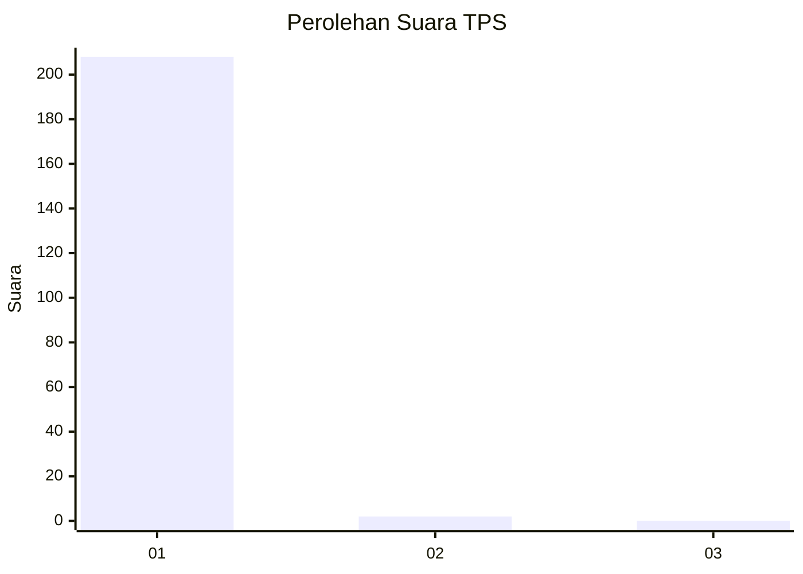
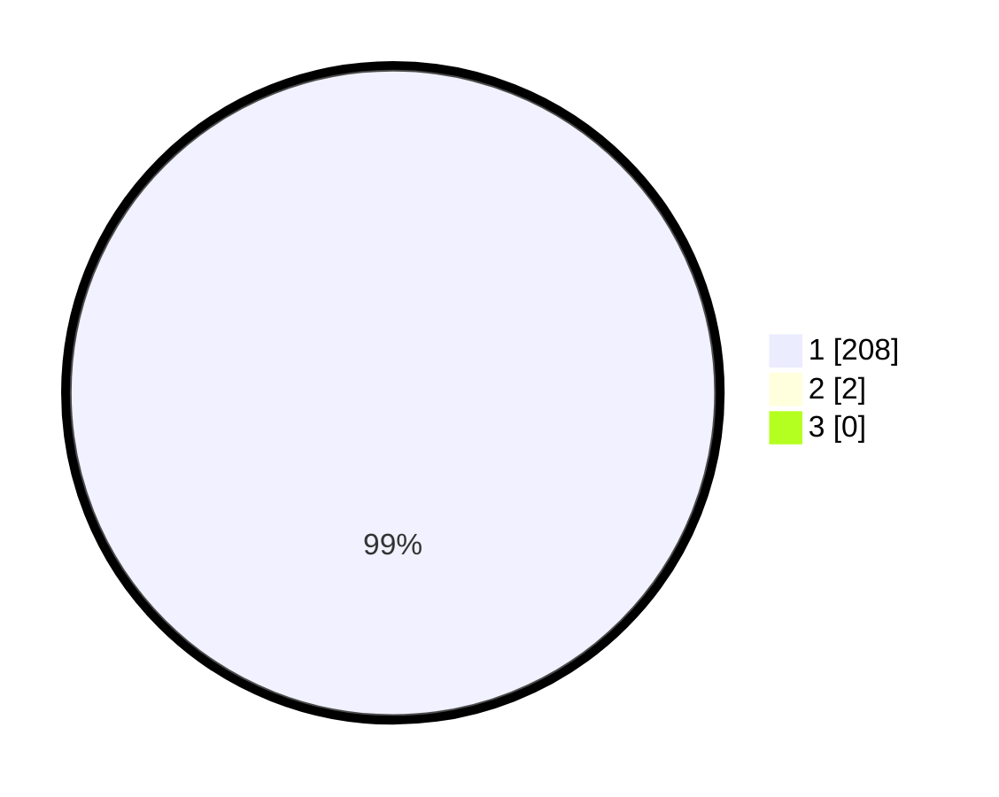

# Hasil

## Grafik

## Tabel

| No. | Nama Paslon    | Suara | Suara (raw) | Persentase |
|:--- |:-------------- | -----:| -----------:| ----------:|
| 1   | ANIES MUHAIMIN | 208   | [208][p-1]  | 99,05      |
| 2   | PRABOWO GIBRAN | 2     | [2][p-2]    | 0,95       |
| 3   | GANJAR MAHFUD  | 0     | [0][p-3]    | 0,00       |

[p-1]: https://github.com/gigit-pemilu/pemilu-2024-35-jawa-timur/blob/main/pilpres/hitung-suara/sub/35-jawa-timur/sub/12-situbondo/sub/14-banyuputih/sub/2003-sumberejo/sub/916-tps/sub/paslon-1.txt
[p-2]: https://github.com/gigit-pemilu/pemilu-2024-35-jawa-timur/blob/main/pilpres/hitung-suara/sub/35-jawa-timur/sub/12-situbondo/sub/14-banyuputih/sub/2003-sumberejo/sub/916-tps/sub/paslon-2.txt
[p-3]: https://github.com/gigit-pemilu/pemilu-2024-35-jawa-timur/blob/main/pilpres/hitung-suara/sub/35-jawa-timur/sub/12-situbondo/sub/14-banyuputih/sub/2003-sumberejo/sub/916-tps/sub/paslon-3.txt

## Foto C Plano

https://sirekap-obj-formc.kpu.go.id/d7bb/pemilu/ppwp/35/12/14/20/03/3512142003916-20240215-180939--361a3dc6-877e-4f59-a6ea-384001430d4c.jpg

https://sirekap-obj-formc.kpu.go.id/d7bb/pemilu/ppwp/35/12/14/20/03/3512142003916-20240215-221626--f02dc2cb-d785-4ee7-b13d-5293a30a2150.jpg

https://sirekap-obj-formc.kpu.go.id/d7bb/pemilu/ppwp/35/12/14/20/03/3512142003916-20240215-221720--fb272a8a-d00f-4d1d-bac3-d550025da0ef.jpg

## Metadata

| Key        | Value               |
| ---------- | ------------------- |
| Time Stamp | 2024-02-16 00:00:26 |

