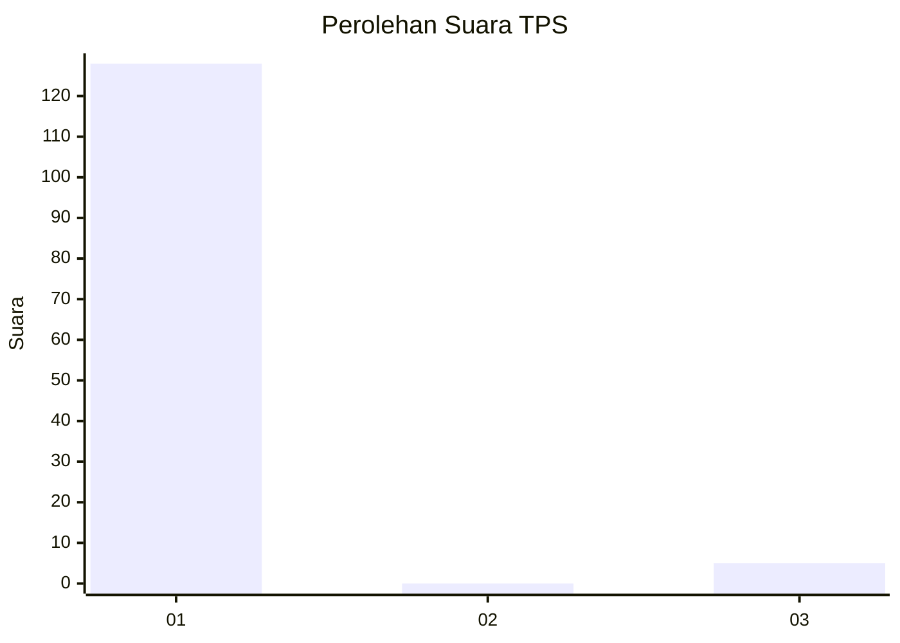
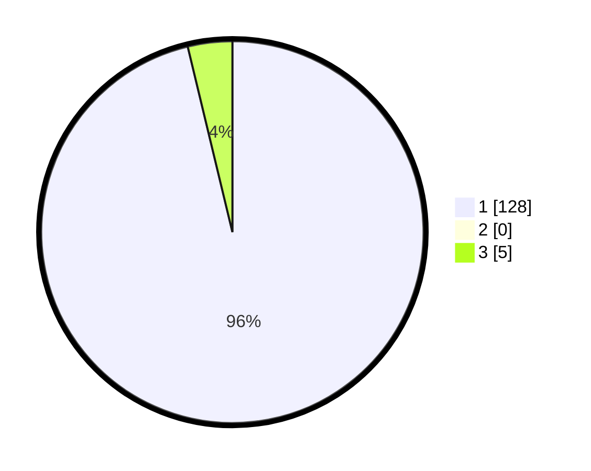

# Hasil

## Grafik

## Tabel

| No. | Nama Paslon    | Suara | Suara (raw) | Persentase |
|:--- |:-------------- | -----:| -----------:| ----------:|
| 1   | ANIES MUHAIMIN | 128   | [128][p-1]  | 96,24      |
| 2   | PRABOWO GIBRAN | 0     | [0][p-2]    | 0,00       |
| 3   | GANJAR MAHFUD  | 5     | [5][p-3]    | 3,76       |

[p-1]: https://github.com/gigit-pemilu/pemilu-2024/blob/main/pilpres/hitung-suara/sub/35-jawa-timur/sub/12-situbondo/sub/14-banyuputih/sub/2003-sumberejo/sub/924-tps/sub/paslon-1.txt
[p-2]: https://github.com/gigit-pemilu/pemilu-2024/blob/main/pilpres/hitung-suara/sub/35-jawa-timur/sub/12-situbondo/sub/14-banyuputih/sub/2003-sumberejo/sub/924-tps/sub/paslon-2.txt
[p-3]: https://github.com/gigit-pemilu/pemilu-2024/blob/main/pilpres/hitung-suara/sub/35-jawa-timur/sub/12-situbondo/sub/14-banyuputih/sub/2003-sumberejo/sub/924-tps/sub/paslon-3.txt

## Foto C Plano

https://sirekap-obj-formc.kpu.go.id/91c5/pemilu/ppwp/35/12/14/20/03/3512142003924-20240220-073046--8572142e-fbbc-47d1-b57d-cf862506c6f0.jpg

https://sirekap-obj-formc.kpu.go.id/91c5/pemilu/ppwp/35/12/14/20/03/3512142003924-20240220-072603--89a1b55e-9825-4b18-93e5-e8d7781465df.jpg

https://sirekap-obj-formc.kpu.go.id/91c5/pemilu/ppwp/35/12/14/20/03/3512142003924-20240220-072716--9b880be7-5357-47c8-b6e4-f5de842fb0a6.jpg

## Metadata

| Key        | Value               |
| ---------- | ------------------- |
| Time Stamp | 2024-02-20 08:00:00 |

## DATA PEMILIH TETAP

Jumlah pemilih dalam DPT: **300**.
 * L: **300**.
 * P: **0**.

## DATA PENGGUNA HAK PILIH

Jumlah pengguna hak pilih dalam DPT: **146**.
 * L: **644**.
 * P: **80**.

Jumlah pengguna hak pilih dalam DPTb: **882**.
 * L: **884**.
 * P: **885**.

Jumlah pengguna hak pilih dalam DPK: **82**.
 * L: **8**.
 * P: **428**.

Jumlah pengguna hak pilih: **143**.
 * L: **542**.
 * P: **2**.

## JUMLAH SUARA SAH DAN TIDAK SAH

JUMLAH SELURUH SUARA SAH: **443**.

JUMLAH SUARA TIDAK SAH: **88**.

JUMLAH SELURUH SUARA SAH DAN SUARA TIDAK SAH: **443**.

