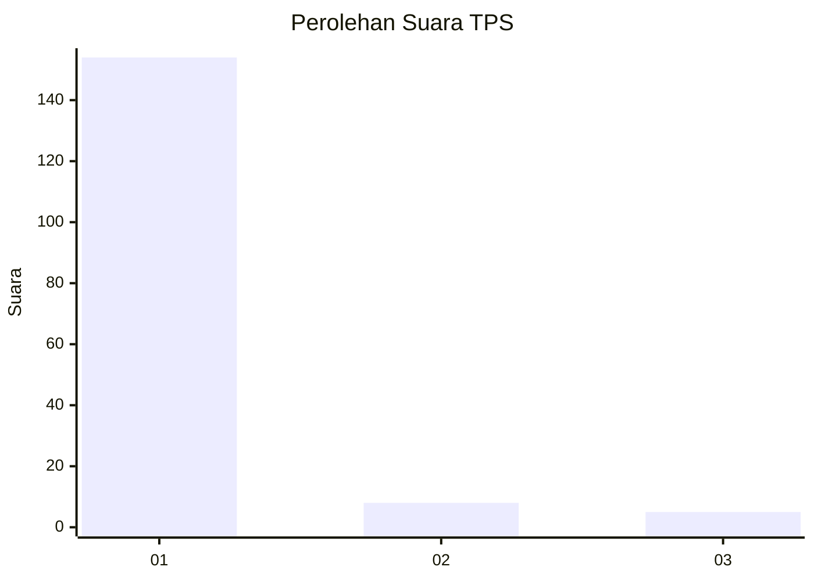
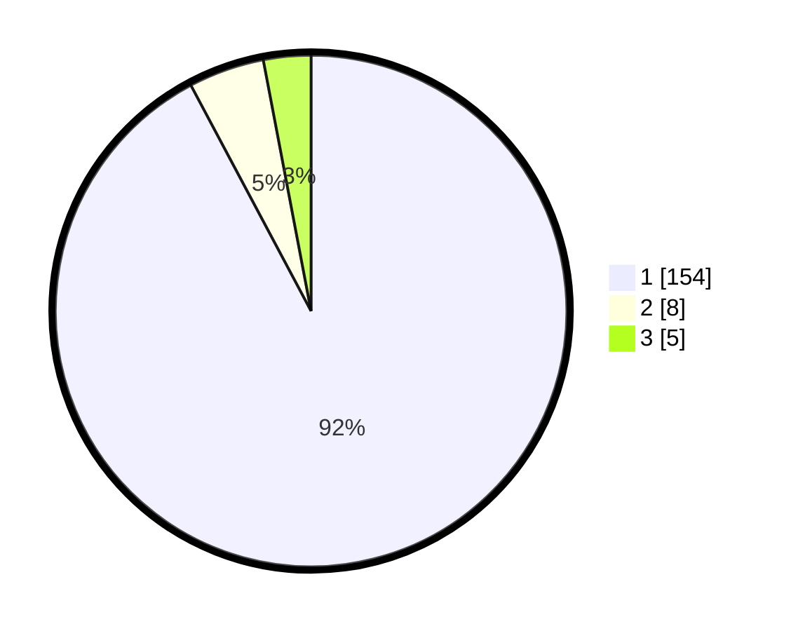

# Hasil

## Grafik

## Tabel

| No. | Nama Paslon    | Suara | Suara (raw) | Persentase |
|:--- |:-------------- | -----:| -----------:| ----------:|
| 1   | ANIES MUHAIMIN | 154   | [154][p-1]  | 92,22      |
| 2   | PRABOWO GIBRAN | 8     | [8][p-2]    | 4,79       |
| 3   | GANJAR MAHFUD  | 5     | [5][p-3]    | 2,99       |

[p-1]: https://github.com/gigit-pemilu/pemilu-2024/blob/main/pilpres/hitung-suara/sub/35-jawa-timur/sub/12-situbondo/sub/14-banyuputih/sub/2003-sumberejo/sub/927-tps/sub/paslon-1.txt
[p-2]: https://github.com/gigit-pemilu/pemilu-2024/blob/main/pilpres/hitung-suara/sub/35-jawa-timur/sub/12-situbondo/sub/14-banyuputih/sub/2003-sumberejo/sub/927-tps/sub/paslon-2.txt
[p-3]: https://github.com/gigit-pemilu/pemilu-2024/blob/main/pilpres/hitung-suara/sub/35-jawa-timur/sub/12-situbondo/sub/14-banyuputih/sub/2003-sumberejo/sub/927-tps/sub/paslon-3.txt

## Foto C Plano

https://sirekap-obj-formc.kpu.go.id/5e9f/pemilu/ppwp/35/12/14/20/03/3512142003927-20240219-012558--c2d981b5-3072-49bc-8c73-3ba244f2c6b6.jpg

https://sirekap-obj-formc.kpu.go.id/5e9f/pemilu/ppwp/35/12/14/20/03/3512142003927-20240219-020544--577600e3-6987-4c51-82f4-7721d23d72e2.jpg

https://sirekap-obj-formc.kpu.go.id/5e9f/pemilu/ppwp/35/12/14/20/03/3512142003927-20240219-012233--ef3863ab-31de-4ebb-913a-f9b3884deba7.jpg

## Metadata

| Key        | Value               |
| ---------- | ------------------- |
| Time Stamp | 2024-02-19 12:00:00 |

