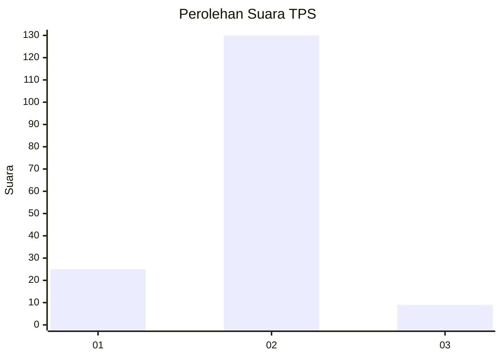
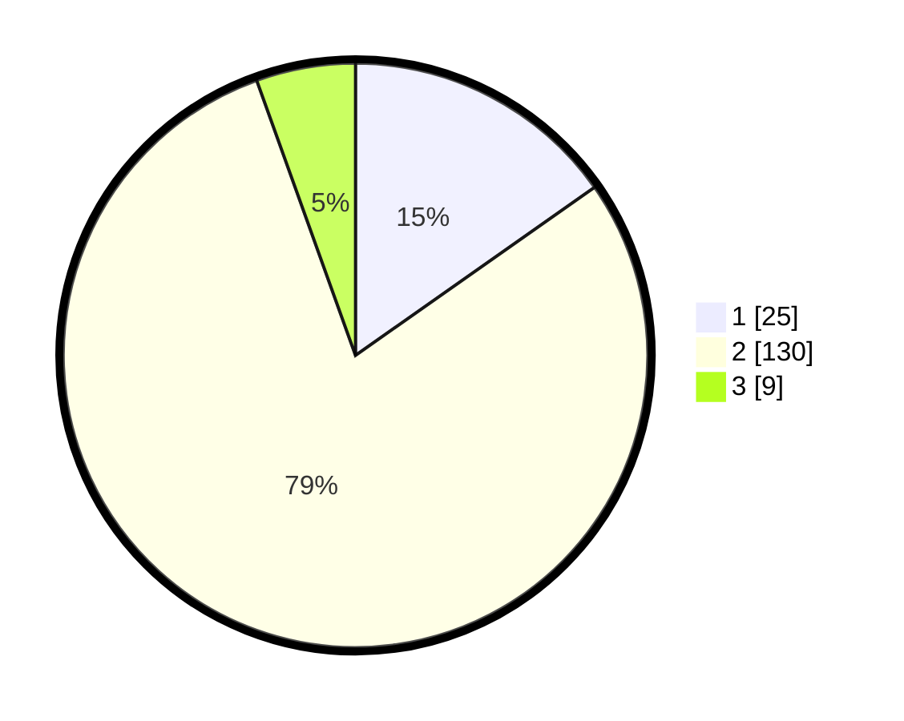

# Hasil

## Grafik

## Tabel

| No. | Nama Paslon    | Suara | Suara (raw) | Persentase |
|:--- |:-------------- | -----:| -----------:| ----------:|
| 1   | ANIES MUHAIMIN | 25    | [25][p-1]   | 15,24      |
| 2   | PRABOWO GIBRAN | 130   | [130][p-2]  | 79,27      |
| 3   | GANJAR MAHFUD  | 9     | [9][p-3]    | 5,49       |

[p-1]: https://github.com/gigit-pemilu/pemilu-2024/blob/main/pilpres/hitung-suara/sub/35-jawa-timur/sub/12-situbondo/sub/14-banyuputih/sub/2004-banyuputih/sub/016-tps/sub/paslon-1.txt
[p-2]: https://github.com/gigit-pemilu/pemilu-2024/blob/main/pilpres/hitung-suara/sub/35-jawa-timur/sub/12-situbondo/sub/14-banyuputih/sub/2004-banyuputih/sub/016-tps/sub/paslon-2.txt
[p-3]: https://github.com/gigit-pemilu/pemilu-2024/blob/main/pilpres/hitung-suara/sub/35-jawa-timur/sub/12-situbondo/sub/14-banyuputih/sub/2004-banyuputih/sub/016-tps/sub/paslon-3.txt

## Foto C Plano

https://sirekap-obj-formc.kpu.go.id/7a3c/pemilu/ppwp/35/12/14/20/04/3512142004016-20240214-223059--7200b4c9-1236-4977-b1ee-d7f30e54a0c9.jpg

https://sirekap-obj-formc.kpu.go.id/7a3c/pemilu/ppwp/35/12/14/20/04/3512142004016-20240214-223232--5da2b242-ef1b-4588-99c2-f4507d18132c.jpg

https://sirekap-obj-formc.kpu.go.id/7a3c/pemilu/ppwp/35/12/14/20/04/3512142004016-20240214-223344--bd7036df-5782-479c-9514-d68a806b4ede.jpg

## Metadata

| Key        | Value               |
| ---------- | ------------------- |
| Time Stamp | 2024-02-15 09:00:24 |

