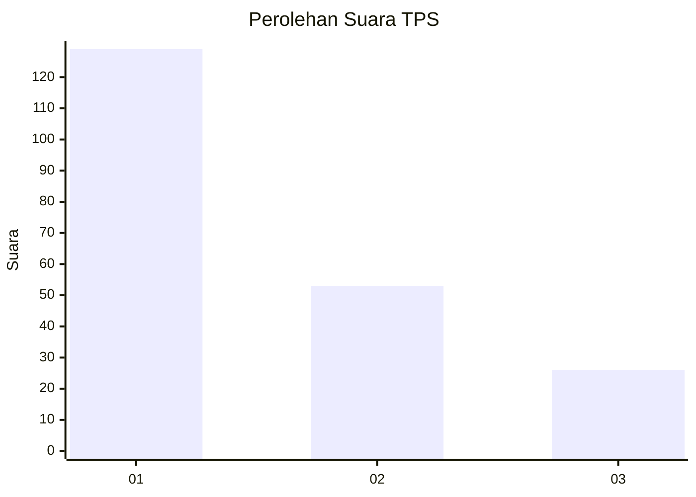
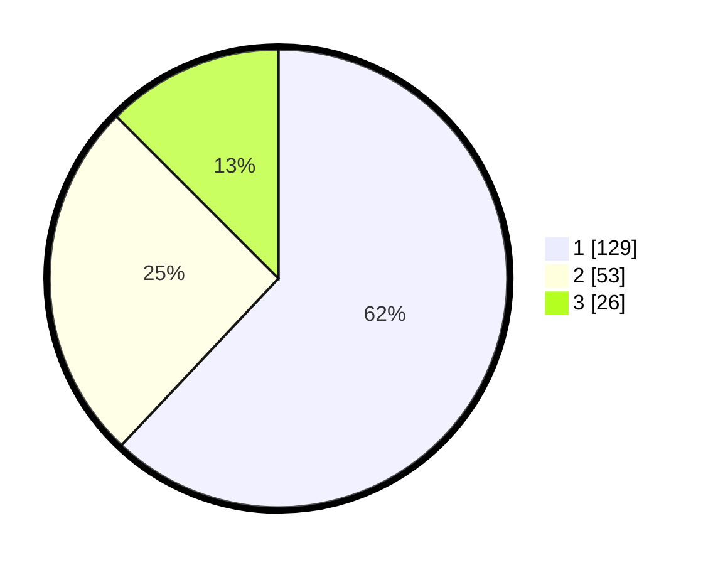

# Hasil

## Grafik

## Tabel

| No. | Nama Paslon    | Suara | Suara (raw) | Persentase |
|:--- |:-------------- | -----:| -----------:| ----------:|
| 1   | ANIES MUHAIMIN | 129   | [129][p-1]  | 62,02      |
| 2   | PRABOWO GIBRAN | 53    | [53][p-2]   | 25,48      |
| 3   | GANJAR MAHFUD  | 26    | [26][p-3]   | 12,50      |

[p-1]: https://github.com/gigit-pemilu/pemilu-2024/blob/main/pilpres/hitung-suara/sub/35-jawa-timur/sub/12-situbondo/sub/14-banyuputih/sub/2005-sumberwaru/sub/006-tps/sub/paslon-1.txt
[p-2]: https://github.com/gigit-pemilu/pemilu-2024/blob/main/pilpres/hitung-suara/sub/35-jawa-timur/sub/12-situbondo/sub/14-banyuputih/sub/2005-sumberwaru/sub/006-tps/sub/paslon-2.txt
[p-3]: https://github.com/gigit-pemilu/pemilu-2024/blob/main/pilpres/hitung-suara/sub/35-jawa-timur/sub/12-situbondo/sub/14-banyuputih/sub/2005-sumberwaru/sub/006-tps/sub/paslon-3.txt

## Foto C Plano

https://sirekap-obj-formc.kpu.go.id/8855/pemilu/ppwp/35/12/14/20/05/3512142005006-20240215-005520--da1ca11c-f937-450d-acae-b151a5b10977.jpg

https://sirekap-obj-formc.kpu.go.id/8855/pemilu/ppwp/35/12/14/20/05/3512142005006-20240215-005612--52f86a5e-bdbd-4846-b78f-231bf856d6da.jpg

https://sirekap-obj-formc.kpu.go.id/8855/pemilu/ppwp/35/12/14/20/05/3512142005006-20240215-005640--abd59ff8-dc63-4922-ab4b-e8c7e5354183.jpg

## Metadata

| Key        | Value               |
| ---------- | ------------------- |
| Time Stamp | 2024-02-16 01:00:27 |

