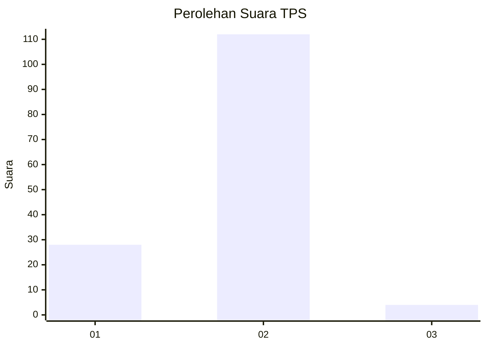
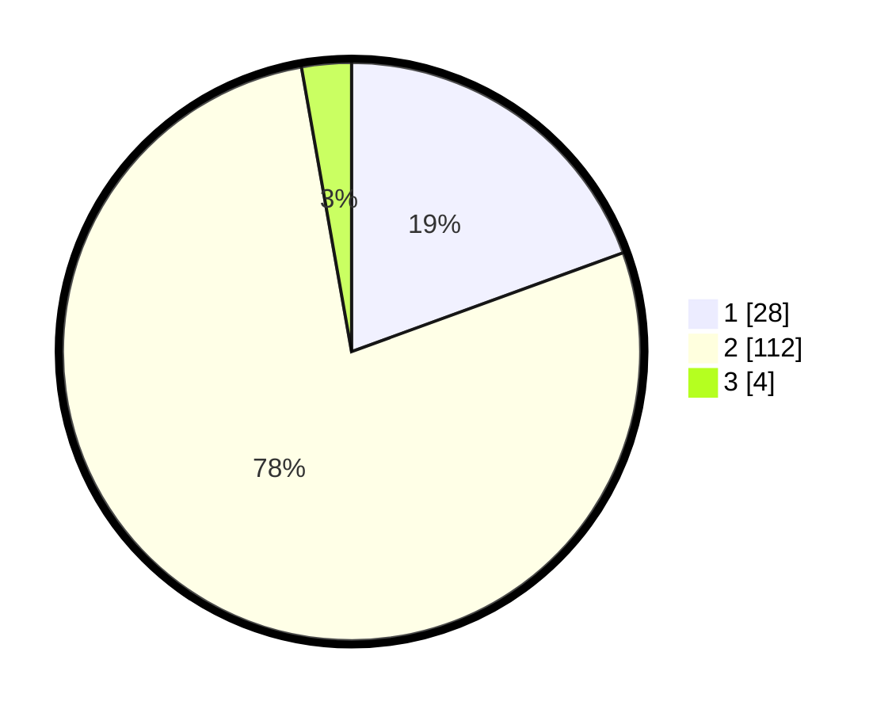

# Hasil

## Grafik

## Tabel

| No. | Nama Paslon    | Suara | Suara (raw) | Persentase |
|:--- |:-------------- | -----:| -----------:| ----------:|
| 1   | ANIES MUHAIMIN | 28    | [28][p-1]   | 19,44      |
| 2   | PRABOWO GIBRAN | 112   | [112][p-2]  | 77,78      |
| 3   | GANJAR MAHFUD  | 4     | [4][p-3]    | 2,78       |

[p-1]: https://github.com/gigit-pemilu/pemilu-2024-35-jawa-timur/blob/main/pilpres/hitung-suara/sub/35-jawa-timur/sub/12-situbondo/sub/15-sumbermalang/sub/2001-tamankursi/sub/001-tps/sub/paslon-1.txt
[p-2]: https://github.com/gigit-pemilu/pemilu-2024-35-jawa-timur/blob/main/pilpres/hitung-suara/sub/35-jawa-timur/sub/12-situbondo/sub/15-sumbermalang/sub/2001-tamankursi/sub/001-tps/sub/paslon-2.txt
[p-3]: https://github.com/gigit-pemilu/pemilu-2024-35-jawa-timur/blob/main/pilpres/hitung-suara/sub/35-jawa-timur/sub/12-situbondo/sub/15-sumbermalang/sub/2001-tamankursi/sub/001-tps/sub/paslon-3.txt

## Foto C Plano

https://sirekap-obj-formc.kpu.go.id/388c/pemilu/ppwp/35/12/15/20/01/3512152001001-20240216-155148--11f4ee09-efa3-4539-8a86-1f086a9204cb.jpg

https://sirekap-obj-formc.kpu.go.id/388c/pemilu/ppwp/35/12/15/20/01/3512152001001-20240216-155150--fc106ff5-cc4c-4ab0-bd53-a7cc842122ee.jpg

https://sirekap-obj-formc.kpu.go.id/388c/pemilu/ppwp/35/12/15/20/01/3512152001001-20240216-155149--7ae1eaad-a14a-4e52-a08f-0908721187c5.jpg

## Metadata

| Key        | Value               |
| ---------- | ------------------- |
| Time Stamp | 2024-02-16 16:25:10 |

## DATA PEMILIH TETAP

Jumlah pemilih dalam DPT: **206**.
 * L: **100**.
 * P: **106**.

## DATA PENGGUNA HAK PILIH

Jumlah pengguna hak pilih dalam DPT: **173**.
 * L: **79**.
 * P: **94**.

Jumlah pengguna hak pilih dalam DPTb: **0**.
 * L: **0**.
 * P: **0**.

Jumlah pengguna hak pilih dalam DPK: **0**.
 * L: **0**.
 * P: **0**.

Jumlah pengguna hak pilih: **173**.
 * L: **79**.
 * P: **94**.

## JUMLAH SUARA SAH DAN TIDAK SAH

JUMLAH SELURUH SUARA SAH: **144**.

JUMLAH SUARA TIDAK SAH: **29**.

JUMLAH SELURUH SUARA SAH DAN SUARA TIDAK SAH: **173**.

