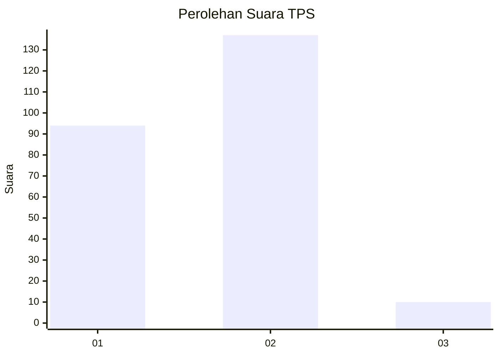
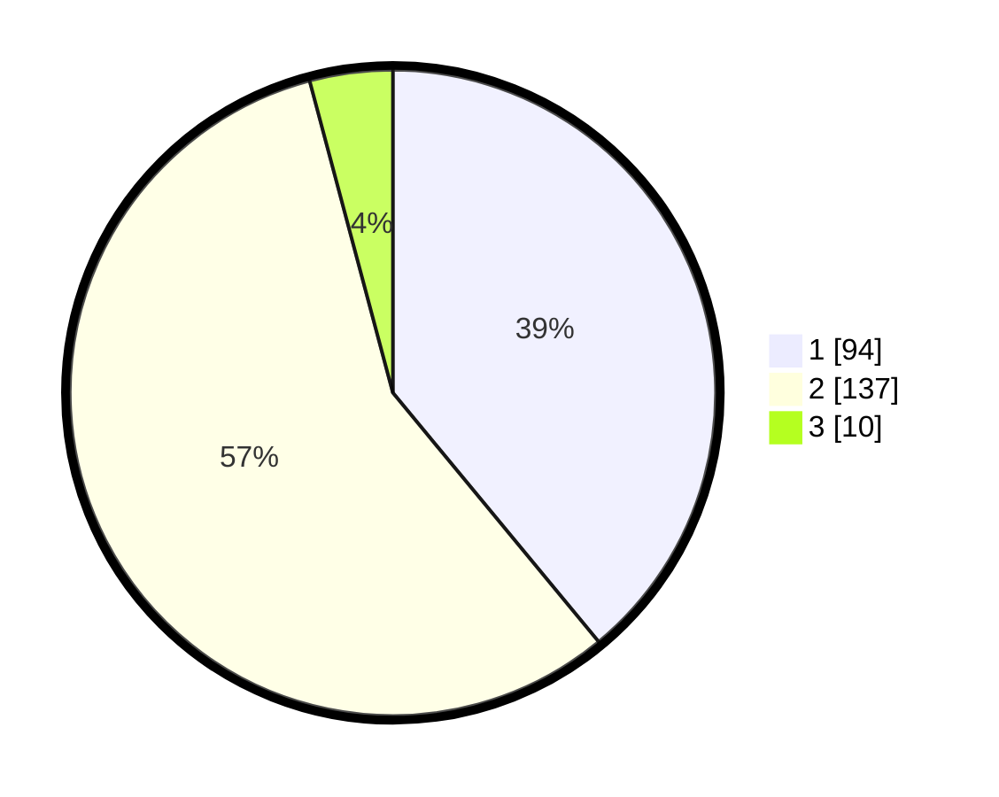

# Hasil

## Grafik

## Tabel

| No. | Nama Paslon    | Suara | Suara (raw) | Persentase |
|:--- |:-------------- | -----:| -----------:| ----------:|
| 1   | ANIES MUHAIMIN | 94    | [94][p-1]   | 39,00      |
| 2   | PRABOWO GIBRAN | 137   | [137][p-2]  | 56,85      |
| 3   | GANJAR MAHFUD  | 10    | [10][p-3]   | 4,15       |

[p-1]: https://github.com/gigit-pemilu/pemilu-2024/blob/main/pilpres/hitung-suara/sub/35-jawa-timur/sub/12-situbondo/sub/16-banyuglugur/sub/2001-lubawang/sub/005-tps/sub/paslon-1.txt
[p-2]: https://github.com/gigit-pemilu/pemilu-2024/blob/main/pilpres/hitung-suara/sub/35-jawa-timur/sub/12-situbondo/sub/16-banyuglugur/sub/2001-lubawang/sub/005-tps/sub/paslon-2.txt
[p-3]: https://github.com/gigit-pemilu/pemilu-2024/blob/main/pilpres/hitung-suara/sub/35-jawa-timur/sub/12-situbondo/sub/16-banyuglugur/sub/2001-lubawang/sub/005-tps/sub/paslon-3.txt

## Foto C Plano

https://sirekap-obj-formc.kpu.go.id/e806/pemilu/ppwp/35/12/16/20/01/3512162001005-20240216-063655--bbde1a74-3c6c-4fe1-aad4-76d962aa9cbf.jpg

https://sirekap-obj-formc.kpu.go.id/e806/pemilu/ppwp/35/12/16/20/01/3512162001005-20240216-063656--02bd36ad-8f76-48a7-ab06-13d67d15aac2.jpg

https://sirekap-obj-formc.kpu.go.id/e806/pemilu/ppwp/35/12/16/20/01/3512162001005-20240215-021152--a9f04698-b9e7-4664-a52b-f5eb3718dff6.jpg

## Metadata

| Key        | Value               |
| ---------- | ------------------- |
| Time Stamp | 2024-02-16 16:25:10 |

## DATA PEMILIH TETAP

Jumlah pemilih dalam DPT: **284**.
 * L: **128**.
 * P: **156**.

## DATA PENGGUNA HAK PILIH

Jumlah pengguna hak pilih dalam DPT: **245**.
 * L: **106**.
 * P: **139**.

Jumlah pengguna hak pilih dalam DPTb: **0**.
 * L: **0**.
 * P: **0**.

Jumlah pengguna hak pilih dalam DPK: **2**.
 * L: **0**.
 * P: **2**.

Jumlah pengguna hak pilih: **247**.
 * L: **106**.
 * P: **141**.

## JUMLAH SUARA SAH DAN TIDAK SAH

JUMLAH SELURUH SUARA SAH: **241**.

JUMLAH SUARA TIDAK SAH: **6**.

JUMLAH SELURUH SUARA SAH DAN SUARA TIDAK SAH: **247**.

