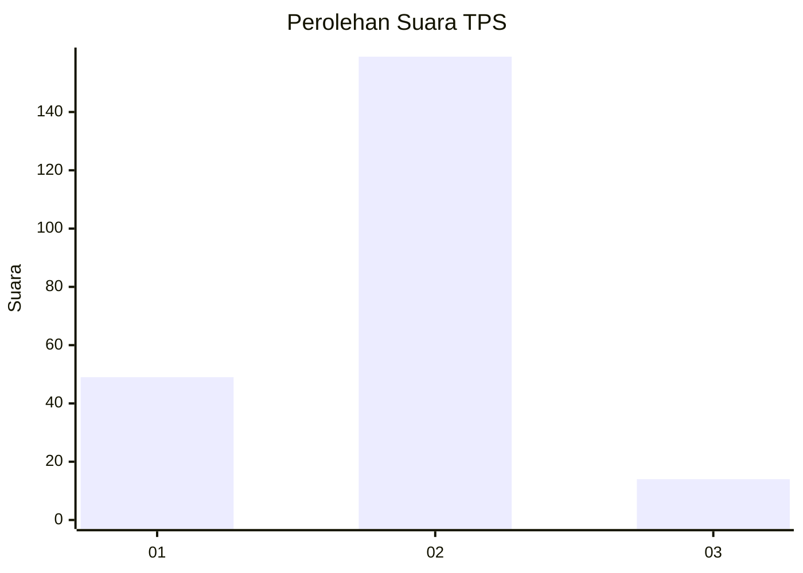

# Hasil

## Grafik

## Tabel

| No. | Nama Paslon    | Suara | Suara (raw) | Persentase |
|:--- |:-------------- | -----:| -----------:| ----------:|
| 1   | ANIES MUHAIMIN | 49    | [49][p-1]   | 22,07      |
| 2   | PRABOWO GIBRAN | 159   | [159][p-2]  | 71,62      |
| 3   | GANJAR MAHFUD  | 14    | [14][p-3]   | 6,31       |

[p-1]: https://github.com/gigit-pemilu/pemilu-2024-35-jawa-timur/blob/main/pilpres/hitung-suara/sub/35-jawa-timur/sub/12-situbondo/sub/16-banyuglugur/sub/2005-banyuglugur/sub/003-tps/sub/paslon-1.txt
[p-2]: https://github.com/gigit-pemilu/pemilu-2024-35-jawa-timur/blob/main/pilpres/hitung-suara/sub/35-jawa-timur/sub/12-situbondo/sub/16-banyuglugur/sub/2005-banyuglugur/sub/003-tps/sub/paslon-2.txt
[p-3]: https://github.com/gigit-pemilu/pemilu-2024-35-jawa-timur/blob/main/pilpres/hitung-suara/sub/35-jawa-timur/sub/12-situbondo/sub/16-banyuglugur/sub/2005-banyuglugur/sub/003-tps/sub/paslon-3.txt

## Foto C Plano

https://sirekap-obj-formc.kpu.go.id/71ac/pemilu/ppwp/35/12/16/20/05/3512162005003-20240215-021647--1926740a-6efa-4b21-ba0e-807e43b2ba50.jpg

https://sirekap-obj-formc.kpu.go.id/71ac/pemilu/ppwp/35/12/16/20/05/3512162005003-20240215-021709--c36aac5f-dd02-4a9c-97b7-30dc4c6c87d8.jpg

https://sirekap-obj-formc.kpu.go.id/71ac/pemilu/ppwp/35/12/16/20/05/3512162005003-20240215-021805--6e64ee4b-a104-4e53-883a-368cd417b30c.jpg

## Metadata

| Key        | Value               |
| ---------- | ------------------- |
| Time Stamp | 2024-02-15 16:30:25 |

