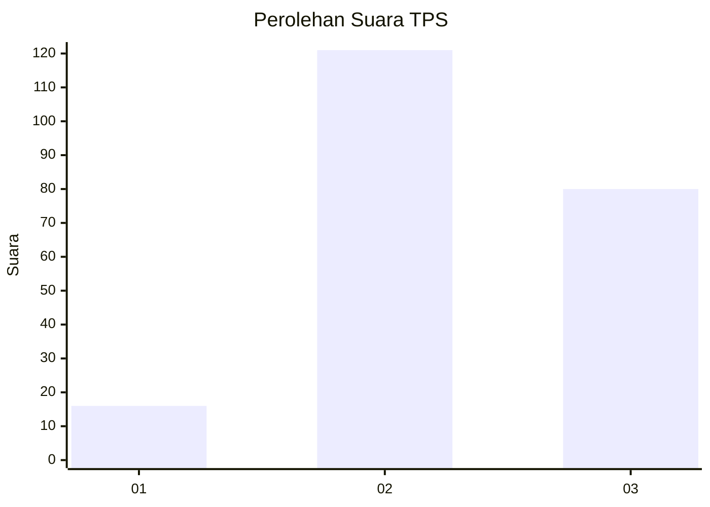
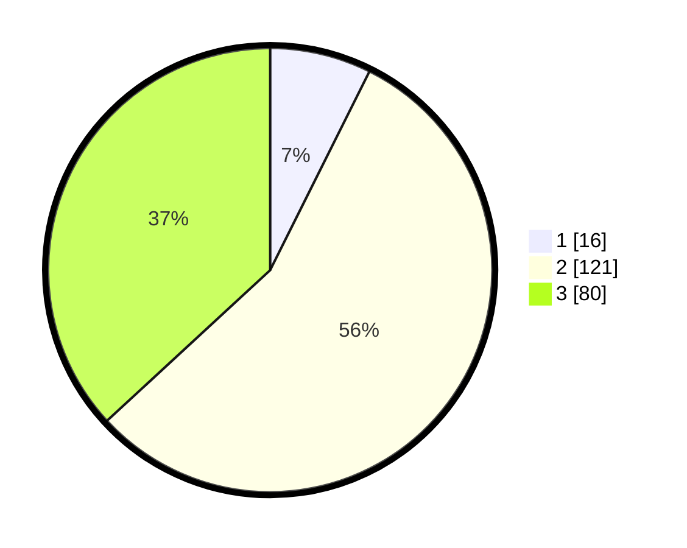

# Hasil

## Grafik

## Tabel

| No. | Nama Paslon    | Suara | Suara (raw) | Persentase |
|:--- |:-------------- | -----:| -----------:| ----------:|
| 1   | ANIES MUHAIMIN | 16    | [16][p-1]   | 7,37       |
| 2   | PRABOWO GIBRAN | 121   | [121][p-2]  | 55,76      |
| 3   | GANJAR MAHFUD  | 80    | [80][p-3]   | 36,87      |

[p-1]: https://github.com/gigit-pemilu/pemilu-2024/blob/main/pilpres/hitung-suara/sub/35-jawa-timur/sub/13-probolinggo/sub/01-sukapura/sub/2001-ngadisari/sub/002-tps/sub/paslon-1.txt
[p-2]: https://github.com/gigit-pemilu/pemilu-2024/blob/main/pilpres/hitung-suara/sub/35-jawa-timur/sub/13-probolinggo/sub/01-sukapura/sub/2001-ngadisari/sub/002-tps/sub/paslon-2.txt
[p-3]: https://github.com/gigit-pemilu/pemilu-2024/blob/main/pilpres/hitung-suara/sub/35-jawa-timur/sub/13-probolinggo/sub/01-sukapura/sub/2001-ngadisari/sub/002-tps/sub/paslon-3.txt

## Foto C Plano

https://sirekap-obj-formc.kpu.go.id/ef7e/pemilu/ppwp/35/13/01/20/01/3513012001002-20240214-223503--fdd7c2d7-1620-425f-b082-10226f7ee773.jpg

https://sirekap-obj-formc.kpu.go.id/ef7e/pemilu/ppwp/35/13/01/20/01/3513012001002-20240216-143051--f8b16774-ff62-4ffa-ad6f-a09a385edb01.jpg

https://sirekap-obj-formc.kpu.go.id/ef7e/pemilu/ppwp/35/13/01/20/01/3513012001002-20240216-143050--a955b08f-d0ed-4482-9ee2-6e03d4003da3.jpg

## Metadata

| Key        | Value               |
| ---------- | ------------------- |
| Time Stamp | 2024-02-16 21:01:00 |

