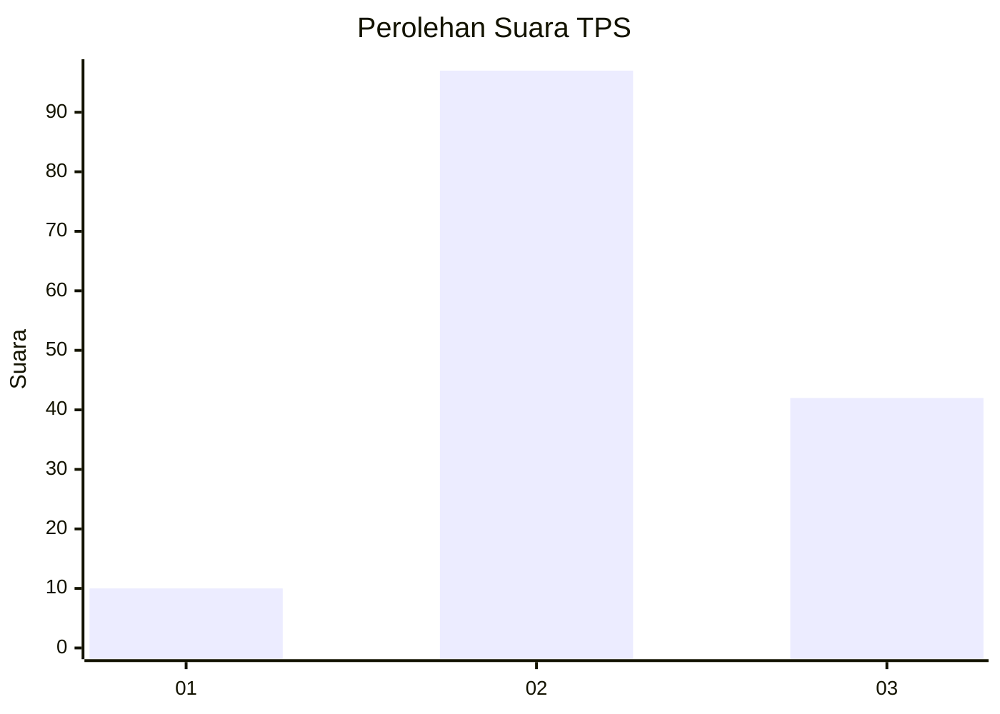
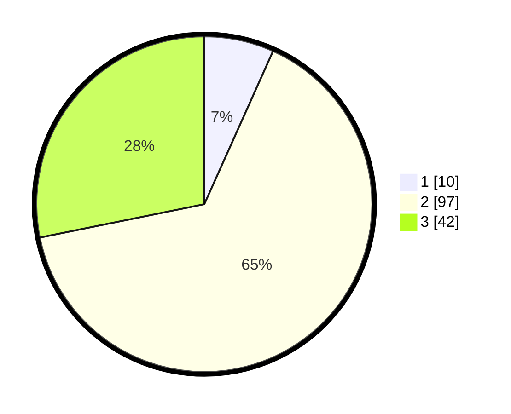

# Hasil

## Grafik

## Tabel

| No. | Nama Paslon    | Suara | Suara (raw) | Persentase |
|:--- |:-------------- | -----:| -----------:| ----------:|
| 1   | ANIES MUHAIMIN | 10    | [10][p-1]   | 6,71       |
| 2   | PRABOWO GIBRAN | 97    | [97][p-2]   | 65,10      |
| 3   | GANJAR MAHFUD  | 42    | [42][p-3]   | 28,19      |

[p-1]: https://github.com/gigit-pemilu/pemilu-2024/blob/main/pilpres/hitung-suara/sub/35-jawa-timur/sub/13-probolinggo/sub/01-sukapura/sub/2001-ngadisari/sub/006-tps/sub/paslon-1.txt
[p-2]: https://github.com/gigit-pemilu/pemilu-2024/blob/main/pilpres/hitung-suara/sub/35-jawa-timur/sub/13-probolinggo/sub/01-sukapura/sub/2001-ngadisari/sub/006-tps/sub/paslon-2.txt
[p-3]: https://github.com/gigit-pemilu/pemilu-2024/blob/main/pilpres/hitung-suara/sub/35-jawa-timur/sub/13-probolinggo/sub/01-sukapura/sub/2001-ngadisari/sub/006-tps/sub/paslon-3.txt

## Foto C Plano

https://sirekap-obj-formc.kpu.go.id/e594/pemilu/ppwp/35/13/01/20/01/3513012001006-20240215-015235--00974ff0-9523-4c05-bfea-cbe47d703fe3.jpg

https://sirekap-obj-formc.kpu.go.id/e594/pemilu/ppwp/35/13/01/20/01/3513012001006-20240215-015303--c9222939-746b-4312-bbfa-011b0fc7f696.jpg

https://sirekap-obj-formc.kpu.go.id/e594/pemilu/ppwp/35/13/01/20/01/3513012001006-20240215-015320--3cfb2bd3-7bf6-4b50-8287-d03ed0a5ca48.jpg

## Metadata

| Key        | Value               |
| ---------- | ------------------- |
| Time Stamp | 2024-02-19 06:16:00 |

