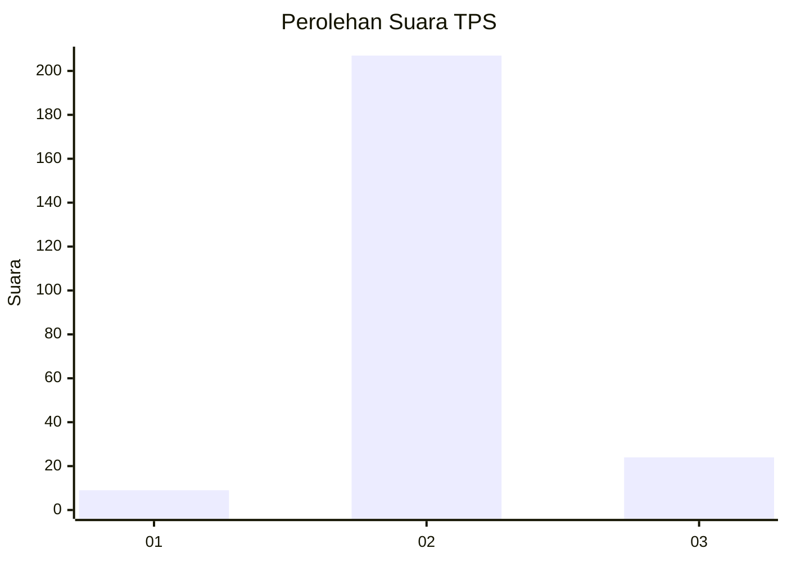
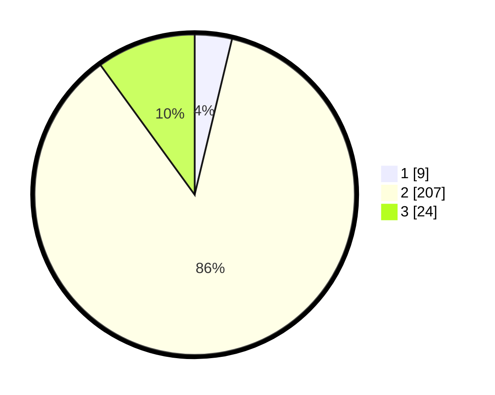

# Hasil

## Grafik

## Tabel

| No. | Nama Paslon    | Suara | Suara (raw) | Persentase |
|:--- |:-------------- | -----:| -----------:| ----------:|
| 1   | ANIES MUHAIMIN | 9     | [9][p-1]    | 3,75       |
| 2   | PRABOWO GIBRAN | 207   | [207][p-2]  | 86,25      |
| 3   | GANJAR MAHFUD  | 24    | [24][p-3]   | 10,00      |

[p-1]: https://github.com/gigit-pemilu/pemilu-2024/blob/main/pilpres/hitung-suara/sub/35-jawa-timur/sub/13-probolinggo/sub/01-sukapura/sub/2006-sariwani/sub/002-tps/sub/paslon-1.txt
[p-2]: https://github.com/gigit-pemilu/pemilu-2024/blob/main/pilpres/hitung-suara/sub/35-jawa-timur/sub/13-probolinggo/sub/01-sukapura/sub/2006-sariwani/sub/002-tps/sub/paslon-2.txt
[p-3]: https://github.com/gigit-pemilu/pemilu-2024/blob/main/pilpres/hitung-suara/sub/35-jawa-timur/sub/13-probolinggo/sub/01-sukapura/sub/2006-sariwani/sub/002-tps/sub/paslon-3.txt

## Foto C Plano

https://sirekap-obj-formc.kpu.go.id/d315/pemilu/ppwp/35/13/01/20/06/3513012006002-20240217-120030--79e8d7cf-e8b0-4010-bb40-0a2b2690216a.jpg

https://sirekap-obj-formc.kpu.go.id/d315/pemilu/ppwp/35/13/01/20/06/3513012006002-20240215-033012--e8f36ef7-ac54-4d9a-9406-6fcb67484380.jpg

https://sirekap-obj-formc.kpu.go.id/d315/pemilu/ppwp/35/13/01/20/06/3513012006002-20240215-032909--a5fe3afb-8e8f-4b08-bba5-9b85c110a974.jpg

## Metadata

| Key        | Value               |
| ---------- | ------------------- |
| Time Stamp | 2024-02-19 06:16:00 |

