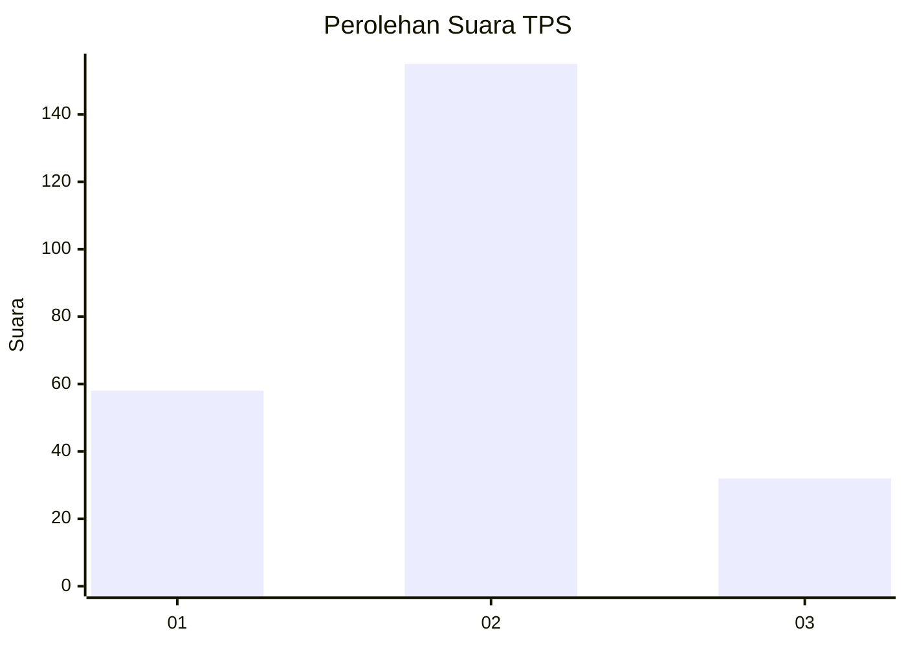
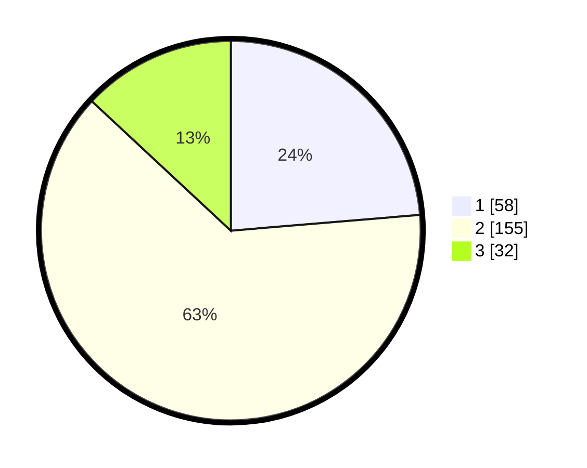

# Hasil

## Grafik

## Tabel

| No. | Nama Paslon    | Suara | Suara (raw) | Persentase |
|:--- |:-------------- | -----:| -----------:| ----------:|
| 1   | ANIES MUHAIMIN | 58    | [58][p-1]   | 23,67      |
| 2   | PRABOWO GIBRAN | 155   | [155][p-2]  | 63,27      |
| 3   | GANJAR MAHFUD  | 32    | [32][p-3]   | 13,06      |

[p-1]: https://github.com/gigit-pemilu/pemilu-2024/blob/main/pilpres/hitung-suara/sub/35-jawa-timur/sub/13-probolinggo/sub/04-bantaran/sub/2006-tempuran/sub/004-tps/sub/paslon-1.txt
[p-2]: https://github.com/gigit-pemilu/pemilu-2024/blob/main/pilpres/hitung-suara/sub/35-jawa-timur/sub/13-probolinggo/sub/04-bantaran/sub/2006-tempuran/sub/004-tps/sub/paslon-2.txt
[p-3]: https://github.com/gigit-pemilu/pemilu-2024/blob/main/pilpres/hitung-suara/sub/35-jawa-timur/sub/13-probolinggo/sub/04-bantaran/sub/2006-tempuran/sub/004-tps/sub/paslon-3.txt

## Foto C Plano

https://sirekap-obj-formc.kpu.go.id/7c1f/pemilu/ppwp/35/13/04/20/06/3513042006004-20240217-104315--38349969-7f66-45e5-8096-9cf13b9e908e.jpg

https://sirekap-obj-formc.kpu.go.id/7c1f/pemilu/ppwp/35/13/04/20/06/3513042006004-20240217-104317--1427c3aa-9664-4e6d-a81a-18747164f12a.jpg

https://sirekap-obj-formc.kpu.go.id/7c1f/pemilu/ppwp/35/13/04/20/06/3513042006004-20240217-104316--8bee578f-b61c-4b67-a22d-46c86b93d09f.jpg

## Metadata

| Key        | Value               |
| ---------- | ------------------- |
| Time Stamp | 2024-02-17 18:30:00 |

## DATA PEMILIH TETAP

Jumlah pemilih dalam DPT: **289**.
 * L: **134**.
 * P: **155**.

## DATA PENGGUNA HAK PILIH

Jumlah pengguna hak pilih dalam DPT: **252**.
 * L: **116**.
 * P: **136**.

Jumlah pengguna hak pilih dalam DPTb: **0**.
 * L: **0**.
 * P: **0**.

Jumlah pengguna hak pilih dalam DPK: **0**.
 * L: **0**.
 * P: **0**.

Jumlah pengguna hak pilih: **252**.
 * L: **116**.
 * P: **136**.

## JUMLAH SUARA SAH DAN TIDAK SAH

JUMLAH SELURUH SUARA SAH: **156**.

JUMLAH SUARA TIDAK SAH: **96**.

JUMLAH SELURUH SUARA SAH DAN SUARA TIDAK SAH: **252**.

