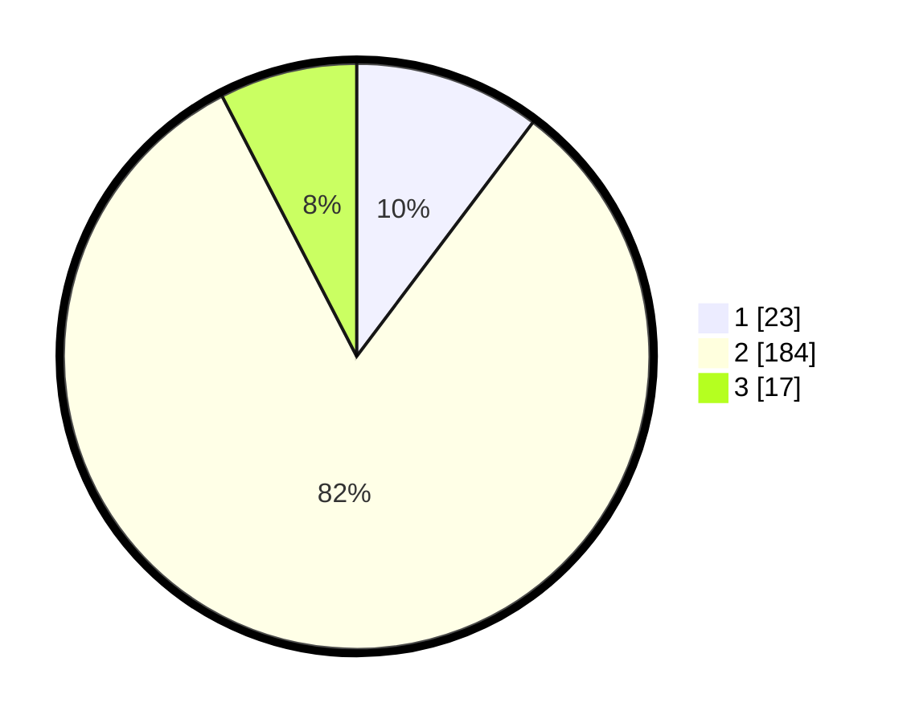

# Hasil

## Grafik

## Tabel

| No. | Nama Paslon    | Suara | Suara (raw) | Persentase |
|:--- |:-------------- | -----:| -----------:| ----------:|
| 1   | ANIES MUHAIMIN | 23    | [23][p-1]   | 10,27      |
| 2   | PRABOWO GIBRAN | 184   | [184][p-2]  | 82,14      |
| 3   | GANJAR MAHFUD  | 17    | [17][p-3]   | 7,59       |

[p-1]: https://github.com/gigit-pemilu/pemilu-2024/blob/main/pilpres/hitung-suara/sub/35-jawa-timur/sub/13-probolinggo/sub/04-bantaran/sub/2007-kropak/sub/003-tps/sub/paslon-1.txt
[p-2]: https://github.com/gigit-pemilu/pemilu-2024/blob/main/pilpres/hitung-suara/sub/35-jawa-timur/sub/13-probolinggo/sub/04-bantaran/sub/2007-kropak/sub/003-tps/sub/paslon-2.txt
[p-3]: https://github.com/gigit-pemilu/pemilu-2024/blob/main/pilpres/hitung-suara/sub/35-jawa-timur/sub/13-probolinggo/sub/04-bantaran/sub/2007-kropak/sub/003-tps/sub/paslon-3.txt

## Foto C Plano

https://sirekap-obj-formc.kpu.go.id/3ee0/pemilu/ppwp/35/13/04/20/07/3513042007003-20240215-121912--864ffcfb-a154-4a45-b94f-95cff02c9b76.jpg

https://sirekap-obj-formc.kpu.go.id/3ee0/pemilu/ppwp/35/13/04/20/07/3513042007003-20240215-021720--f6fe3dbb-6a0f-4d6e-a476-9f2a80e1e8cb.jpg

https://sirekap-obj-formc.kpu.go.id/3ee0/pemilu/ppwp/35/13/04/20/07/3513042007003-20240215-021735--5806b656-b7d8-49a2-80f7-5a1eb77ffbce.jpg

## Metadata

| Key        | Value               |
| ---------- | ------------------- |
| Time Stamp | 2024-02-17 19:00:04 |

