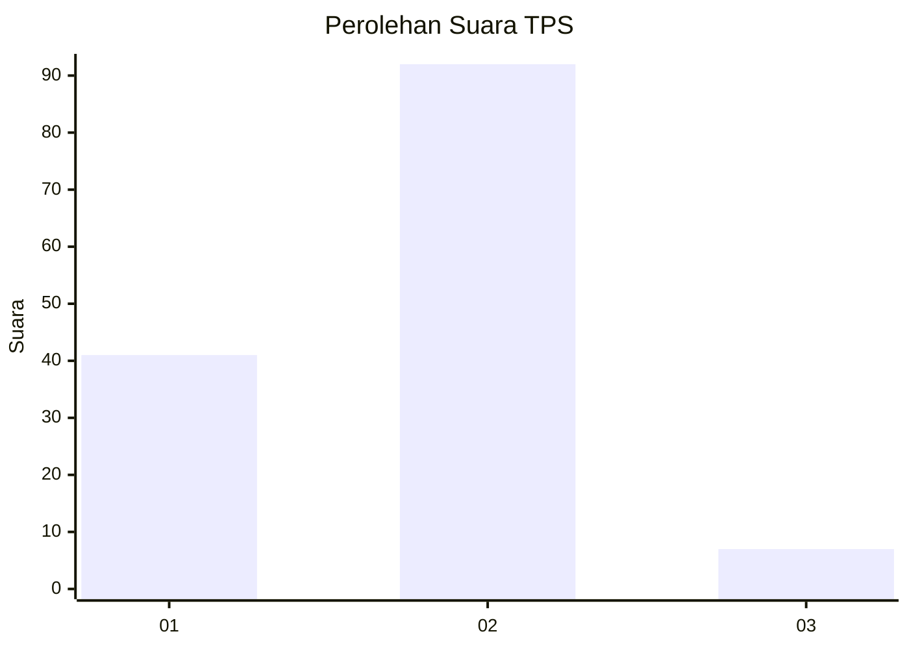
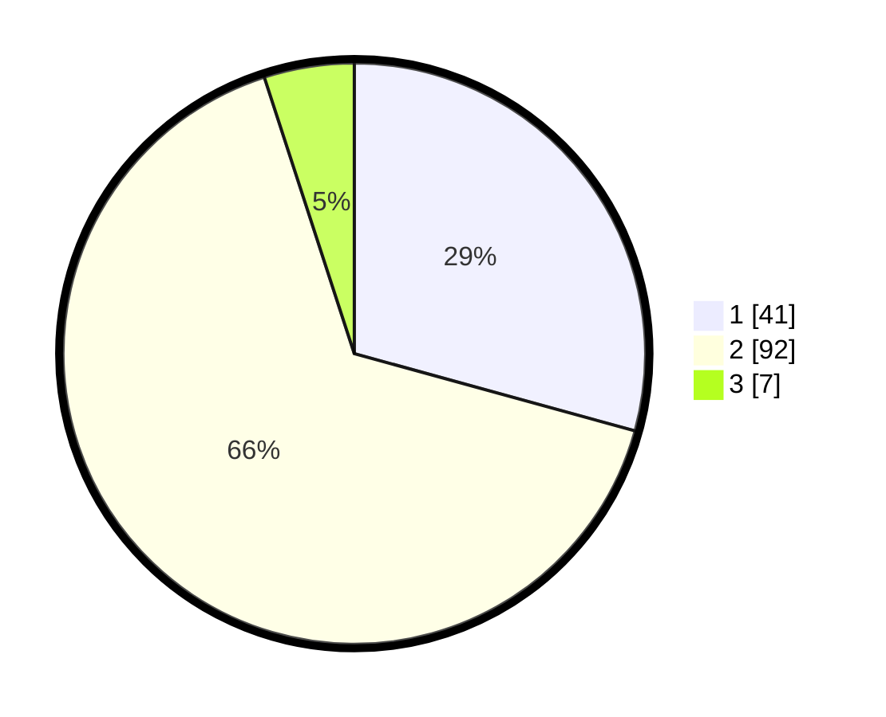

# Hasil

## Grafik

## Tabel

| No. | Nama Paslon    | Suara | Suara (raw) | Persentase |
|:--- |:-------------- | -----:| -----------:| ----------:|
| 1   | ANIES MUHAIMIN | 41    | [41][p-1]   | 29,29      |
| 2   | PRABOWO GIBRAN | 92    | [92][p-2]   | 65,71      |
| 3   | GANJAR MAHFUD  | 7     | [7][p-3]    | 5,00       |

[p-1]: https://github.com/gigit-pemilu/pemilu-2024-35-jawa-timur/blob/main/pilpres/hitung-suara/sub/35-jawa-timur/sub/13-probolinggo/sub/04-bantaran/sub/2009-kramatagung/sub/002-tps/sub/paslon-1.txt
[p-2]: https://github.com/gigit-pemilu/pemilu-2024-35-jawa-timur/blob/main/pilpres/hitung-suara/sub/35-jawa-timur/sub/13-probolinggo/sub/04-bantaran/sub/2009-kramatagung/sub/002-tps/sub/paslon-2.txt
[p-3]: https://github.com/gigit-pemilu/pemilu-2024-35-jawa-timur/blob/main/pilpres/hitung-suara/sub/35-jawa-timur/sub/13-probolinggo/sub/04-bantaran/sub/2009-kramatagung/sub/002-tps/sub/paslon-3.txt

## Foto C Plano

https://sirekap-obj-formc.kpu.go.id/8347/pemilu/ppwp/35/13/04/20/09/3513042009002-20240215-002314--b44c5f55-22cb-4922-9411-0097dafe9bf1.jpg

https://sirekap-obj-formc.kpu.go.id/8347/pemilu/ppwp/35/13/04/20/09/3513042009002-20240215-003543--88fc33b0-d9b4-4810-a1ac-7a52cf50c989.jpg

https://sirekap-obj-formc.kpu.go.id/8347/pemilu/ppwp/35/13/04/20/09/3513042009002-20240215-003749--09d1f0a6-a2ac-4652-b73f-0ced57cf1179.jpg

## Metadata

| Key        | Value               |
| ---------- | ------------------- |
| Time Stamp | 2024-02-15 20:30:46 |

