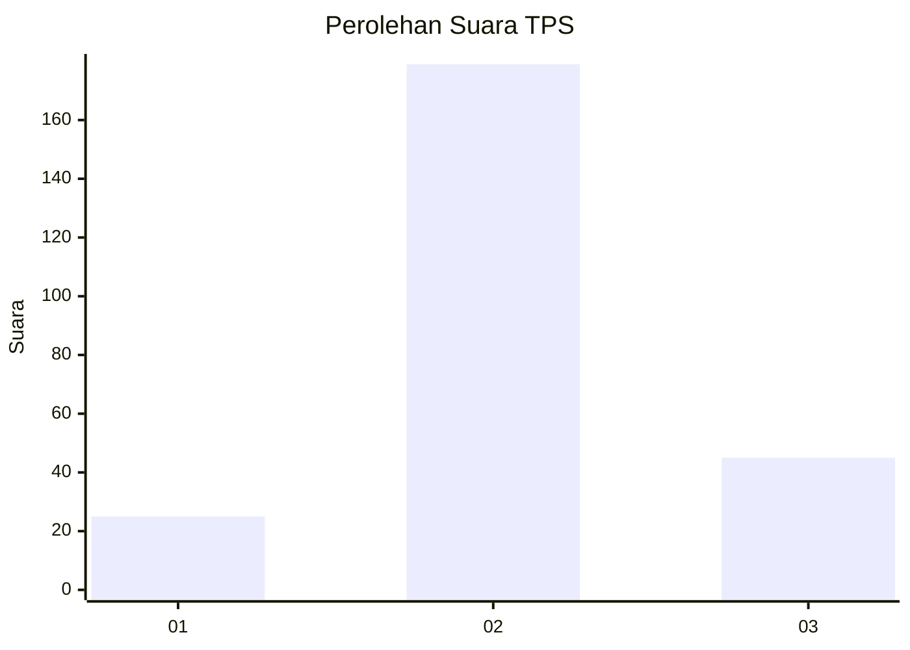
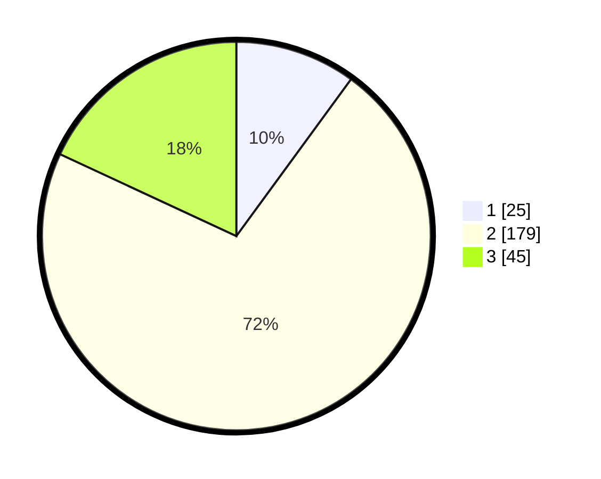

# Hasil

## Grafik

## Tabel

| No. | Nama Paslon    | Suara | Suara (raw) | Persentase |
|:--- |:-------------- | -----:| -----------:| ----------:|
| 1   | ANIES MUHAIMIN | 25    | [25][p-1]   | 10,04      |
| 2   | PRABOWO GIBRAN | 179   | [179][p-2]  | 71,89      |
| 3   | GANJAR MAHFUD  | 45    | [45][p-3]   | 18,07      |

[p-1]: https://github.com/gigit-pemilu/pemilu-2024-35-jawa-timur/blob/main/pilpres/hitung-suara/sub/35-jawa-timur/sub/13-probolinggo/sub/05-leces/sub/2001-malasankulon/sub/001-tps/sub/paslon-1.txt
[p-2]: https://github.com/gigit-pemilu/pemilu-2024-35-jawa-timur/blob/main/pilpres/hitung-suara/sub/35-jawa-timur/sub/13-probolinggo/sub/05-leces/sub/2001-malasankulon/sub/001-tps/sub/paslon-2.txt
[p-3]: https://github.com/gigit-pemilu/pemilu-2024-35-jawa-timur/blob/main/pilpres/hitung-suara/sub/35-jawa-timur/sub/13-probolinggo/sub/05-leces/sub/2001-malasankulon/sub/001-tps/sub/paslon-3.txt

## Foto C Plano

https://sirekap-obj-formc.kpu.go.id/6746/pemilu/ppwp/35/13/05/20/01/3513052001001-20240217-113520--af08fbc1-5493-4e18-861a-2e3a574aff75.jpg

https://sirekap-obj-formc.kpu.go.id/6746/pemilu/ppwp/35/13/05/20/01/3513052001001-20240217-093315--a54c9428-3407-4053-bdd6-dc8f371f0a4d.jpg

https://sirekap-obj-formc.kpu.go.id/6746/pemilu/ppwp/35/13/05/20/01/3513052001001-20240217-093356--696b56e4-ecd0-4b0d-a9d4-5a94ae10b8ef.jpg

## Metadata

| Key        | Value               |
| ---------- | ------------------- |
| Time Stamp | 2024-02-25 13:00:00 |

