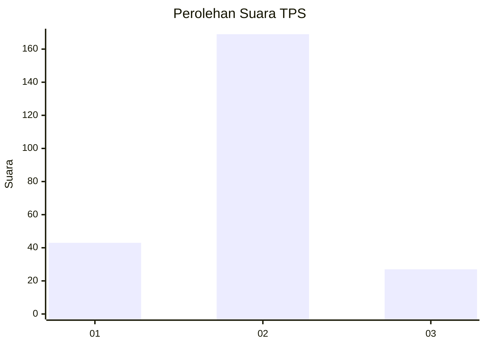
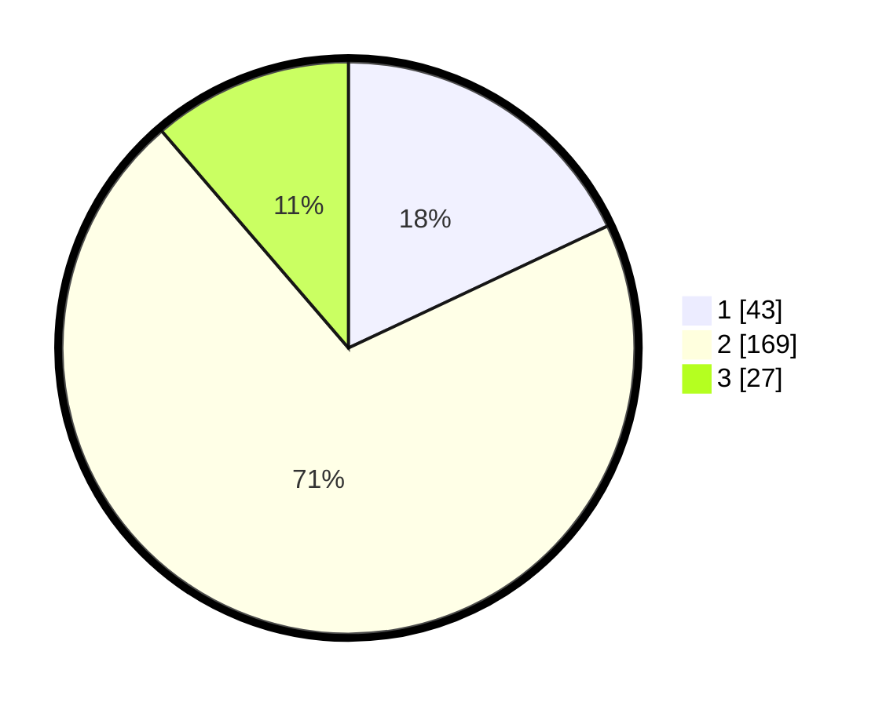

# Hasil

## Grafik

## Tabel

| No. | Nama Paslon    | Suara | Suara (raw) | Persentase |
|:--- |:-------------- | -----:| -----------:| ----------:|
| 1   | ANIES MUHAIMIN | 43    | [43][p-1]   | 17,99      |
| 2   | PRABOWO GIBRAN | 169   | [169][p-2]  | 70,71      |
| 3   | GANJAR MAHFUD  | 27    | [27][p-3]   | 11,30      |

[p-1]: https://github.com/gigit-pemilu/pemilu-2024-35-jawa-timur/blob/main/pilpres/hitung-suara/sub/35-jawa-timur/sub/13-probolinggo/sub/05-leces/sub/2002-tigasan-wetan/sub/005-tps/sub/paslon-1.txt
[p-2]: https://github.com/gigit-pemilu/pemilu-2024-35-jawa-timur/blob/main/pilpres/hitung-suara/sub/35-jawa-timur/sub/13-probolinggo/sub/05-leces/sub/2002-tigasan-wetan/sub/005-tps/sub/paslon-2.txt
[p-3]: https://github.com/gigit-pemilu/pemilu-2024-35-jawa-timur/blob/main/pilpres/hitung-suara/sub/35-jawa-timur/sub/13-probolinggo/sub/05-leces/sub/2002-tigasan-wetan/sub/005-tps/sub/paslon-3.txt

## Foto C Plano

https://sirekap-obj-formc.kpu.go.id/e67e/pemilu/ppwp/35/13/05/20/02/3513052002005-20240214-233106--2f3ab055-fac1-4b13-95f7-ae3635da1e12.jpg

https://sirekap-obj-formc.kpu.go.id/e67e/pemilu/ppwp/35/13/05/20/02/3513052002005-20240214-233317--cebf300c-45c1-4d0d-9734-3b853059b062.jpg

https://sirekap-obj-formc.kpu.go.id/e67e/pemilu/ppwp/35/13/05/20/02/3513052002005-20240214-233447--d745ecab-fc2b-41ad-a9eb-4a230e4964e5.jpg

## Metadata

| Key        | Value               |
| ---------- | ------------------- |
| Time Stamp | 2024-02-24 22:31:28 |

