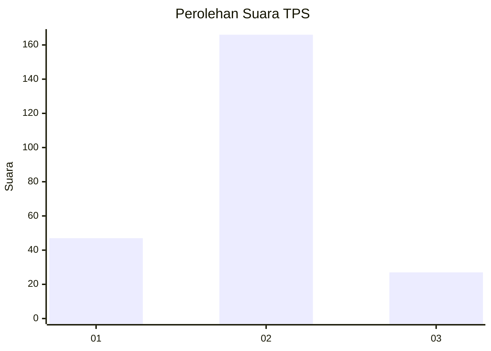
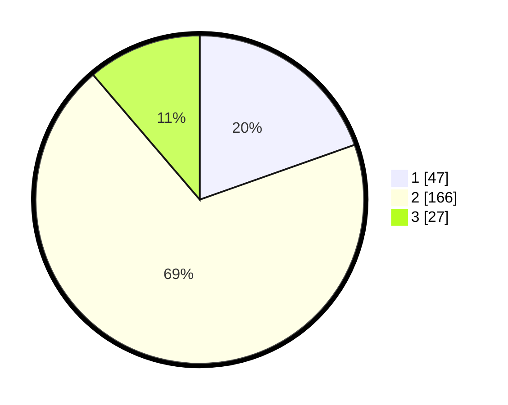

# Hasil

## Grafik

## Tabel

| No. | Nama Paslon    | Suara | Suara (raw) | Persentase |
|:--- |:-------------- | -----:| -----------:| ----------:|
| 1   | ANIES MUHAIMIN | 47    | [47][p-1]   | 19,58      |
| 2   | PRABOWO GIBRAN | 166   | [166][p-2]  | 69,17      |
| 3   | GANJAR MAHFUD  | 27    | [27][p-3]   | 11,25      |

[p-1]: https://github.com/gigit-pemilu/pemilu-2024/blob/main/pilpres/hitung-suara/sub/35-jawa-timur/sub/13-probolinggo/sub/05-leces/sub/2005-leces/sub/008-tps/sub/paslon-1.txt
[p-2]: https://github.com/gigit-pemilu/pemilu-2024/blob/main/pilpres/hitung-suara/sub/35-jawa-timur/sub/13-probolinggo/sub/05-leces/sub/2005-leces/sub/008-tps/sub/paslon-2.txt
[p-3]: https://github.com/gigit-pemilu/pemilu-2024/blob/main/pilpres/hitung-suara/sub/35-jawa-timur/sub/13-probolinggo/sub/05-leces/sub/2005-leces/sub/008-tps/sub/paslon-3.txt

## Foto C Plano

https://sirekap-obj-formc.kpu.go.id/3235/pemilu/ppwp/35/13/05/20/05/3513052005008-20240217-211636--4ec7b9d0-c656-4fcd-a016-19e07b4fe06d.jpg

https://sirekap-obj-formc.kpu.go.id/3235/pemilu/ppwp/35/13/05/20/05/3513052005008-20240217-212016--774fa331-8613-4c4c-adbc-433c642a6be7.jpg

https://sirekap-obj-formc.kpu.go.id/3235/pemilu/ppwp/35/13/05/20/05/3513052005008-20240217-211708--dc5a23a6-af89-4e5a-9a2f-51617b569189.jpg

## Metadata

| Key        | Value               |
| ---------- | ------------------- |
| Time Stamp | 2024-02-19 13:00:00 |

## DATA PEMILIH TETAP

Jumlah pemilih dalam DPT: **297**.
 * L: **246**.
 * P: **153**.

## DATA PENGGUNA HAK PILIH

Jumlah pengguna hak pilih dalam DPT: **297**.
 * L: **45**.
 * P: **156**.

Jumlah pengguna hak pilih dalam DPTb: **25**.
 * L: **820**.
 * P: **240**.

Jumlah pengguna hak pilih dalam DPK: **77**.
 * L: **334**.
 * P: **743**.

Jumlah pengguna hak pilih: **572**.
 * L: **426**.
 * P: **452**.

## JUMLAH SUARA SAH DAN TIDAK SAH

JUMLAH SELURUH SUARA SAH: **240**.

JUMLAH SUARA TIDAK SAH: **12**.

JUMLAH SELURUH SUARA SAH DAN SUARA TIDAK SAH: **252**.

