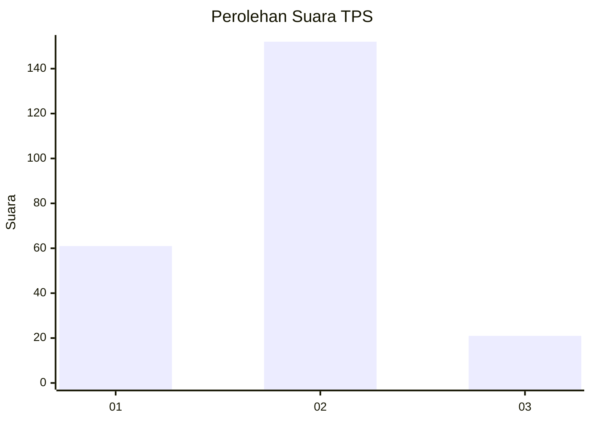
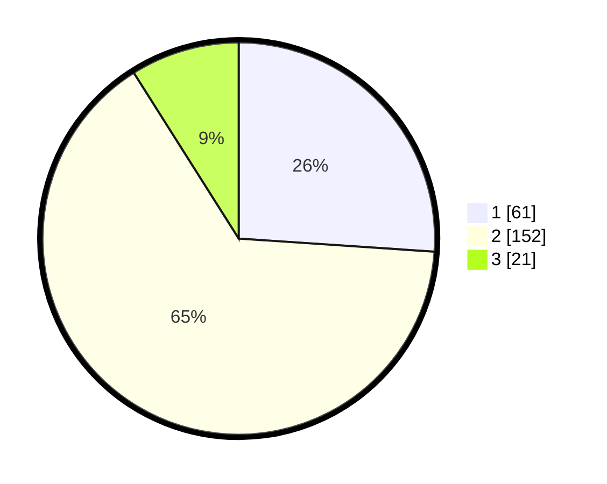

# Hasil

## Grafik

## Tabel

| No. | Nama Paslon    | Suara | Suara (raw) | Persentase |
|:--- |:-------------- | -----:| -----------:| ----------:|
| 1   | ANIES MUHAIMIN | 61    | [61][p-1]   | 26,07      |
| 2   | PRABOWO GIBRAN | 152   | [152][p-2]  | 64,96      |
| 3   | GANJAR MAHFUD  | 21    | [21][p-3]   | 8,97       |

[p-1]: https://github.com/gigit-pemilu/pemilu-2024/blob/main/pilpres/hitung-suara/sub/35-jawa-timur/sub/13-probolinggo/sub/05-leces/sub/2006-sumberkedawung/sub/005-tps/sub/paslon-1.txt
[p-2]: https://github.com/gigit-pemilu/pemilu-2024/blob/main/pilpres/hitung-suara/sub/35-jawa-timur/sub/13-probolinggo/sub/05-leces/sub/2006-sumberkedawung/sub/005-tps/sub/paslon-2.txt
[p-3]: https://github.com/gigit-pemilu/pemilu-2024/blob/main/pilpres/hitung-suara/sub/35-jawa-timur/sub/13-probolinggo/sub/05-leces/sub/2006-sumberkedawung/sub/005-tps/sub/paslon-3.txt

## Foto C Plano

https://sirekap-obj-formc.kpu.go.id/7d73/pemilu/ppwp/35/13/05/20/06/3513052006005-20240215-015335--7b20d4e4-6298-4c04-9e0f-fc14d0f7e037.jpg

https://sirekap-obj-formc.kpu.go.id/7d73/pemilu/ppwp/35/13/05/20/06/3513052006005-20240215-015643--f9882590-0fe0-4c2d-bd64-8d7c43938b6d.jpg

https://sirekap-obj-formc.kpu.go.id/7d73/pemilu/ppwp/35/13/05/20/06/3513052006005-20240215-015758--ceae7ce5-d267-4c00-a24c-b572b39e8b2a.jpg

## Metadata

| Key        | Value               |
| ---------- | ------------------- |
| Time Stamp | 2024-02-15 20:30:46 |

