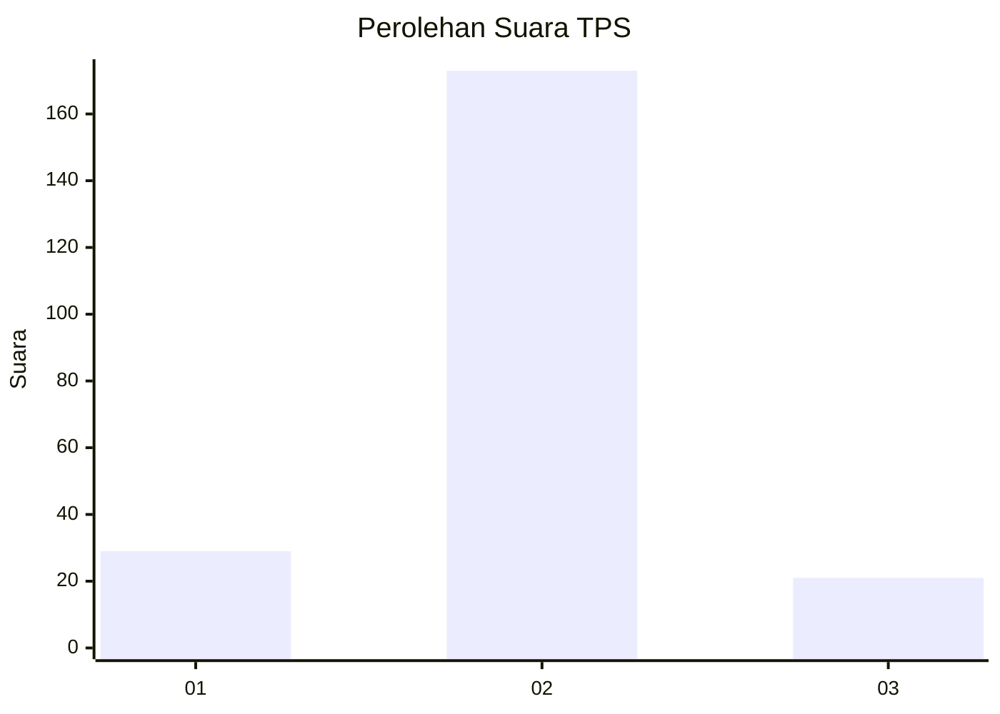
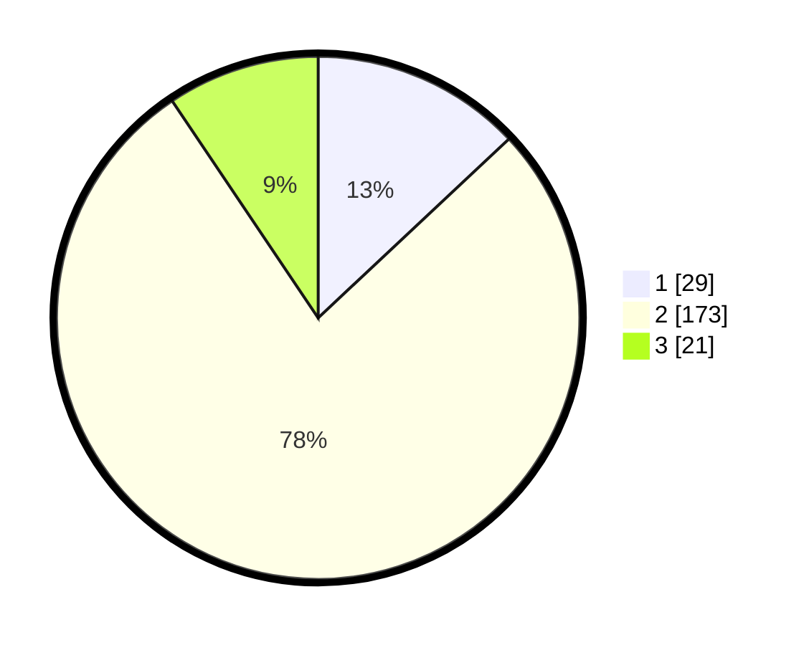

# Hasil

## Grafik

## Tabel

| No. | Nama Paslon    | Suara | Suara (raw) | Persentase |
|:--- |:-------------- | -----:| -----------:| ----------:|
| 1   | ANIES MUHAIMIN | 29    | [29][p-1]   | 13,00      |
| 2   | PRABOWO GIBRAN | 173   | [173][p-2]  | 77,58      |
| 3   | GANJAR MAHFUD  | 21    | [21][p-3]   | 9,42       |

[p-1]: https://github.com/gigit-pemilu/pemilu-2024/blob/main/pilpres/hitung-suara/sub/35-jawa-timur/sub/13-probolinggo/sub/05-leces/sub/2008-clarak/sub/003-tps/sub/paslon-1.txt
[p-2]: https://github.com/gigit-pemilu/pemilu-2024/blob/main/pilpres/hitung-suara/sub/35-jawa-timur/sub/13-probolinggo/sub/05-leces/sub/2008-clarak/sub/003-tps/sub/paslon-2.txt
[p-3]: https://github.com/gigit-pemilu/pemilu-2024/blob/main/pilpres/hitung-suara/sub/35-jawa-timur/sub/13-probolinggo/sub/05-leces/sub/2008-clarak/sub/003-tps/sub/paslon-3.txt

## Foto C Plano

https://sirekap-obj-formc.kpu.go.id/72d0/pemilu/ppwp/35/13/05/20/08/3513052008003-20240215-031549--1346d9aa-12b4-413b-96ba-f0c3ad37438c.jpg

https://sirekap-obj-formc.kpu.go.id/72d0/pemilu/ppwp/35/13/05/20/08/3513052008003-20240216-231318--27b24df6-4611-438c-a861-2723b06c6256.jpg

https://sirekap-obj-formc.kpu.go.id/72d0/pemilu/ppwp/35/13/05/20/08/3513052008003-20240215-031918--a36a10db-b710-4029-99d4-a512171a2ae7.jpg

## Metadata

| Key        | Value               |
| ---------- | ------------------- |
| Time Stamp | 2024-02-19 21:00:00 |

