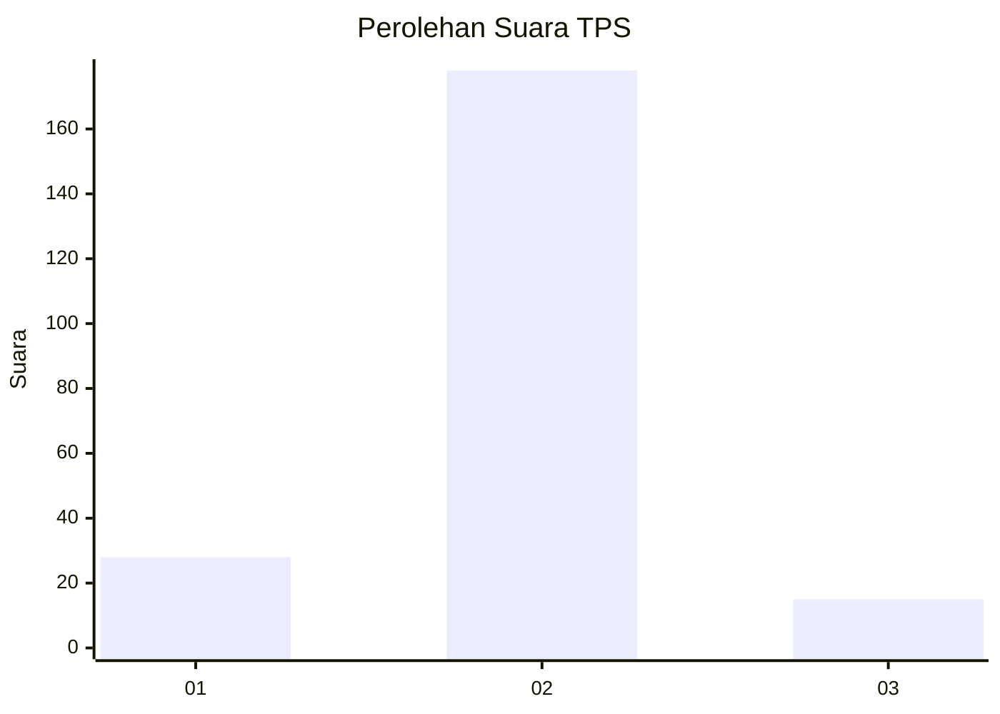
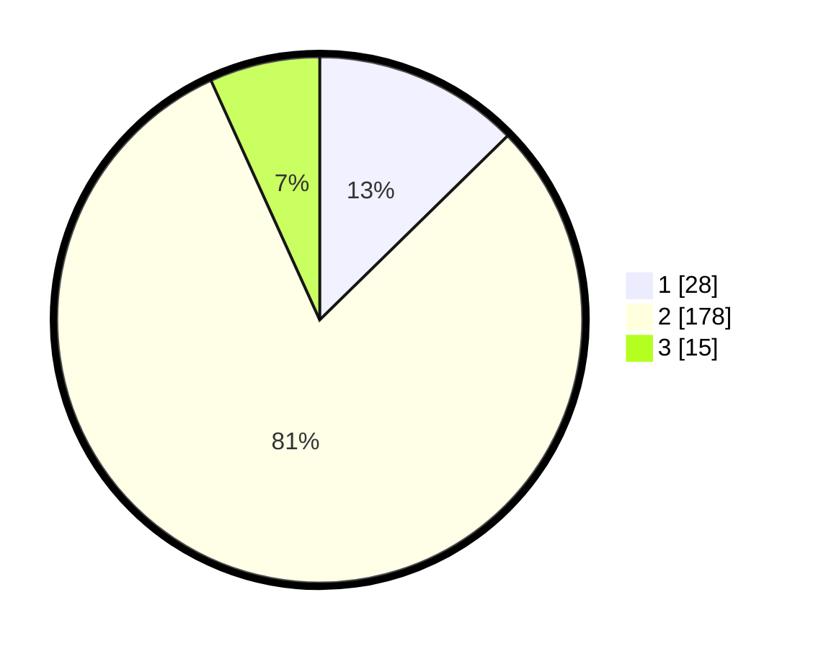

# Hasil

## Grafik

## Tabel

| No. | Nama Paslon    | Suara | Suara (raw) | Persentase |
|:--- |:-------------- | -----:| -----------:| ----------:|
| 1   | ANIES MUHAIMIN | 28    | [28][p-1]   | 12,67      |
| 2   | PRABOWO GIBRAN | 178   | [178][p-2]  | 80,54      |
| 3   | GANJAR MAHFUD  | 15    | [15][p-3]   | 6,79       |

[p-1]: https://github.com/gigit-pemilu/pemilu-2024-35-jawa-timur/blob/main/pilpres/hitung-suara/sub/35-jawa-timur/sub/13-probolinggo/sub/06-banyuanyar/sub/2001-sentulan/sub/003-tps/sub/paslon-1.txt
[p-2]: https://github.com/gigit-pemilu/pemilu-2024-35-jawa-timur/blob/main/pilpres/hitung-suara/sub/35-jawa-timur/sub/13-probolinggo/sub/06-banyuanyar/sub/2001-sentulan/sub/003-tps/sub/paslon-2.txt
[p-3]: https://github.com/gigit-pemilu/pemilu-2024-35-jawa-timur/blob/main/pilpres/hitung-suara/sub/35-jawa-timur/sub/13-probolinggo/sub/06-banyuanyar/sub/2001-sentulan/sub/003-tps/sub/paslon-3.txt

## Foto C Plano

https://sirekap-obj-formc.kpu.go.id/8b35/pemilu/ppwp/35/13/06/20/01/3513062001003-20240214-155412--a8419342-c829-44fc-901a-9573d4bcfc3e.jpg

https://sirekap-obj-formc.kpu.go.id/8b35/pemilu/ppwp/35/13/06/20/01/3513062001003-20240214-155534--ee68d613-cde4-4bbb-97f1-9ea00e07cde9.jpg

https://sirekap-obj-formc.kpu.go.id/8b35/pemilu/ppwp/35/13/06/20/01/3513062001003-20240214-155721--f91bbee5-f5fb-4d93-9b54-d65b0c71ee50.jpg

## Metadata

| Key        | Value               |
| ---------- | ------------------- |
| Time Stamp | 2024-02-19 06:16:00 |

