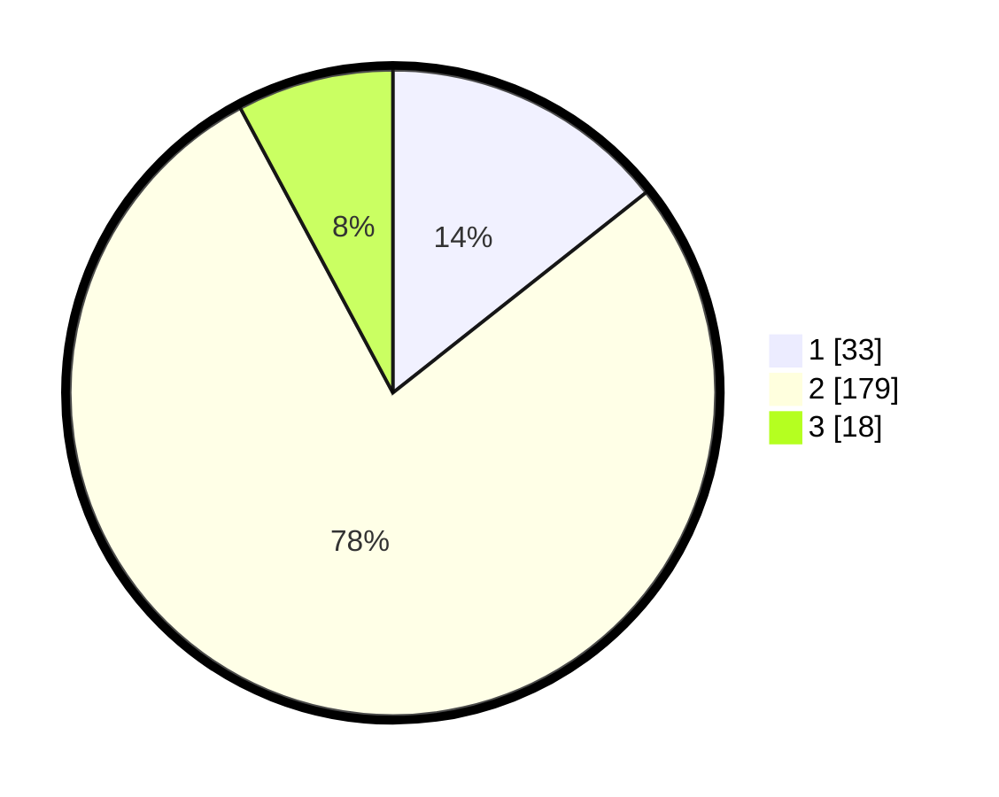

# Hasil

## Grafik

## Tabel

| No. | Nama Paslon    | Suara | Suara (raw) | Persentase |
|:--- |:-------------- | -----:| -----------:| ----------:|
| 1   | ANIES MUHAIMIN | 33    | [33][p-1]   | 14,35      |
| 2   | PRABOWO GIBRAN | 179   | [179][p-2]  | 77,83      |
| 3   | GANJAR MAHFUD  | 18    | [18][p-3]   | 7,83       |

[p-1]: https://github.com/gigit-pemilu/pemilu-2024/blob/main/pilpres/hitung-suara/sub/35-jawa-timur/sub/13-probolinggo/sub/06-banyuanyar/sub/2002-gadingkulon/sub/004-tps/sub/paslon-1.txt
[p-2]: https://github.com/gigit-pemilu/pemilu-2024/blob/main/pilpres/hitung-suara/sub/35-jawa-timur/sub/13-probolinggo/sub/06-banyuanyar/sub/2002-gadingkulon/sub/004-tps/sub/paslon-2.txt
[p-3]: https://github.com/gigit-pemilu/pemilu-2024/blob/main/pilpres/hitung-suara/sub/35-jawa-timur/sub/13-probolinggo/sub/06-banyuanyar/sub/2002-gadingkulon/sub/004-tps/sub/paslon-3.txt

## Foto C Plano

https://sirekap-obj-formc.kpu.go.id/4b6b/pemilu/ppwp/35/13/06/20/02/3513062002004-20240217-143342--21dda574-7215-4250-883d-ca69a630f264.jpg

https://sirekap-obj-formc.kpu.go.id/4b6b/pemilu/ppwp/35/13/06/20/02/3513062002004-20240214-213815--cc2611fd-48c1-44d4-8d53-761bbe56bd98.jpg

https://sirekap-obj-formc.kpu.go.id/4b6b/pemilu/ppwp/35/13/06/20/02/3513062002004-20240214-213856--daf22aeb-971f-4012-8506-d2ceb75d4399.jpg

## Metadata

| Key        | Value               |
| ---------- | ------------------- |
| Time Stamp | 2024-02-19 06:16:00 |

## DATA PEMILIH TETAP

Jumlah pemilih dalam DPT: **285**.
 * L: **633**.
 * P: **850**.

## DATA PENGGUNA HAK PILIH

Jumlah pengguna hak pilih dalam DPT: **241**.
 * L: **408**.
 * P: **433**.

Jumlah pengguna hak pilih dalam DPTb: **29**.
 * L: **887**.
 * P: **882**.

Jumlah pengguna hak pilih dalam DPK: **0**.
 * L: **0**.
 * P: **88**.

Jumlah pengguna hak pilih: **250**.
 * L: **115**.
 * P: **835**.

## JUMLAH SUARA SAH DAN TIDAK SAH

JUMLAH SELURUH SUARA SAH: **230**.

JUMLAH SUARA TIDAK SAH: **20**.

JUMLAH SELURUH SUARA SAH DAN SUARA TIDAK SAH: **250**.

