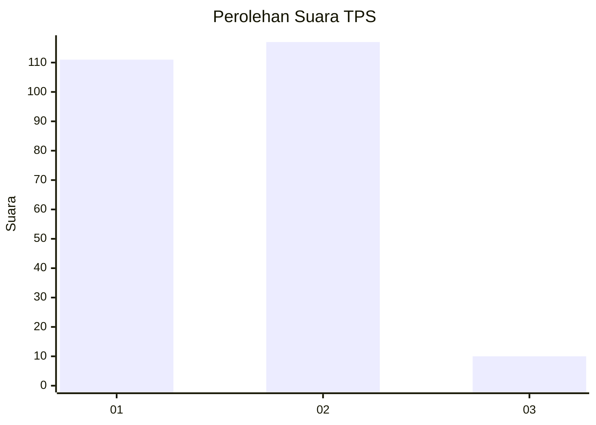
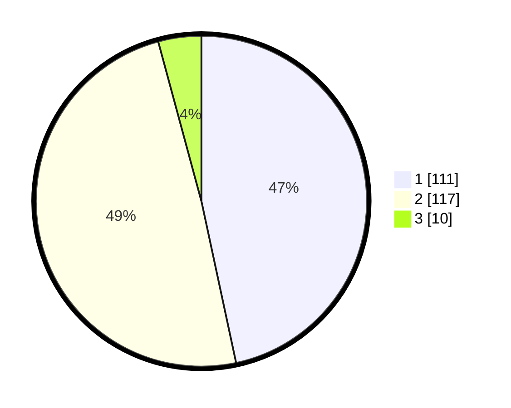

# Hasil

## Grafik

## Tabel

| No. | Nama Paslon    | Suara | Suara (raw) | Persentase |
|:--- |:-------------- | -----:| -----------:| ----------:|
| 1   | ANIES MUHAIMIN | 111   | [111][p-1]  | 46,64      |
| 2   | PRABOWO GIBRAN | 117   | [117][p-2]  | 49,16      |
| 3   | GANJAR MAHFUD  | 10    | [10][p-3]   | 4,20       |

[p-1]: https://github.com/gigit-pemilu/pemilu-2024/blob/main/pilpres/hitung-suara/sub/35-jawa-timur/sub/13-probolinggo/sub/06-banyuanyar/sub/2006-pendil/sub/007-tps/sub/paslon-1.txt
[p-2]: https://github.com/gigit-pemilu/pemilu-2024/blob/main/pilpres/hitung-suara/sub/35-jawa-timur/sub/13-probolinggo/sub/06-banyuanyar/sub/2006-pendil/sub/007-tps/sub/paslon-2.txt
[p-3]: https://github.com/gigit-pemilu/pemilu-2024/blob/main/pilpres/hitung-suara/sub/35-jawa-timur/sub/13-probolinggo/sub/06-banyuanyar/sub/2006-pendil/sub/007-tps/sub/paslon-3.txt

## Foto C Plano

https://sirekap-obj-formc.kpu.go.id/6574/pemilu/ppwp/35/13/06/20/06/3513062006007-20240215-003522--26a8d19f-4f5a-47c0-8575-c4abdaefc2a1.jpg

https://sirekap-obj-formc.kpu.go.id/6574/pemilu/ppwp/35/13/06/20/06/3513062006007-20240215-011804--e4a25cf0-7d50-4144-9eaf-7d36a154e4fa.jpg

https://sirekap-obj-formc.kpu.go.id/6574/pemilu/ppwp/35/13/06/20/06/3513062006007-20240215-011821--76fe8aeb-e789-4382-96c4-d4b35edea2d4.jpg

## Metadata

| Key        | Value               |
| ---------- | ------------------- |
| Time Stamp | 2024-02-19 06:16:00 |

