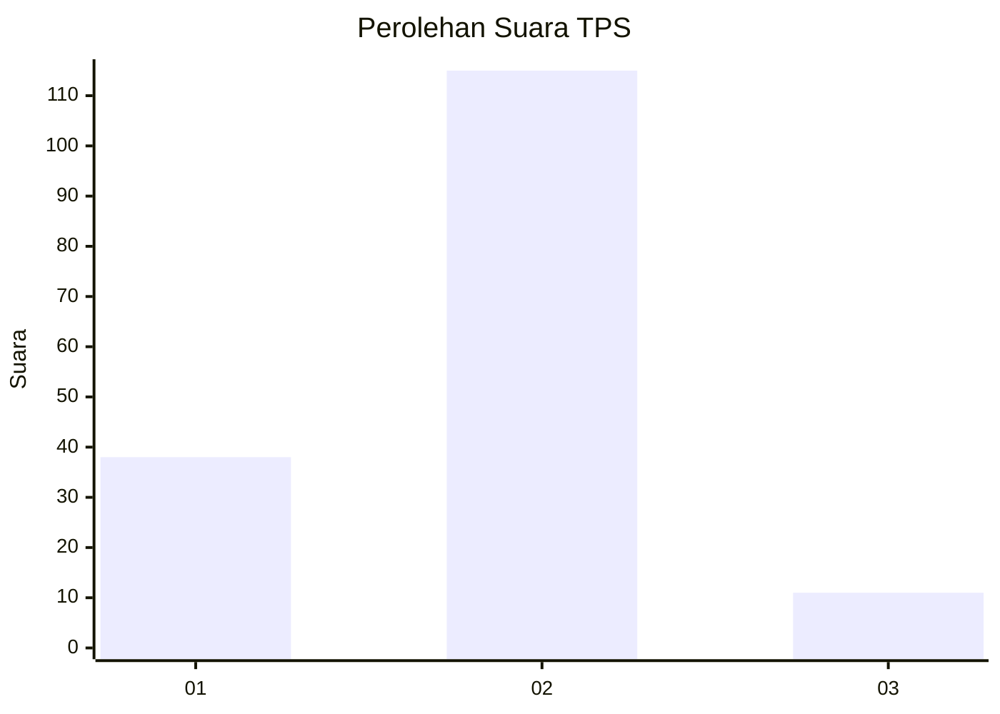

# Hasil

## Grafik

## Tabel

| No. | Nama Paslon    | Suara | Suara (raw) | Persentase |
|:--- |:-------------- | -----:| -----------:| ----------:|
| 1   | ANIES MUHAIMIN | 38    | [38][p-1]   | 23,17      |
| 2   | PRABOWO GIBRAN | 115   | [115][p-2]  | 70,12      |
| 3   | GANJAR MAHFUD  | 11    | [11][p-3]   | 6,71       |

[p-1]: https://github.com/gigit-pemilu/pemilu-2024-35-jawa-timur/blob/main/pilpres/hitung-suara/sub/35-jawa-timur/sub/13-probolinggo/sub/06-banyuanyar/sub/2009-liprak-kidul/sub/013-tps/sub/paslon-1.txt
[p-2]: https://github.com/gigit-pemilu/pemilu-2024-35-jawa-timur/blob/main/pilpres/hitung-suara/sub/35-jawa-timur/sub/13-probolinggo/sub/06-banyuanyar/sub/2009-liprak-kidul/sub/013-tps/sub/paslon-2.txt
[p-3]: https://github.com/gigit-pemilu/pemilu-2024-35-jawa-timur/blob/main/pilpres/hitung-suara/sub/35-jawa-timur/sub/13-probolinggo/sub/06-banyuanyar/sub/2009-liprak-kidul/sub/013-tps/sub/paslon-3.txt

## Foto C Plano

https://sirekap-obj-formc.kpu.go.id/c77b/pemilu/ppwp/35/13/06/20/09/3513062009013-20240217-153732--a23d8555-39fd-4e87-9b91-8a05e632d1e7.jpg

https://sirekap-obj-formc.kpu.go.id/c77b/pemilu/ppwp/35/13/06/20/09/3513062009013-20240217-193621--bb61ef64-eabb-4cca-81a8-e8a25c33c3b4.jpg

https://sirekap-obj-formc.kpu.go.id/c77b/pemilu/ppwp/35/13/06/20/09/3513062009013-20240217-153947--3f5fe8cd-b37c-43ba-91d7-49ccfae40575.jpg

## Metadata

| Key        | Value               |
| ---------- | ------------------- |
| Time Stamp | 2024-02-19 06:16:00 |

