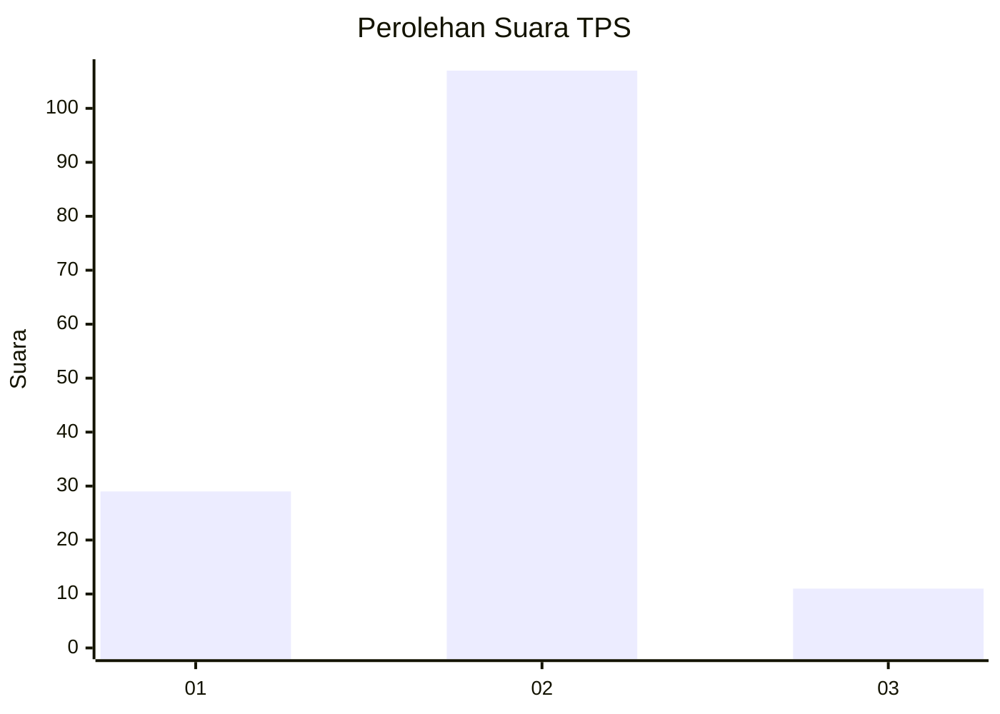
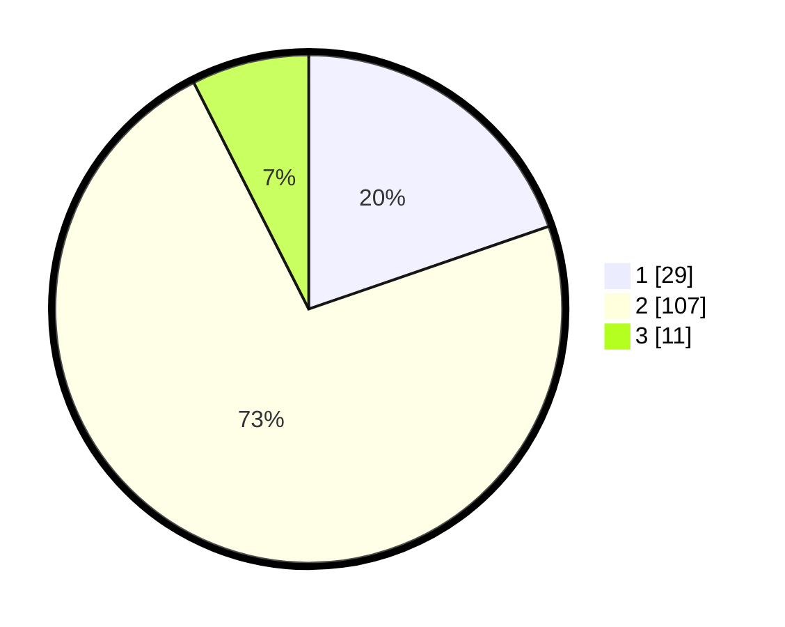

# Hasil

## Grafik

## Tabel

| No. | Nama Paslon    | Suara | Suara (raw) | Persentase |
|:--- |:-------------- | -----:| -----------:| ----------:|
| 1   | ANIES MUHAIMIN | 29    | [29][p-1]   | 19,73      |
| 2   | PRABOWO GIBRAN | 107   | [107][p-2]  | 72,79      |
| 3   | GANJAR MAHFUD  | 11    | [11][p-3]   | 7,48       |

[p-1]: https://github.com/gigit-pemilu/pemilu-2024/blob/main/pilpres/hitung-suara/sub/35-jawa-timur/sub/13-probolinggo/sub/06-banyuanyar/sub/2010-liprak-kulon/sub/007-tps/sub/paslon-1.txt
[p-2]: https://github.com/gigit-pemilu/pemilu-2024/blob/main/pilpres/hitung-suara/sub/35-jawa-timur/sub/13-probolinggo/sub/06-banyuanyar/sub/2010-liprak-kulon/sub/007-tps/sub/paslon-2.txt
[p-3]: https://github.com/gigit-pemilu/pemilu-2024/blob/main/pilpres/hitung-suara/sub/35-jawa-timur/sub/13-probolinggo/sub/06-banyuanyar/sub/2010-liprak-kulon/sub/007-tps/sub/paslon-3.txt

## Foto C Plano

https://sirekap-obj-formc.kpu.go.id/d58e/pemilu/ppwp/35/13/06/20/10/3513062010007-20240214-155632--1fe952fd-1c94-4240-b0e0-b8fe1658fe0a.jpg

https://sirekap-obj-formc.kpu.go.id/d58e/pemilu/ppwp/35/13/06/20/10/3513062010007-20240214-155546--e7ccb8f7-275b-4f29-b35b-c313608f7682.jpg

https://sirekap-obj-formc.kpu.go.id/d58e/pemilu/ppwp/35/13/06/20/10/3513062010007-20240214-155703--0fa80731-29c7-402a-8813-70cdc57db6ff.jpg

## Metadata

| Key        | Value               |
| ---------- | ------------------- |
| Time Stamp | 2024-02-19 06:16:00 |

