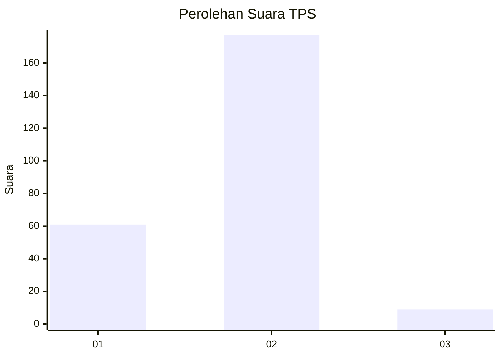
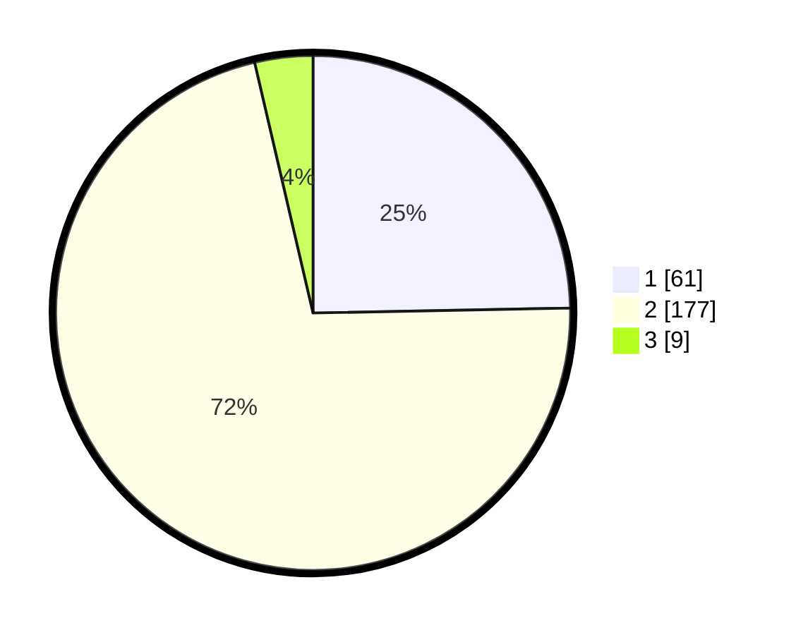

# Hasil

## Grafik

## Tabel

| No. | Nama Paslon    | Suara | Suara (raw) | Persentase |
|:--- |:-------------- | -----:| -----------:| ----------:|
| 1   | ANIES MUHAIMIN | 61    | [61][p-1]   | 24,70      |
| 2   | PRABOWO GIBRAN | 177   | [177][p-2]  | 71,66      |
| 3   | GANJAR MAHFUD  | 9     | [9][p-3]    | 3,64       |

[p-1]: https://github.com/gigit-pemilu/pemilu-2024/blob/main/pilpres/hitung-suara/sub/35-jawa-timur/sub/13-probolinggo/sub/07-tiris/sub/2004-tlogosari/sub/001-tps/sub/paslon-1.txt
[p-2]: https://github.com/gigit-pemilu/pemilu-2024/blob/main/pilpres/hitung-suara/sub/35-jawa-timur/sub/13-probolinggo/sub/07-tiris/sub/2004-tlogosari/sub/001-tps/sub/paslon-2.txt
[p-3]: https://github.com/gigit-pemilu/pemilu-2024/blob/main/pilpres/hitung-suara/sub/35-jawa-timur/sub/13-probolinggo/sub/07-tiris/sub/2004-tlogosari/sub/001-tps/sub/paslon-3.txt

## Foto C Plano

https://sirekap-obj-formc.kpu.go.id/d013/pemilu/ppwp/35/13/07/20/04/3513072004001-20240215-001215--9042f3b0-3910-4f3c-900c-dd8ae3106935.jpg

https://sirekap-obj-formc.kpu.go.id/d013/pemilu/ppwp/35/13/07/20/04/3513072004001-20240215-072022--d2c712f9-e3a9-4bde-b685-c9d1fb56a0d9.jpg

https://sirekap-obj-formc.kpu.go.id/d013/pemilu/ppwp/35/13/07/20/04/3513072004001-20240215-172650--cd60573f-2504-4a67-b581-2ce01571e578.jpg

## Metadata

| Key        | Value               |
| ---------- | ------------------- |
| Time Stamp | 2024-02-17 11:00:02 |

