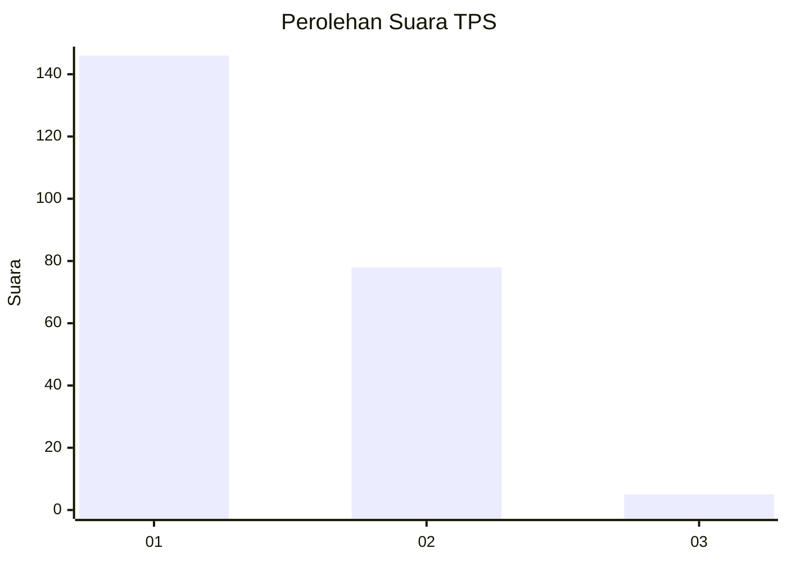
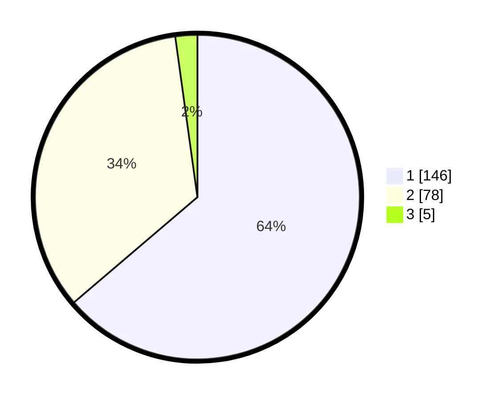

# Hasil

## Grafik

## Tabel

| No. | Nama Paslon    | Suara | Suara (raw) | Persentase |
|:--- |:-------------- | -----:| -----------:| ----------:|
| 1   | ANIES MUHAIMIN | 146   | [146][p-1]  | 63,76      |
| 2   | PRABOWO GIBRAN | 78    | [78][p-2]   | 34,06      |
| 3   | GANJAR MAHFUD  | 5     | [5][p-3]    | 2,18       |

[p-1]: https://github.com/gigit-pemilu/pemilu-2024-35-jawa-timur/blob/main/pilpres/hitung-suara/sub/35-jawa-timur/sub/13-probolinggo/sub/07-tiris/sub/2004-tlogosari/sub/002-tps/sub/paslon-1.txt
[p-2]: https://github.com/gigit-pemilu/pemilu-2024-35-jawa-timur/blob/main/pilpres/hitung-suara/sub/35-jawa-timur/sub/13-probolinggo/sub/07-tiris/sub/2004-tlogosari/sub/002-tps/sub/paslon-2.txt
[p-3]: https://github.com/gigit-pemilu/pemilu-2024-35-jawa-timur/blob/main/pilpres/hitung-suara/sub/35-jawa-timur/sub/13-probolinggo/sub/07-tiris/sub/2004-tlogosari/sub/002-tps/sub/paslon-3.txt

## Foto C Plano

https://sirekap-obj-formc.kpu.go.id/5546/pemilu/ppwp/35/13/07/20/04/3513072004002-20240215-125528--4b2b0adb-37f7-43e3-9ff2-c68cefaf7f30.jpg

https://sirekap-obj-formc.kpu.go.id/5546/pemilu/ppwp/35/13/07/20/04/3513072004002-20240215-194720--6ff2ba3d-9e21-4245-ac8b-6856941f5304.jpg

https://sirekap-obj-formc.kpu.go.id/5546/pemilu/ppwp/35/13/07/20/04/3513072004002-20240215-100029--99946775-784a-4f87-b229-2d6b2a9be52b.jpg

## Metadata

| Key        | Value               |
| ---------- | ------------------- |
| Time Stamp | 2024-02-17 11:00:02 |

