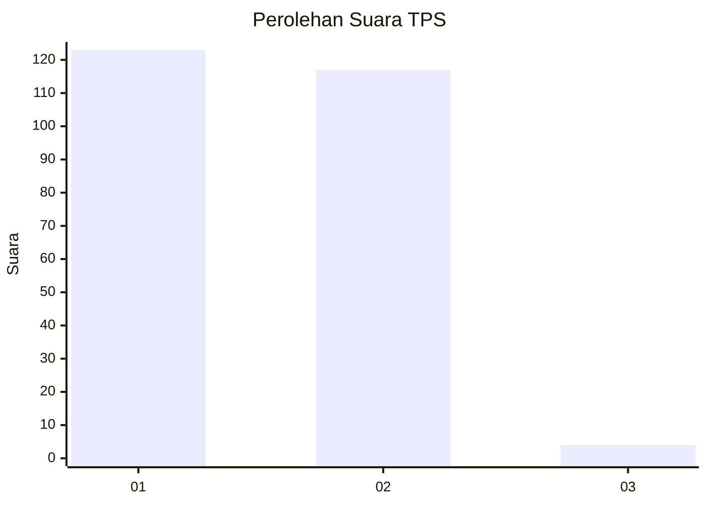
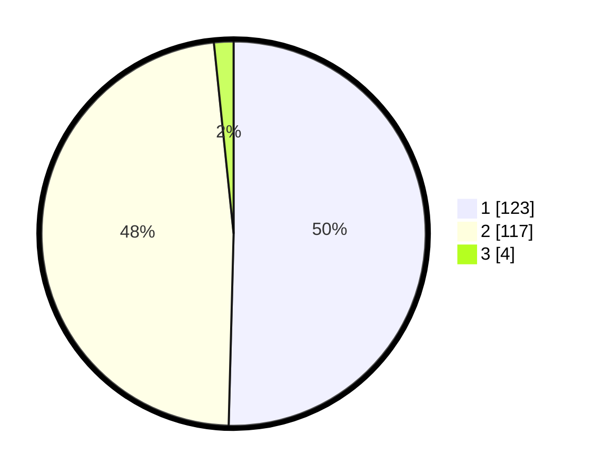

# Hasil

## Grafik

## Tabel

| No. | Nama Paslon    | Suara | Suara (raw) | Persentase |
|:--- |:-------------- | -----:| -----------:| ----------:|
| 1   | ANIES MUHAIMIN | 123   | [123][p-1]  | 50,41      |
| 2   | PRABOWO GIBRAN | 117   | [117][p-2]  | 47,95      |
| 3   | GANJAR MAHFUD  | 4     | [4][p-3]    | 1,64       |

[p-1]: https://github.com/gigit-pemilu/pemilu-2024-35-jawa-timur/blob/main/pilpres/hitung-suara/sub/35-jawa-timur/sub/13-probolinggo/sub/07-tiris/sub/2004-tlogosari/sub/003-tps/sub/paslon-1.txt
[p-2]: https://github.com/gigit-pemilu/pemilu-2024-35-jawa-timur/blob/main/pilpres/hitung-suara/sub/35-jawa-timur/sub/13-probolinggo/sub/07-tiris/sub/2004-tlogosari/sub/003-tps/sub/paslon-2.txt
[p-3]: https://github.com/gigit-pemilu/pemilu-2024-35-jawa-timur/blob/main/pilpres/hitung-suara/sub/35-jawa-timur/sub/13-probolinggo/sub/07-tiris/sub/2004-tlogosari/sub/003-tps/sub/paslon-3.txt

## Foto C Plano

https://sirekap-obj-formc.kpu.go.id/ac7b/pemilu/ppwp/35/13/07/20/04/3513072004003-20240215-103948--23cc296f-71e8-4710-b703-225241923337.jpg

https://sirekap-obj-formc.kpu.go.id/ac7b/pemilu/ppwp/35/13/07/20/04/3513072004003-20240214-233906--560f6327-3579-46e7-a229-c390d66cdc30.jpg

https://sirekap-obj-formc.kpu.go.id/ac7b/pemilu/ppwp/35/13/07/20/04/3513072004003-20240214-233637--a0f13fc2-4c5e-4b43-a472-23db8785859d.jpg

## Metadata

| Key        | Value               |
| ---------- | ------------------- |
| Time Stamp | 2024-02-17 11:00:02 |

