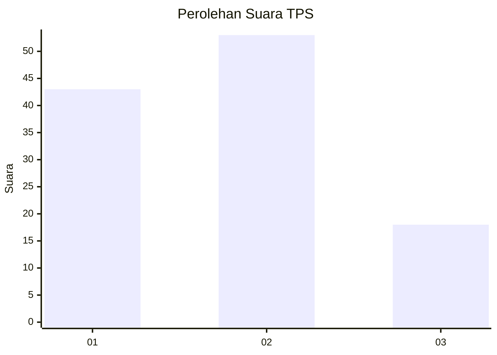
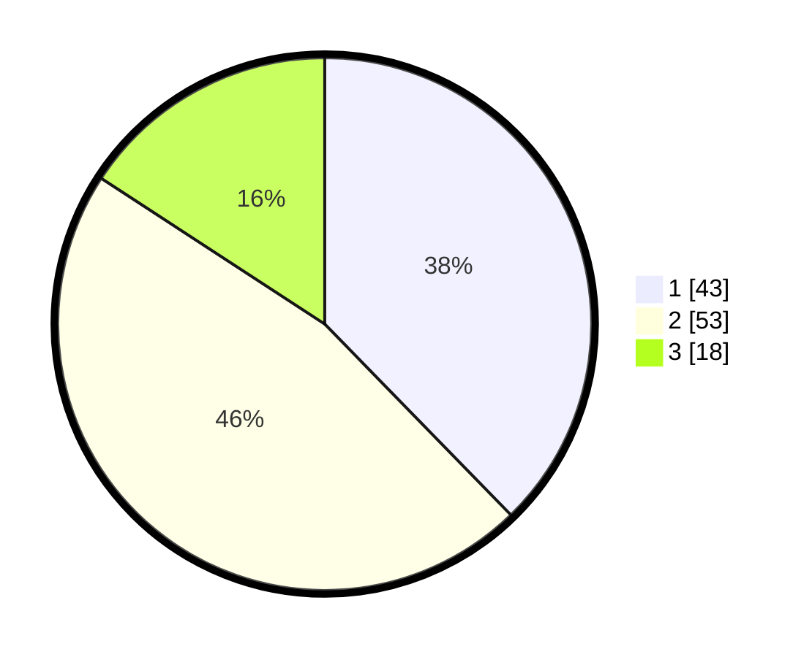

# Hasil

## Grafik

## Tabel

| No. | Nama Paslon    | Suara | Suara (raw) | Persentase |
|:--- |:-------------- | -----:| -----------:| ----------:|
| 1   | ANIES MUHAIMIN | 43    | [43][p-1]   | 37,72      |
| 2   | PRABOWO GIBRAN | 53    | [53][p-2]   | 46,49      |
| 3   | GANJAR MAHFUD  | 18    | [18][p-3]   | 15,79      |

[p-1]: https://github.com/gigit-pemilu/pemilu-2024-35-jawa-timur/blob/main/pilpres/hitung-suara/sub/35-jawa-timur/sub/13-probolinggo/sub/07-tiris/sub/2008-ranuagung/sub/021-tps/sub/paslon-1.txt
[p-2]: https://github.com/gigit-pemilu/pemilu-2024-35-jawa-timur/blob/main/pilpres/hitung-suara/sub/35-jawa-timur/sub/13-probolinggo/sub/07-tiris/sub/2008-ranuagung/sub/021-tps/sub/paslon-2.txt
[p-3]: https://github.com/gigit-pemilu/pemilu-2024-35-jawa-timur/blob/main/pilpres/hitung-suara/sub/35-jawa-timur/sub/13-probolinggo/sub/07-tiris/sub/2008-ranuagung/sub/021-tps/sub/paslon-3.txt

## Foto C Plano

https://sirekap-obj-formc.kpu.go.id/5213/pemilu/ppwp/35/13/07/20/08/3513072008021-20240220-090550--7d2f7b90-f4ae-43c9-8292-f053341d84cc.jpg

https://sirekap-obj-formc.kpu.go.id/5213/pemilu/ppwp/35/13/07/20/08/3513072008021-20240214-203937--f87c15bb-fff9-4640-9ce9-aa5fd08b6e3f.jpg

https://sirekap-obj-formc.kpu.go.id/5213/pemilu/ppwp/35/13/07/20/08/3513072008021-20240216-074846--7f1fa745-2721-472e-b78f-637522f1c44b.jpg

## Metadata

| Key        | Value               |
| ---------- | ------------------- |
| Time Stamp | 2024-02-24 22:31:28 |

