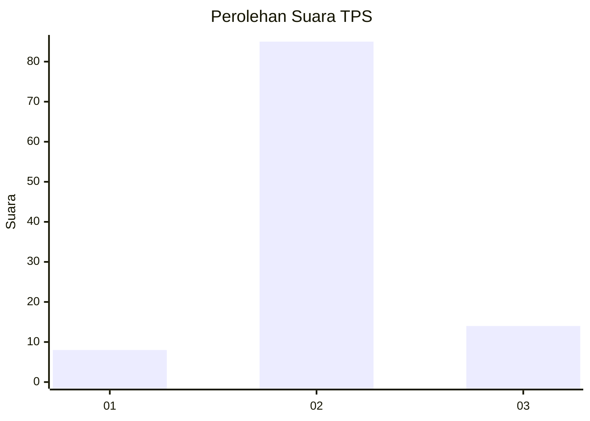
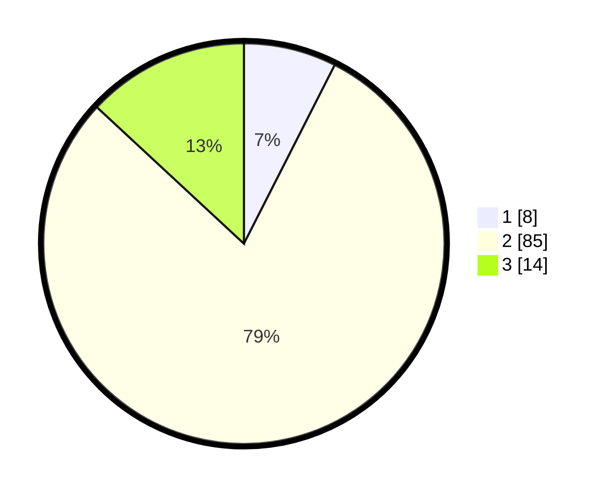

# Hasil

## Grafik

## Tabel

| No. | Nama Paslon    | Suara | Suara (raw) | Persentase |
|:--- |:-------------- | -----:| -----------:| ----------:|
| 1   | ANIES MUHAIMIN | 8     | [8][p-1]    | 7,48       |
| 2   | PRABOWO GIBRAN | 85    | [85][p-2]   | 79,44      |
| 3   | GANJAR MAHFUD  | 14    | [14][p-3]   | 13,08      |

[p-1]: https://github.com/gigit-pemilu/pemilu-2024/blob/main/pilpres/hitung-suara/sub/35-jawa-timur/sub/13-probolinggo/sub/07-tiris/sub/2010-wedusan/sub/007-tps/sub/paslon-1.txt
[p-2]: https://github.com/gigit-pemilu/pemilu-2024/blob/main/pilpres/hitung-suara/sub/35-jawa-timur/sub/13-probolinggo/sub/07-tiris/sub/2010-wedusan/sub/007-tps/sub/paslon-2.txt
[p-3]: https://github.com/gigit-pemilu/pemilu-2024/blob/main/pilpres/hitung-suara/sub/35-jawa-timur/sub/13-probolinggo/sub/07-tiris/sub/2010-wedusan/sub/007-tps/sub/paslon-3.txt

## Foto C Plano

https://sirekap-obj-formc.kpu.go.id/c528/pemilu/ppwp/35/13/07/20/10/3513072010007-20240215-125430--ab3da8eb-b0b4-458b-83c6-6e420be8321e.jpg

https://sirekap-obj-formc.kpu.go.id/c528/pemilu/ppwp/35/13/07/20/10/3513072010007-20240215-125835--a1aa81d2-2758-468f-aa27-82d49ad72ec7.jpg

https://sirekap-obj-formc.kpu.go.id/c528/pemilu/ppwp/35/13/07/20/10/3513072010007-20240215-020611--96435443-afde-4002-9801-69fb497d3a49.jpg

## Metadata

| Key        | Value               |
| ---------- | ------------------- |
| Time Stamp | 2024-02-24 22:31:28 |

