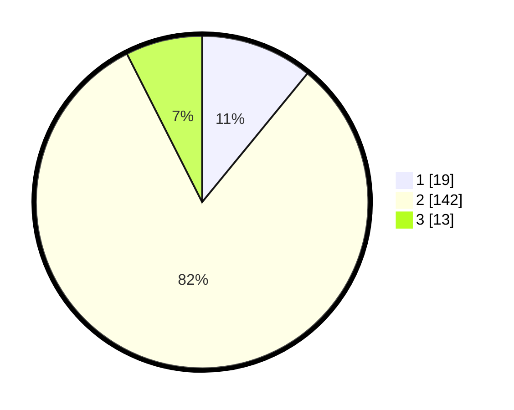

# Hasil

## Grafik

## Tabel

| No. | Nama Paslon    | Suara | Suara (raw) | Persentase |
|:--- |:-------------- | -----:| -----------:| ----------:|
| 1   | ANIES MUHAIMIN | 19    | [19][p-1]   | 10,92      |
| 2   | PRABOWO GIBRAN | 142   | [142][p-2]  | 81,61      |
| 3   | GANJAR MAHFUD  | 13    | [13][p-3]   | 7,47       |

[p-1]: https://github.com/gigit-pemilu/pemilu-2024-35-jawa-timur/blob/main/pilpres/hitung-suara/sub/35-jawa-timur/sub/13-probolinggo/sub/07-tiris/sub/2011-racek/sub/007-tps/sub/paslon-1.txt
[p-2]: https://github.com/gigit-pemilu/pemilu-2024-35-jawa-timur/blob/main/pilpres/hitung-suara/sub/35-jawa-timur/sub/13-probolinggo/sub/07-tiris/sub/2011-racek/sub/007-tps/sub/paslon-2.txt
[p-3]: https://github.com/gigit-pemilu/pemilu-2024-35-jawa-timur/blob/main/pilpres/hitung-suara/sub/35-jawa-timur/sub/13-probolinggo/sub/07-tiris/sub/2011-racek/sub/007-tps/sub/paslon-3.txt

## Foto C Plano

https://sirekap-obj-formc.kpu.go.id/c82a/pemilu/ppwp/35/13/07/20/11/3513072011007-20240214-230157--553ea0cc-ec79-43d8-b166-c5ff29c24e7c.jpg

https://sirekap-obj-formc.kpu.go.id/c82a/pemilu/ppwp/35/13/07/20/11/3513072011007-20240214-194443--dce865c5-5c34-40bd-b78c-4f55550e7e77.jpg

https://sirekap-obj-formc.kpu.go.id/c82a/pemilu/ppwp/35/13/07/20/11/3513072011007-20240214-215254--643b6bfe-9258-46db-9853-c58765bce47d.jpg

## Metadata

| Key        | Value               |
| ---------- | ------------------- |
| Time Stamp | 2024-02-25 16:00:00 |

