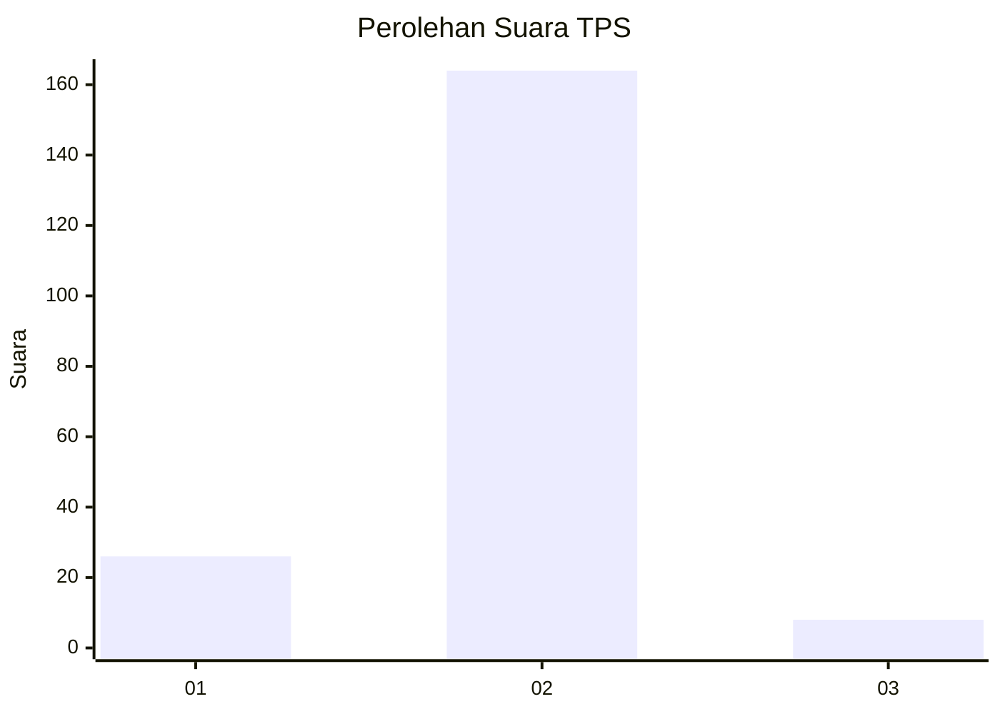
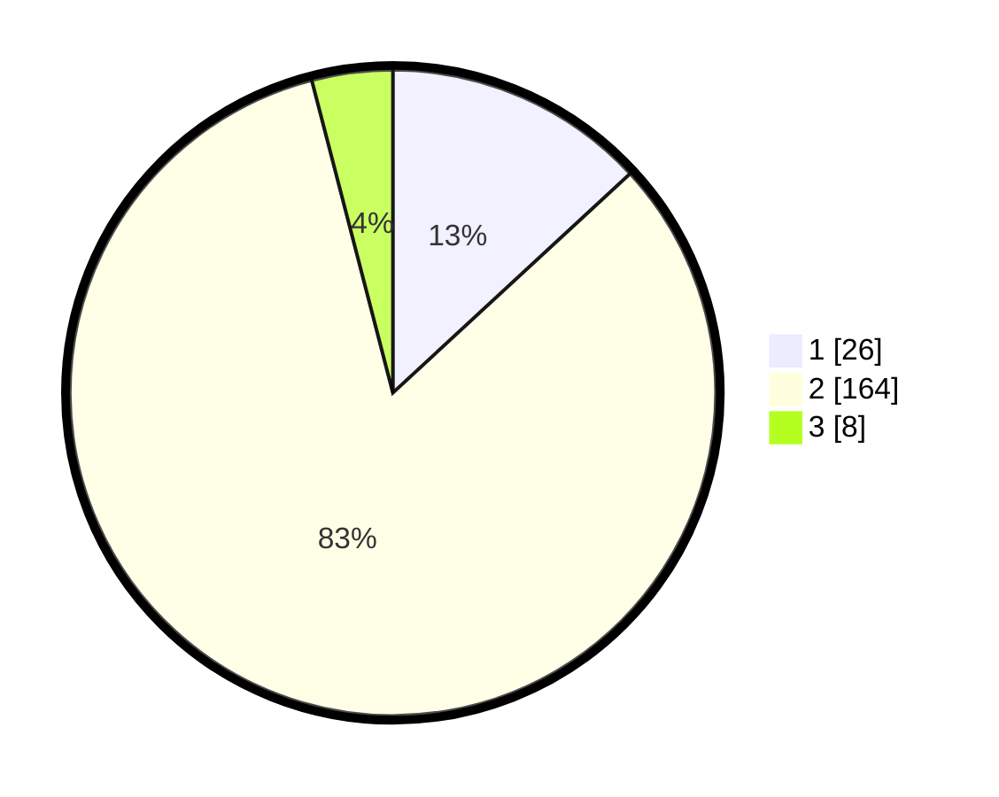

# Hasil

## Grafik

## Tabel

| No. | Nama Paslon    | Suara | Suara (raw) | Persentase |
|:--- |:-------------- | -----:| -----------:| ----------:|
| 1   | ANIES MUHAIMIN | 26    | [26][p-1]   | 13,13      |
| 2   | PRABOWO GIBRAN | 164   | [164][p-2]  | 82,83      |
| 3   | GANJAR MAHFUD  | 8     | [8][p-3]    | 4,04       |

[p-1]: https://github.com/gigit-pemilu/pemilu-2024-35-jawa-timur/blob/main/pilpres/hitung-suara/sub/35-jawa-timur/sub/13-probolinggo/sub/07-tiris/sub/2011-racek/sub/012-tps/sub/paslon-1.txt
[p-2]: https://github.com/gigit-pemilu/pemilu-2024-35-jawa-timur/blob/main/pilpres/hitung-suara/sub/35-jawa-timur/sub/13-probolinggo/sub/07-tiris/sub/2011-racek/sub/012-tps/sub/paslon-2.txt
[p-3]: https://github.com/gigit-pemilu/pemilu-2024-35-jawa-timur/blob/main/pilpres/hitung-suara/sub/35-jawa-timur/sub/13-probolinggo/sub/07-tiris/sub/2011-racek/sub/012-tps/sub/paslon-3.txt

## Foto C Plano

https://sirekap-obj-formc.kpu.go.id/4a4f/pemilu/ppwp/35/13/07/20/11/3513072011012-20240215-065733--68f5def5-b89a-4caa-adee-3df9a8e81c39.jpg

https://sirekap-obj-formc.kpu.go.id/4a4f/pemilu/ppwp/35/13/07/20/11/3513072011012-20240215-065956--d6298fc3-00ce-4a2a-aba5-83e80c0d7f19.jpg

https://sirekap-obj-formc.kpu.go.id/4a4f/pemilu/ppwp/35/13/07/20/11/3513072011012-20240215-070159--51c58153-d0ca-4724-b1da-430ea88635cd.jpg

## Metadata

| Key        | Value               |
| ---------- | ------------------- |
| Time Stamp | 2024-02-25 22:00:00 |

