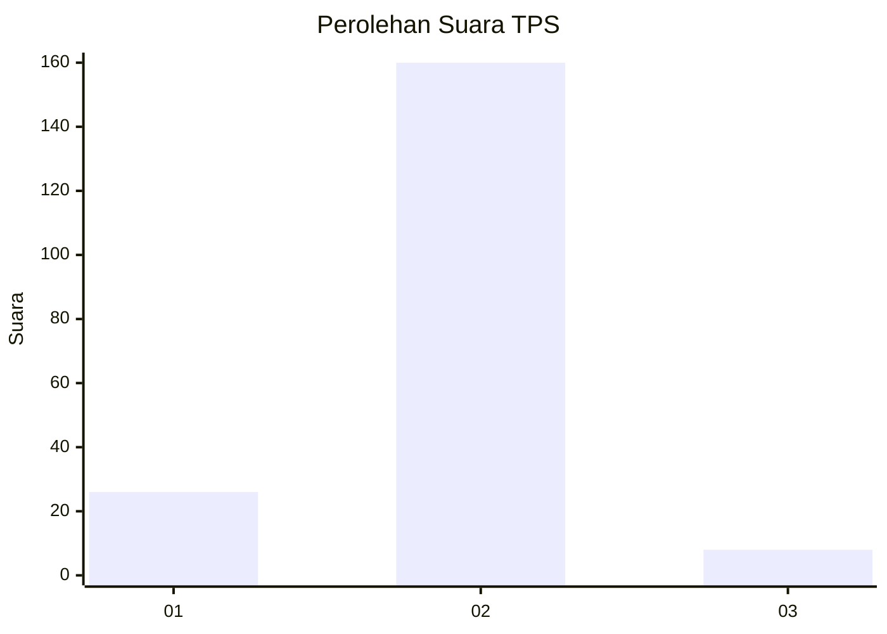
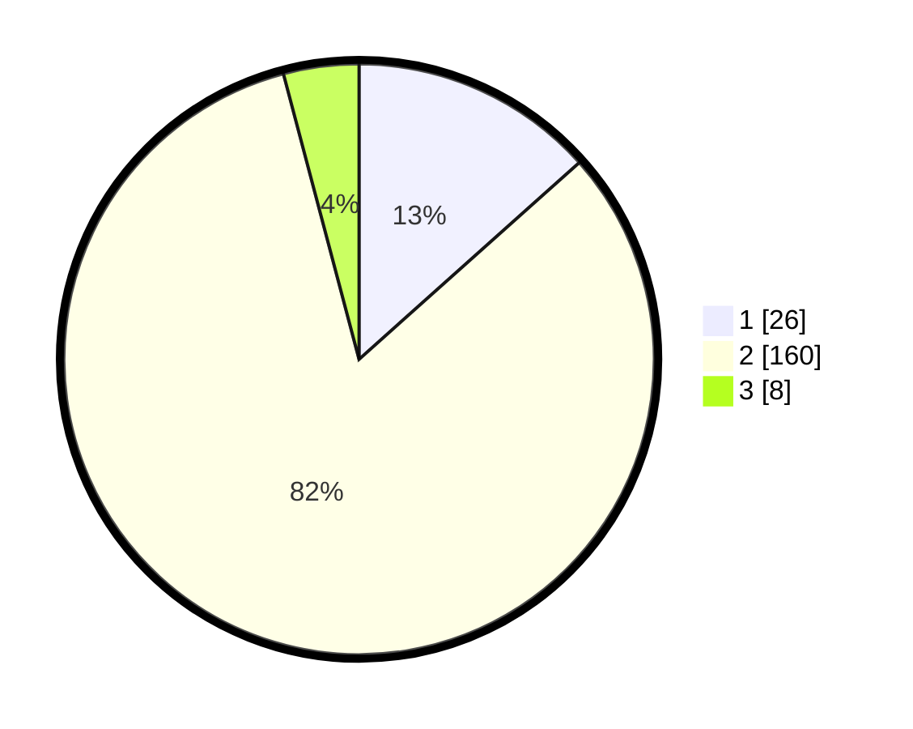

# Hasil

## Grafik

## Tabel

| No. | Nama Paslon    | Suara | Suara (raw) | Persentase |
|:--- |:-------------- | -----:| -----------:| ----------:|
| 1   | ANIES MUHAIMIN | 26    | [26][p-1]   | 13,40      |
| 2   | PRABOWO GIBRAN | 160   | [160][p-2]  | 82,47      |
| 3   | GANJAR MAHFUD  | 8     | [8][p-3]    | 4,12       |

[p-1]: https://github.com/gigit-pemilu/pemilu-2024/blob/main/pilpres/hitung-suara/sub/35-jawa-timur/sub/13-probolinggo/sub/07-tiris/sub/2012-pesawahan/sub/012-tps/sub/paslon-1.txt
[p-2]: https://github.com/gigit-pemilu/pemilu-2024/blob/main/pilpres/hitung-suara/sub/35-jawa-timur/sub/13-probolinggo/sub/07-tiris/sub/2012-pesawahan/sub/012-tps/sub/paslon-2.txt
[p-3]: https://github.com/gigit-pemilu/pemilu-2024/blob/main/pilpres/hitung-suara/sub/35-jawa-timur/sub/13-probolinggo/sub/07-tiris/sub/2012-pesawahan/sub/012-tps/sub/paslon-3.txt

## Foto C Plano

https://sirekap-obj-formc.kpu.go.id/fb97/pemilu/ppwp/35/13/07/20/12/3513072012012-20240215-073452--e36d1458-cb23-4851-8d6a-c382a0e81f98.jpg

https://sirekap-obj-formc.kpu.go.id/fb97/pemilu/ppwp/35/13/07/20/12/3513072012012-20240215-073638--b0eb1a63-eef8-438c-aeb3-7dad0e134743.jpg

https://sirekap-obj-formc.kpu.go.id/fb97/pemilu/ppwp/35/13/07/20/12/3513072012012-20240215-073816--c8d90c3d-fe6b-477a-bd9b-6b7959b9a576.jpg

## Metadata

| Key        | Value               |
| ---------- | ------------------- |
| Time Stamp | 2024-02-24 22:31:28 |

