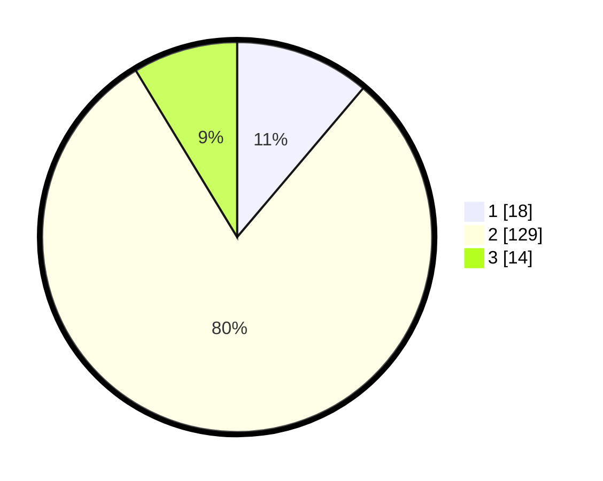

# Hasil

## Grafik

## Tabel

| No. | Nama Paslon    | Suara | Suara (raw) | Persentase |
|:--- |:-------------- | -----:| -----------:| ----------:|
| 1   | ANIES MUHAIMIN | 18    | [18][p-1]   | 11,18      |
| 2   | PRABOWO GIBRAN | 129   | [129][p-2]  | 80,12      |
| 3   | GANJAR MAHFUD  | 14    | [14][p-3]   | 8,70       |

[p-1]: https://github.com/gigit-pemilu/pemilu-2024-35-jawa-timur/blob/main/pilpres/hitung-suara/sub/35-jawa-timur/sub/13-probolinggo/sub/07-tiris/sub/2014-rejing/sub/001-tps/sub/paslon-1.txt
[p-2]: https://github.com/gigit-pemilu/pemilu-2024-35-jawa-timur/blob/main/pilpres/hitung-suara/sub/35-jawa-timur/sub/13-probolinggo/sub/07-tiris/sub/2014-rejing/sub/001-tps/sub/paslon-2.txt
[p-3]: https://github.com/gigit-pemilu/pemilu-2024-35-jawa-timur/blob/main/pilpres/hitung-suara/sub/35-jawa-timur/sub/13-probolinggo/sub/07-tiris/sub/2014-rejing/sub/001-tps/sub/paslon-3.txt

## Foto C Plano

https://sirekap-obj-formc.kpu.go.id/f75e/pemilu/ppwp/35/13/07/20/14/3513072014001-20240215-013117--6b431732-7d20-461c-aad3-eb5656ff9543.jpg

https://sirekap-obj-formc.kpu.go.id/f75e/pemilu/ppwp/35/13/07/20/14/3513072014001-20240215-013443--4927d44e-1001-452f-97e7-bdf85b4a022f.jpg

https://sirekap-obj-formc.kpu.go.id/f75e/pemilu/ppwp/35/13/07/20/14/3513072014001-20240215-013517--0185a9e5-75f9-40e4-be06-c8094ede33e2.jpg

## Metadata

| Key        | Value               |
| ---------- | ------------------- |
| Time Stamp | 2024-02-15 12:00:28 |

