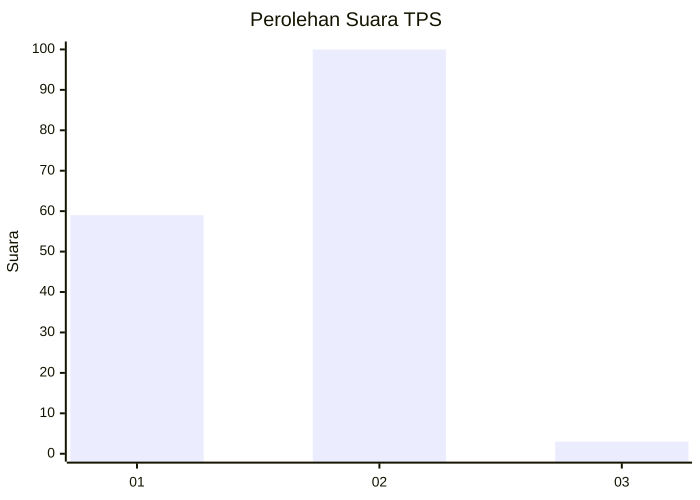
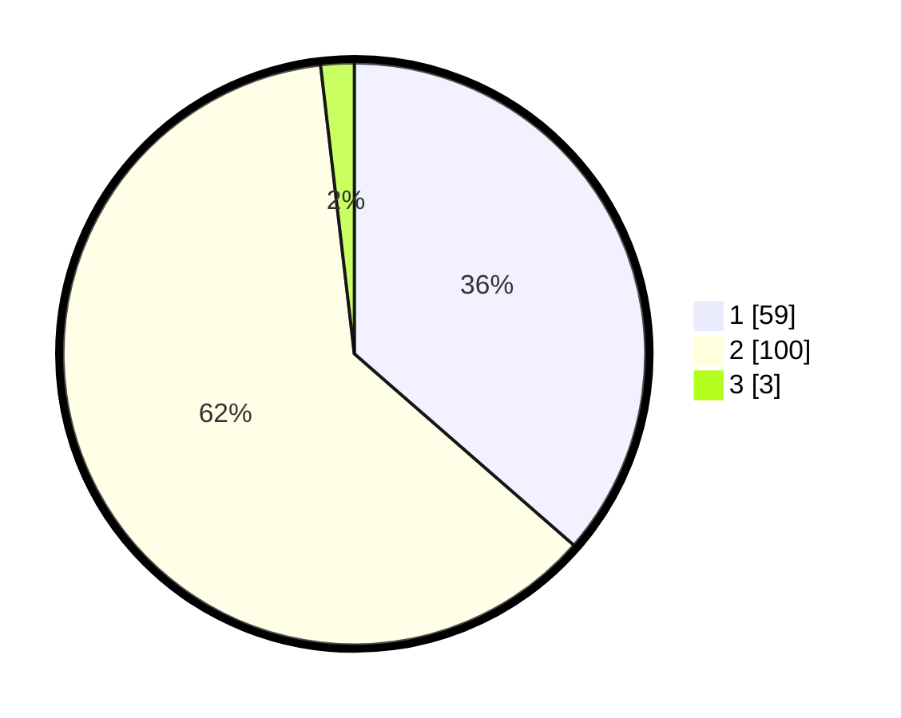

# Hasil

## Grafik

## Tabel

| No. | Nama Paslon    | Suara | Suara (raw) | Persentase |
|:--- |:-------------- | -----:| -----------:| ----------:|
| 1   | ANIES MUHAIMIN | 59    | [59][p-1]   | 36,42      |
| 2   | PRABOWO GIBRAN | 100   | [100][p-2]  | 61,73      |
| 3   | GANJAR MAHFUD  | 3     | [3][p-3]    | 1,85       |

[p-1]: https://github.com/gigit-pemilu/pemilu-2024/blob/main/pilpres/hitung-suara/sub/35-jawa-timur/sub/13-probolinggo/sub/08-krucil/sub/2001-sumberduren/sub/005-tps/sub/paslon-1.txt
[p-2]: https://github.com/gigit-pemilu/pemilu-2024/blob/main/pilpres/hitung-suara/sub/35-jawa-timur/sub/13-probolinggo/sub/08-krucil/sub/2001-sumberduren/sub/005-tps/sub/paslon-2.txt
[p-3]: https://github.com/gigit-pemilu/pemilu-2024/blob/main/pilpres/hitung-suara/sub/35-jawa-timur/sub/13-probolinggo/sub/08-krucil/sub/2001-sumberduren/sub/005-tps/sub/paslon-3.txt

## Foto C Plano

https://sirekap-obj-formc.kpu.go.id/1455/pemilu/ppwp/35/13/08/20/01/3513082001005-20240215-195808--e195694b-9cc9-4cba-844a-509800fc12c1.jpg

https://sirekap-obj-formc.kpu.go.id/1455/pemilu/ppwp/35/13/08/20/01/3513082001005-20240215-195841--1db39835-70c9-43a7-b716-2adedc83fbd8.jpg

https://sirekap-obj-formc.kpu.go.id/1455/pemilu/ppwp/35/13/08/20/01/3513082001005-20240215-195854--50561484-726a-4fde-b8a7-65dba180e20b.jpg

## Metadata

| Key        | Value               |
| ---------- | ------------------- |
| Time Stamp | 2024-02-15 22:30:27 |

