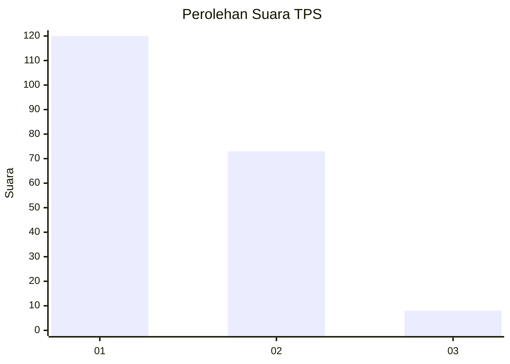
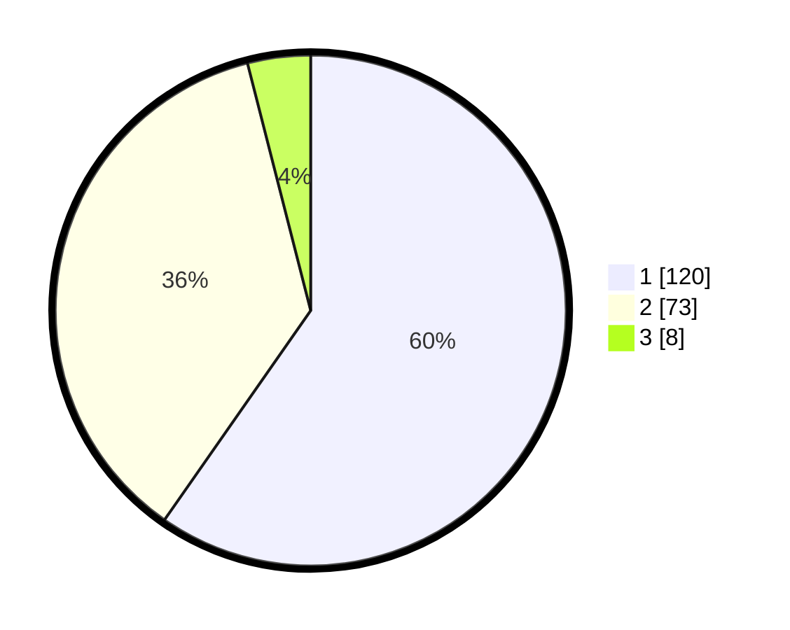

# Hasil

## Grafik

## Tabel

| No. | Nama Paslon    | Suara | Suara (raw) | Persentase |
|:--- |:-------------- | -----:| -----------:| ----------:|
| 1   | ANIES MUHAIMIN | 120   | [120][p-1]  | 59,70      |
| 2   | PRABOWO GIBRAN | 73    | [73][p-2]   | 36,32      |
| 3   | GANJAR MAHFUD  | 8     | [8][p-3]    | 3,98       |

[p-1]: https://github.com/gigit-pemilu/pemilu-2024-35-jawa-timur/blob/main/pilpres/hitung-suara/sub/35-jawa-timur/sub/13-probolinggo/sub/08-krucil/sub/2001-sumberduren/sub/008-tps/sub/paslon-1.txt
[p-2]: https://github.com/gigit-pemilu/pemilu-2024-35-jawa-timur/blob/main/pilpres/hitung-suara/sub/35-jawa-timur/sub/13-probolinggo/sub/08-krucil/sub/2001-sumberduren/sub/008-tps/sub/paslon-2.txt
[p-3]: https://github.com/gigit-pemilu/pemilu-2024-35-jawa-timur/blob/main/pilpres/hitung-suara/sub/35-jawa-timur/sub/13-probolinggo/sub/08-krucil/sub/2001-sumberduren/sub/008-tps/sub/paslon-3.txt

## Foto C Plano

https://sirekap-obj-formc.kpu.go.id/ed49/pemilu/ppwp/35/13/08/20/01/3513082001008-20240214-141051--8e5733a5-0ac4-4439-a68b-1ac06d13fa8f.jpg

https://sirekap-obj-formc.kpu.go.id/ed49/pemilu/ppwp/35/13/08/20/01/3513082001008-20240215-002352--33f0cff3-6885-43cb-bff4-2ebba738f439.jpg

https://sirekap-obj-formc.kpu.go.id/ed49/pemilu/ppwp/35/13/08/20/01/3513082001008-20240214-141358--b844618e-4464-4a49-84f8-0ec066554bcf.jpg

## Metadata

| Key        | Value               |
| ---------- | ------------------- |
| Time Stamp | 2024-02-15 18:00:26 |

