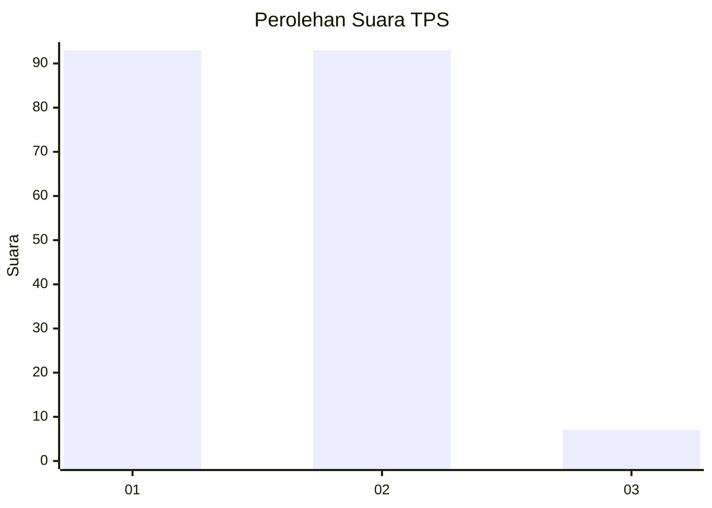
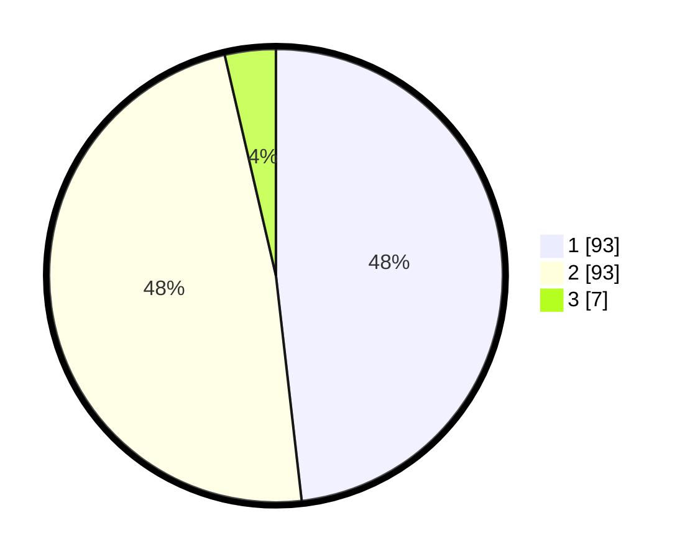

# Hasil

## Grafik

## Tabel

| No. | Nama Paslon    | Suara | Suara (raw) | Persentase |
|:--- |:-------------- | -----:| -----------:| ----------:|
| 1   | ANIES MUHAIMIN | 93    | [93][p-1]   | 48,19      |
| 2   | PRABOWO GIBRAN | 93    | [93][p-2]   | 48,19      |
| 3   | GANJAR MAHFUD  | 7     | [7][p-3]    | 3,63       |

[p-1]: https://github.com/gigit-pemilu/pemilu-2024/blob/main/pilpres/hitung-suara/sub/35-jawa-timur/sub/13-probolinggo/sub/08-krucil/sub/2001-sumberduren/sub/011-tps/sub/paslon-1.txt
[p-2]: https://github.com/gigit-pemilu/pemilu-2024/blob/main/pilpres/hitung-suara/sub/35-jawa-timur/sub/13-probolinggo/sub/08-krucil/sub/2001-sumberduren/sub/011-tps/sub/paslon-2.txt
[p-3]: https://github.com/gigit-pemilu/pemilu-2024/blob/main/pilpres/hitung-suara/sub/35-jawa-timur/sub/13-probolinggo/sub/08-krucil/sub/2001-sumberduren/sub/011-tps/sub/paslon-3.txt

## Foto C Plano

https://sirekap-obj-formc.kpu.go.id/bc43/pemilu/ppwp/35/13/08/20/01/3513082001011-20240214-212653--377b3176-e6c7-45f8-b599-fd1d461631f4.jpg

https://sirekap-obj-formc.kpu.go.id/bc43/pemilu/ppwp/35/13/08/20/01/3513082001011-20240214-212520--702a9ac3-df6e-4445-b524-8cc9cc5c219c.jpg

https://sirekap-obj-formc.kpu.go.id/bc43/pemilu/ppwp/35/13/08/20/01/3513082001011-20240214-212641--6edc1d02-c1f8-4f5b-809a-cc54291ef45a.jpg

## Metadata

| Key        | Value               |
| ---------- | ------------------- |
| Time Stamp | 2024-02-15 21:30:27 |

