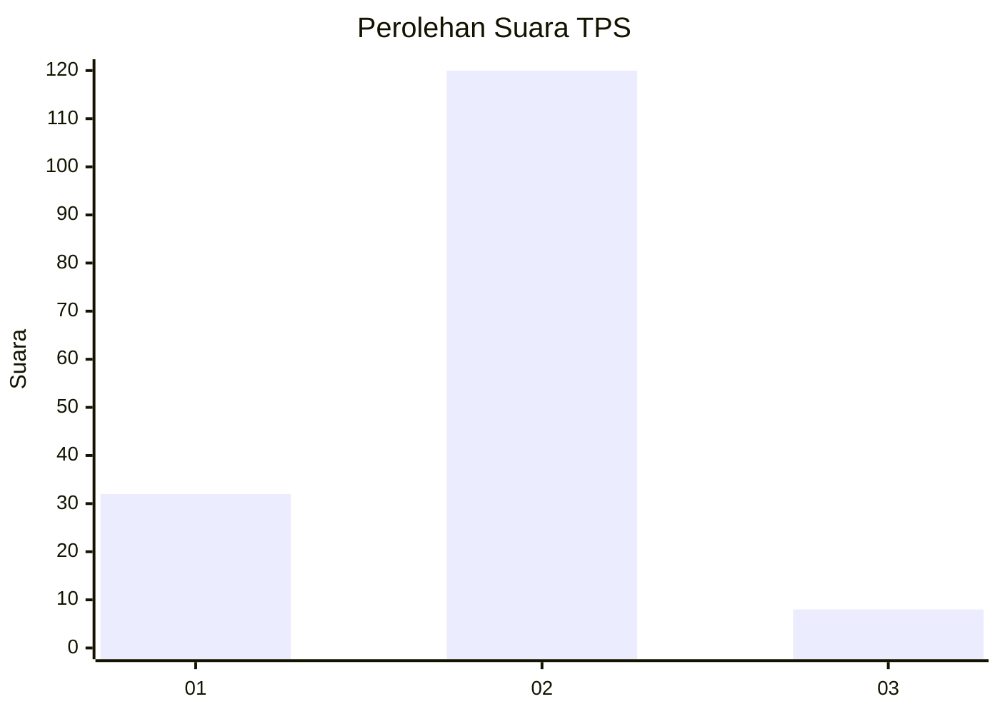
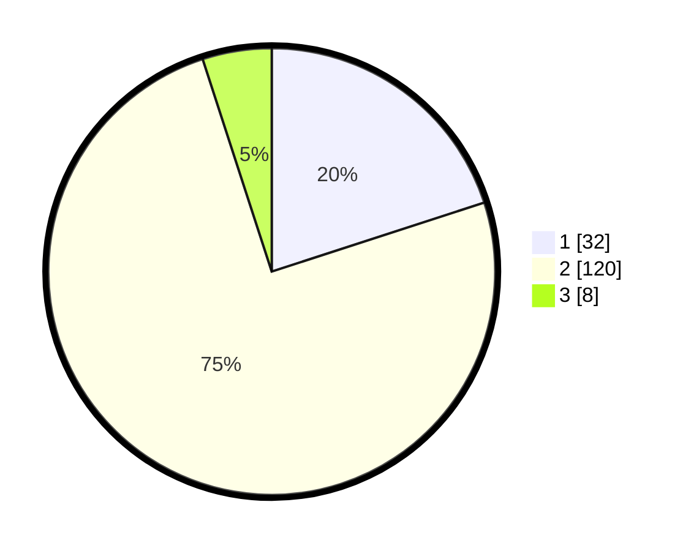

# Hasil

## Grafik

## Tabel

| No. | Nama Paslon    | Suara | Suara (raw) | Persentase |
|:--- |:-------------- | -----:| -----------:| ----------:|
| 1   | ANIES MUHAIMIN | 32    | [32][p-1]   | 20,00      |
| 2   | PRABOWO GIBRAN | 120   | [120][p-2]  | 75,00      |
| 3   | GANJAR MAHFUD  | 8     | [8][p-3]    | 5,00       |

[p-1]: https://github.com/gigit-pemilu/pemilu-2024/blob/main/pilpres/hitung-suara/sub/35-jawa-timur/sub/13-probolinggo/sub/08-krucil/sub/2002-roto/sub/002-tps/sub/paslon-1.txt
[p-2]: https://github.com/gigit-pemilu/pemilu-2024/blob/main/pilpres/hitung-suara/sub/35-jawa-timur/sub/13-probolinggo/sub/08-krucil/sub/2002-roto/sub/002-tps/sub/paslon-2.txt
[p-3]: https://github.com/gigit-pemilu/pemilu-2024/blob/main/pilpres/hitung-suara/sub/35-jawa-timur/sub/13-probolinggo/sub/08-krucil/sub/2002-roto/sub/002-tps/sub/paslon-3.txt

## Foto C Plano

https://sirekap-obj-formc.kpu.go.id/b71b/pemilu/ppwp/35/13/08/20/02/3513082002002-20240214-235637--7310cd52-21d5-4d8e-bdc1-058d5f58809b.jpg

https://sirekap-obj-formc.kpu.go.id/b71b/pemilu/ppwp/35/13/08/20/02/3513082002002-20240214-235940--02d01b34-8e3b-4161-9cd8-9a118e66fe25.jpg

https://sirekap-obj-formc.kpu.go.id/b71b/pemilu/ppwp/35/13/08/20/02/3513082002002-20240215-000151--6e6f1fe6-83d1-463a-ab5d-4edc8f86bab2.jpg

## Metadata

| Key        | Value               |
| ---------- | ------------------- |
| Time Stamp | 2024-02-15 21:30:27 |

