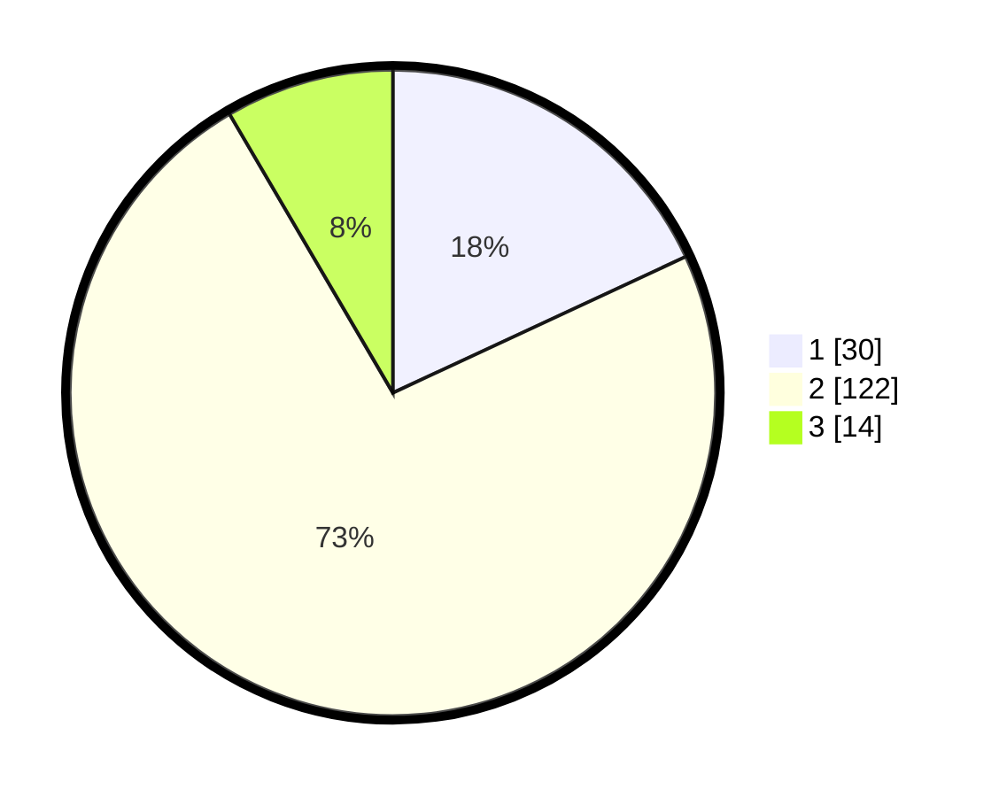

# Hasil

## Grafik

## Tabel

| No. | Nama Paslon    | Suara | Suara (raw) | Persentase |
|:--- |:-------------- | -----:| -----------:| ----------:|
| 1   | ANIES MUHAIMIN | 30    | [30][p-1]   | 18,07      |
| 2   | PRABOWO GIBRAN | 122   | [122][p-2]  | 73,49      |
| 3   | GANJAR MAHFUD  | 14    | [14][p-3]   | 8,43       |

[p-1]: https://github.com/gigit-pemilu/pemilu-2024/blob/main/pilpres/hitung-suara/sub/35-jawa-timur/sub/13-probolinggo/sub/08-krucil/sub/2002-roto/sub/003-tps/sub/paslon-1.txt
[p-2]: https://github.com/gigit-pemilu/pemilu-2024/blob/main/pilpres/hitung-suara/sub/35-jawa-timur/sub/13-probolinggo/sub/08-krucil/sub/2002-roto/sub/003-tps/sub/paslon-2.txt
[p-3]: https://github.com/gigit-pemilu/pemilu-2024/blob/main/pilpres/hitung-suara/sub/35-jawa-timur/sub/13-probolinggo/sub/08-krucil/sub/2002-roto/sub/003-tps/sub/paslon-3.txt

## Foto C Plano

https://sirekap-obj-formc.kpu.go.id/938a/pemilu/ppwp/35/13/08/20/02/3513082002003-20240214-211937--9d1a1806-57a8-4472-baf2-49ada11a3be8.jpg

https://sirekap-obj-formc.kpu.go.id/938a/pemilu/ppwp/35/13/08/20/02/3513082002003-20240214-212224--38853fa4-1390-4084-b499-42b3118b1520.jpg

https://sirekap-obj-formc.kpu.go.id/938a/pemilu/ppwp/35/13/08/20/02/3513082002003-20240214-212355--af144945-f99f-4f45-8c58-c33c00c0b6c3.jpg

## Metadata

| Key        | Value               |
| ---------- | ------------------- |
| Time Stamp | 2024-02-15 22:00:27 |

