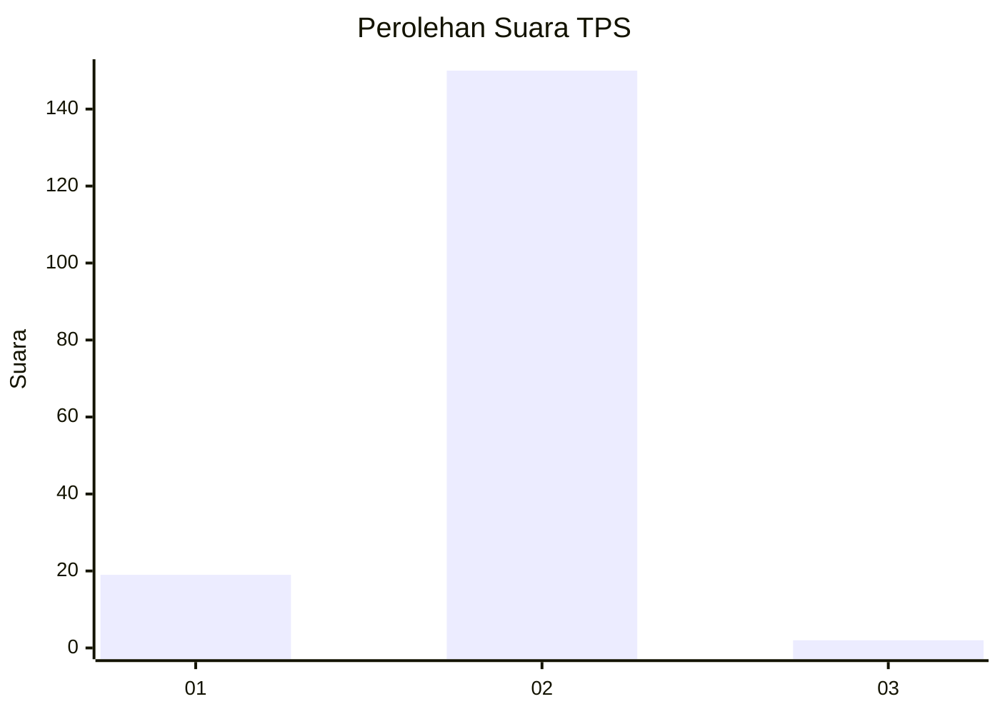
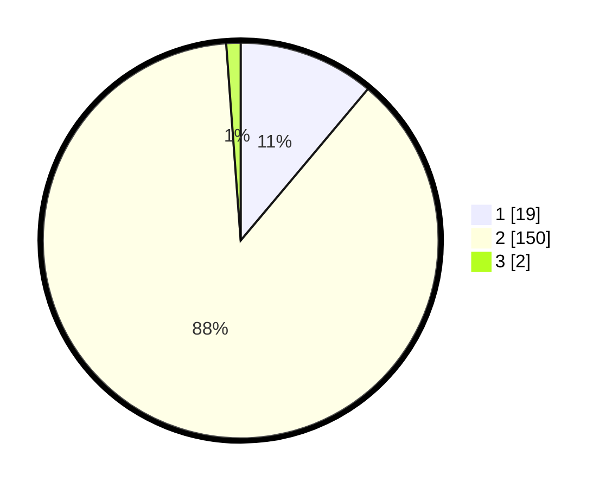

# Hasil

## Grafik

## Tabel

| No. | Nama Paslon    | Suara | Suara (raw) | Persentase |
|:--- |:-------------- | -----:| -----------:| ----------:|
| 1   | ANIES MUHAIMIN | 19    | [19][p-1]   | 11,11      |
| 2   | PRABOWO GIBRAN | 150   | [150][p-2]  | 87,72      |
| 3   | GANJAR MAHFUD  | 2     | [2][p-3]    | 1,17       |

[p-1]: https://github.com/gigit-pemilu/pemilu-2024/blob/main/pilpres/hitung-suara/sub/35-jawa-timur/sub/13-probolinggo/sub/08-krucil/sub/2002-roto/sub/004-tps/sub/paslon-1.txt
[p-2]: https://github.com/gigit-pemilu/pemilu-2024/blob/main/pilpres/hitung-suara/sub/35-jawa-timur/sub/13-probolinggo/sub/08-krucil/sub/2002-roto/sub/004-tps/sub/paslon-2.txt
[p-3]: https://github.com/gigit-pemilu/pemilu-2024/blob/main/pilpres/hitung-suara/sub/35-jawa-timur/sub/13-probolinggo/sub/08-krucil/sub/2002-roto/sub/004-tps/sub/paslon-3.txt

## Foto C Plano

https://sirekap-obj-formc.kpu.go.id/d35a/pemilu/ppwp/35/13/08/20/02/3513082002004-20240214-222249--09a4aef4-80a7-4c91-a375-45b05e3e6851.jpg

https://sirekap-obj-formc.kpu.go.id/d35a/pemilu/ppwp/35/13/08/20/02/3513082002004-20240214-204809--d25b49d9-3823-43f2-a227-d68ef9c0eaf9.jpg

https://sirekap-obj-formc.kpu.go.id/d35a/pemilu/ppwp/35/13/08/20/02/3513082002004-20240214-204815--e3fdaf30-4f9f-401e-a9dc-1192eb939c7d.jpg

## Metadata

| Key        | Value               |
| ---------- | ------------------- |
| Time Stamp | 2024-02-15 19:00:26 |

