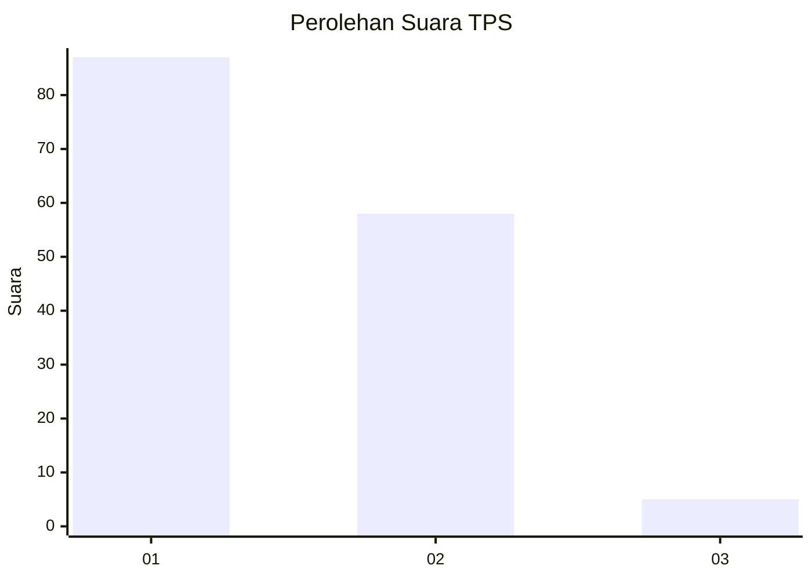
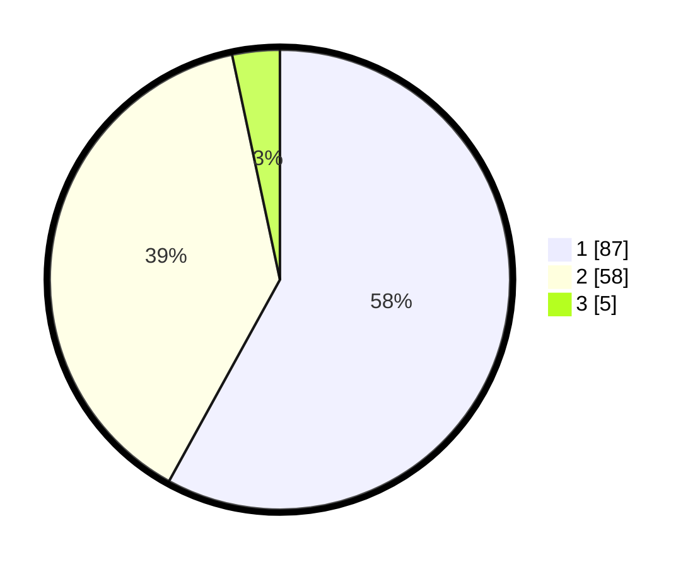

# Hasil

## Grafik

## Tabel

| No. | Nama Paslon    | Suara | Suara (raw) | Persentase |
|:--- |:-------------- | -----:| -----------:| ----------:|
| 1   | ANIES MUHAIMIN | 87    | [87][p-1]   | 58,00      |
| 2   | PRABOWO GIBRAN | 58    | [58][p-2]   | 38,67      |
| 3   | GANJAR MAHFUD  | 5     | [5][p-3]    | 3,33       |

[p-1]: https://github.com/gigit-pemilu/pemilu-2024/blob/main/pilpres/hitung-suara/sub/35-jawa-timur/sub/13-probolinggo/sub/08-krucil/sub/2002-roto/sub/011-tps/sub/paslon-1.txt
[p-2]: https://github.com/gigit-pemilu/pemilu-2024/blob/main/pilpres/hitung-suara/sub/35-jawa-timur/sub/13-probolinggo/sub/08-krucil/sub/2002-roto/sub/011-tps/sub/paslon-2.txt
[p-3]: https://github.com/gigit-pemilu/pemilu-2024/blob/main/pilpres/hitung-suara/sub/35-jawa-timur/sub/13-probolinggo/sub/08-krucil/sub/2002-roto/sub/011-tps/sub/paslon-3.txt

## Foto C Plano

https://sirekap-obj-formc.kpu.go.id/1a7d/pemilu/ppwp/35/13/08/20/02/3513082002011-20240215-011159--7e5f75c6-cb33-49b3-84b5-ea95d9fe41a7.jpg

https://sirekap-obj-formc.kpu.go.id/1a7d/pemilu/ppwp/35/13/08/20/02/3513082002011-20240215-003556--487be7c1-2cf6-421a-a5fd-a96c84024080.jpg

https://sirekap-obj-formc.kpu.go.id/1a7d/pemilu/ppwp/35/13/08/20/02/3513082002011-20240214-225224--bc98622b-323b-4d24-83ab-d05c04c5f1a8.jpg

## Metadata

| Key        | Value               |
| ---------- | ------------------- |
| Time Stamp | 2024-02-25 12:00:00 |

