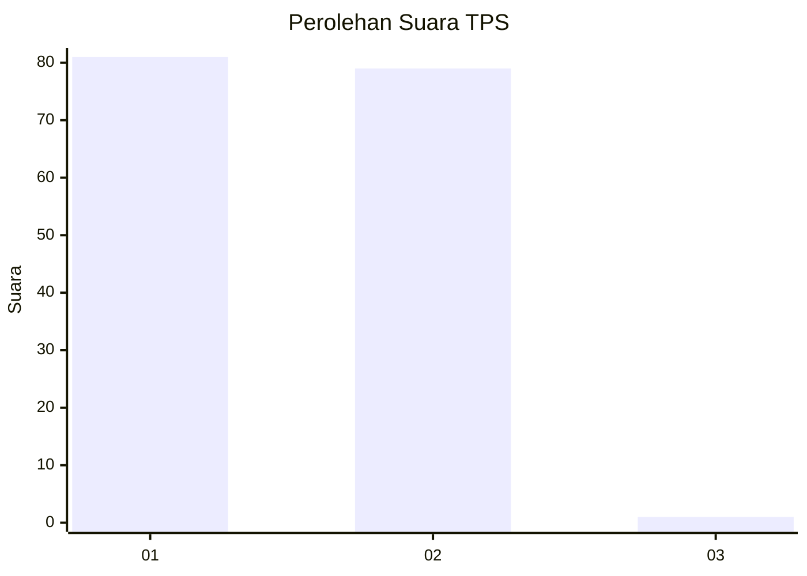
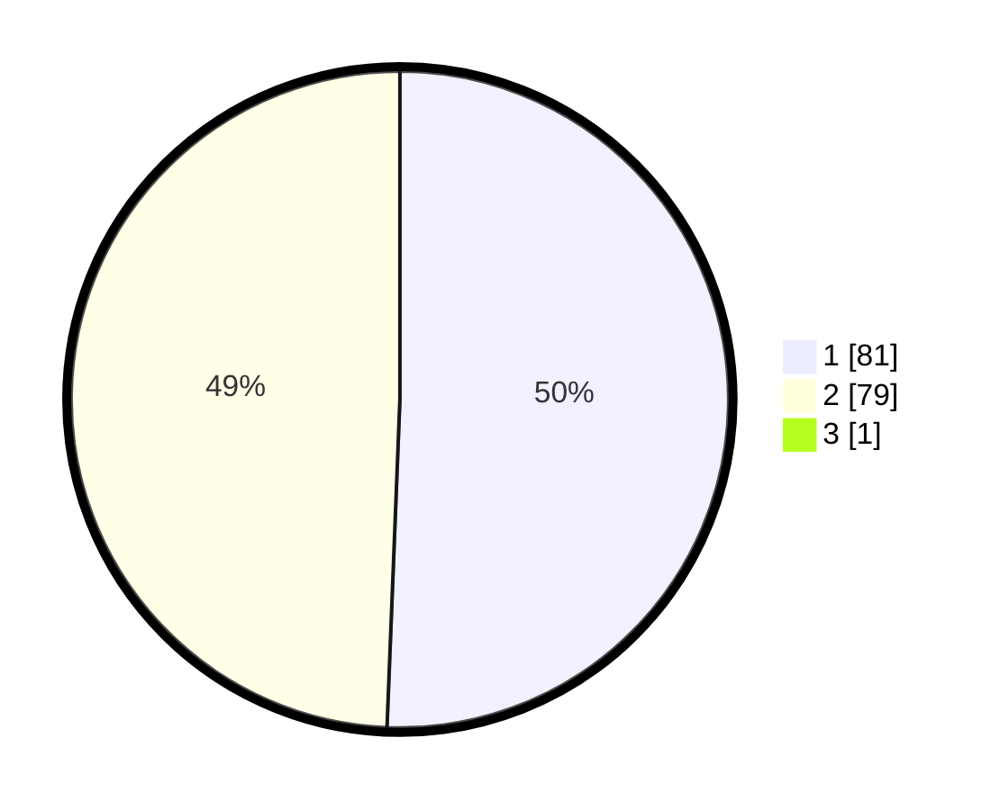

# Hasil

## Grafik

## Tabel

| No. | Nama Paslon    | Suara | Suara (raw) | Persentase |
|:--- |:-------------- | -----:| -----------:| ----------:|
| 1   | ANIES MUHAIMIN | 81    | [81][p-1]   | 50,31      |
| 2   | PRABOWO GIBRAN | 79    | [79][p-2]   | 49,07      |
| 3   | GANJAR MAHFUD  | 1     | [1][p-3]    | 0,62       |

[p-1]: https://github.com/gigit-pemilu/pemilu-2024-35-jawa-timur/blob/main/pilpres/hitung-suara/sub/35-jawa-timur/sub/13-probolinggo/sub/08-krucil/sub/2002-roto/sub/014-tps/sub/paslon-1.txt
[p-2]: https://github.com/gigit-pemilu/pemilu-2024-35-jawa-timur/blob/main/pilpres/hitung-suara/sub/35-jawa-timur/sub/13-probolinggo/sub/08-krucil/sub/2002-roto/sub/014-tps/sub/paslon-2.txt
[p-3]: https://github.com/gigit-pemilu/pemilu-2024-35-jawa-timur/blob/main/pilpres/hitung-suara/sub/35-jawa-timur/sub/13-probolinggo/sub/08-krucil/sub/2002-roto/sub/014-tps/sub/paslon-3.txt

## Foto C Plano

https://sirekap-obj-formc.kpu.go.id/4916/pemilu/ppwp/35/13/08/20/02/3513082002014-20240214-234435--15fa2a9c-9a73-43c9-8ce1-f045bd006beb.jpg

https://sirekap-obj-formc.kpu.go.id/4916/pemilu/ppwp/35/13/08/20/02/3513082002014-20240214-234607--c325a786-fef1-4916-ac1c-0a534547dac7.jpg

https://sirekap-obj-formc.kpu.go.id/4916/pemilu/ppwp/35/13/08/20/02/3513082002014-20240214-234744--54f749ef-83f6-4d62-8c87-3e8f9710c7db.jpg

## Metadata

| Key        | Value               |
| ---------- | ------------------- |
| Time Stamp | 2024-02-15 18:00:26 |

