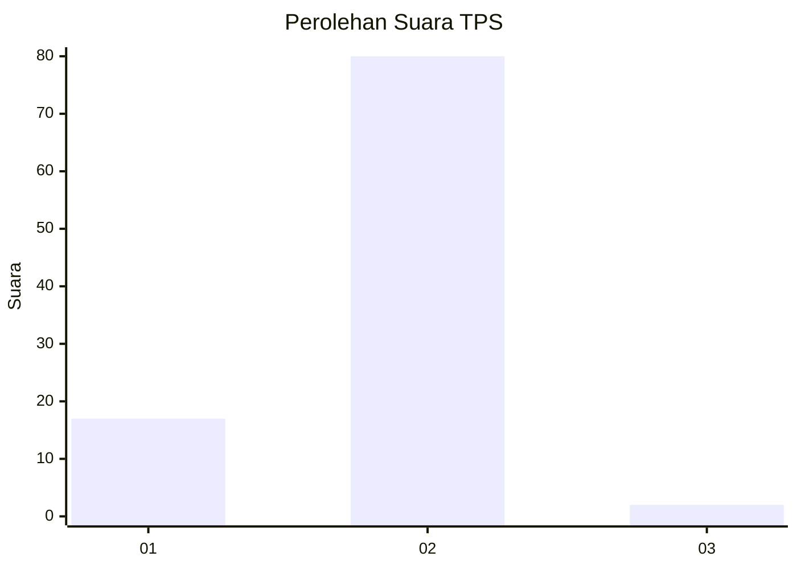
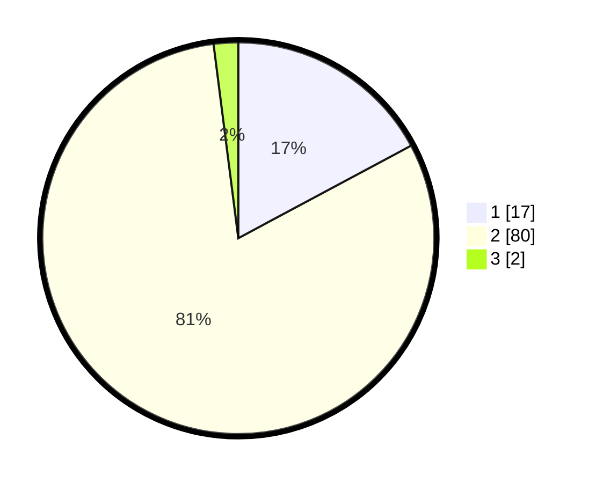

# Hasil

## Grafik

## Tabel

| No. | Nama Paslon    | Suara | Suara (raw) | Persentase |
|:--- |:-------------- | -----:| -----------:| ----------:|
| 1   | ANIES MUHAIMIN | 17    | [17][p-1]   | 17,17      |
| 2   | PRABOWO GIBRAN | 80    | [80][p-2]   | 80,81      |
| 3   | GANJAR MAHFUD  | 2     | [2][p-3]    | 2,02       |

[p-1]: https://github.com/gigit-pemilu/pemilu-2024/blob/main/pilpres/hitung-suara/sub/35-jawa-timur/sub/13-probolinggo/sub/08-krucil/sub/2002-roto/sub/016-tps/sub/paslon-1.txt
[p-2]: https://github.com/gigit-pemilu/pemilu-2024/blob/main/pilpres/hitung-suara/sub/35-jawa-timur/sub/13-probolinggo/sub/08-krucil/sub/2002-roto/sub/016-tps/sub/paslon-2.txt
[p-3]: https://github.com/gigit-pemilu/pemilu-2024/blob/main/pilpres/hitung-suara/sub/35-jawa-timur/sub/13-probolinggo/sub/08-krucil/sub/2002-roto/sub/016-tps/sub/paslon-3.txt

## Foto C Plano

https://sirekap-obj-formc.kpu.go.id/5f1e/pemilu/ppwp/35/13/08/20/02/3513082002016-20240214-230648--e95615d9-f129-436c-9785-c1b5592804ba.jpg

https://sirekap-obj-formc.kpu.go.id/5f1e/pemilu/ppwp/35/13/08/20/02/3513082002016-20240214-230744--60a5d160-9a30-407b-b369-df8d5094f813.jpg

https://sirekap-obj-formc.kpu.go.id/5f1e/pemilu/ppwp/35/13/08/20/02/3513082002016-20240214-230901--2916bacd-e20c-4b04-9d60-0e4469ad2801.jpg

## Metadata

| Key        | Value               |
| ---------- | ------------------- |
| Time Stamp | 2024-02-15 22:00:27 |

