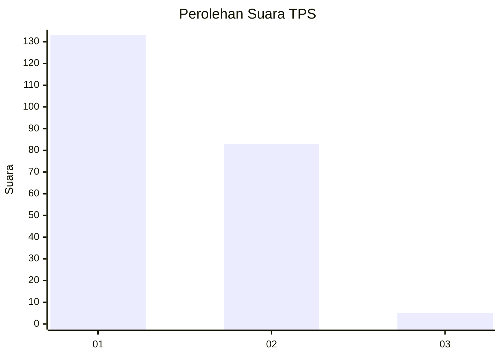
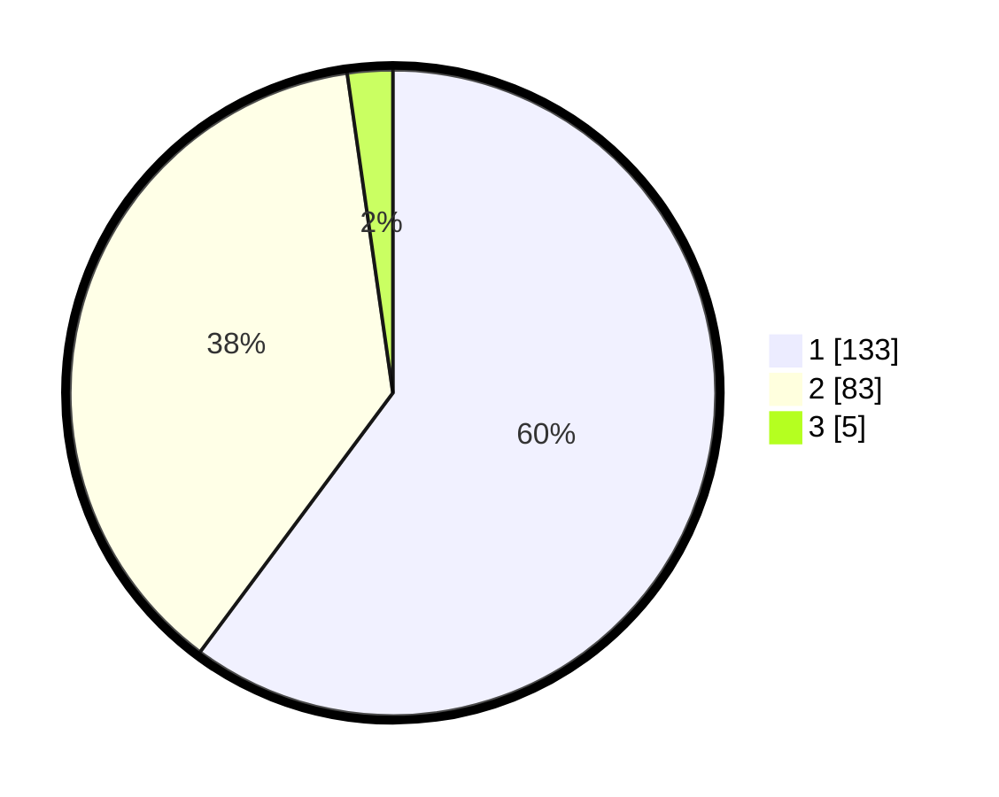

# Hasil

## Grafik

## Tabel

| No. | Nama Paslon    | Suara | Suara (raw) | Persentase |
|:--- |:-------------- | -----:| -----------:| ----------:|
| 1   | ANIES MUHAIMIN | 133   | [133][p-1]  | 60,18      |
| 2   | PRABOWO GIBRAN | 83    | [83][p-2]   | 37,56      |
| 3   | GANJAR MAHFUD  | 5     | [5][p-3]    | 2,26       |

[p-1]: https://github.com/gigit-pemilu/pemilu-2024-35-jawa-timur/blob/main/pilpres/hitung-suara/sub/35-jawa-timur/sub/13-probolinggo/sub/08-krucil/sub/2004-tambelang/sub/011-tps/sub/paslon-1.txt
[p-2]: https://github.com/gigit-pemilu/pemilu-2024-35-jawa-timur/blob/main/pilpres/hitung-suara/sub/35-jawa-timur/sub/13-probolinggo/sub/08-krucil/sub/2004-tambelang/sub/011-tps/sub/paslon-2.txt
[p-3]: https://github.com/gigit-pemilu/pemilu-2024-35-jawa-timur/blob/main/pilpres/hitung-suara/sub/35-jawa-timur/sub/13-probolinggo/sub/08-krucil/sub/2004-tambelang/sub/011-tps/sub/paslon-3.txt

## Foto C Plano

https://sirekap-obj-formc.kpu.go.id/1165/pemilu/ppwp/35/13/08/20/04/3513082004011-20240214-212829--6e3bcee9-acad-4bd3-8a9a-6590404063df.jpg

https://sirekap-obj-formc.kpu.go.id/1165/pemilu/ppwp/35/13/08/20/04/3513082004011-20240214-213220--23a564fe-bb69-4d9c-be55-2f0228dbed7b.jpg

https://sirekap-obj-formc.kpu.go.id/1165/pemilu/ppwp/35/13/08/20/04/3513082004011-20240214-213522--61ccac58-21a0-4b54-ac93-458b7f97eb45.jpg

## Metadata

| Key        | Value               |
| ---------- | ------------------- |
| Time Stamp | 2024-02-15 22:30:27 |

