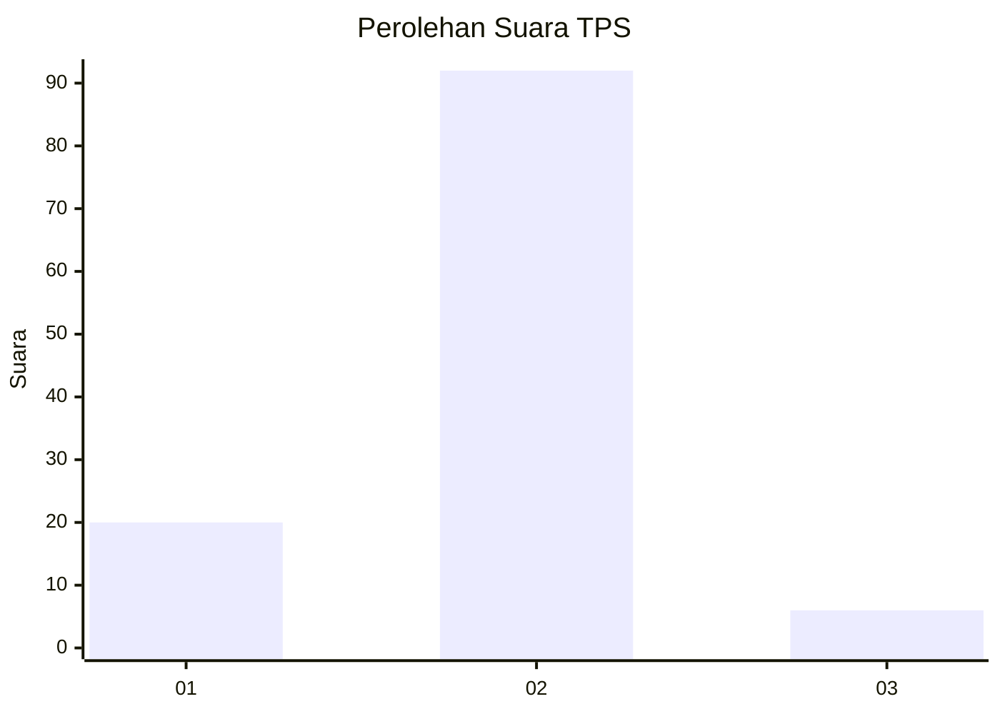
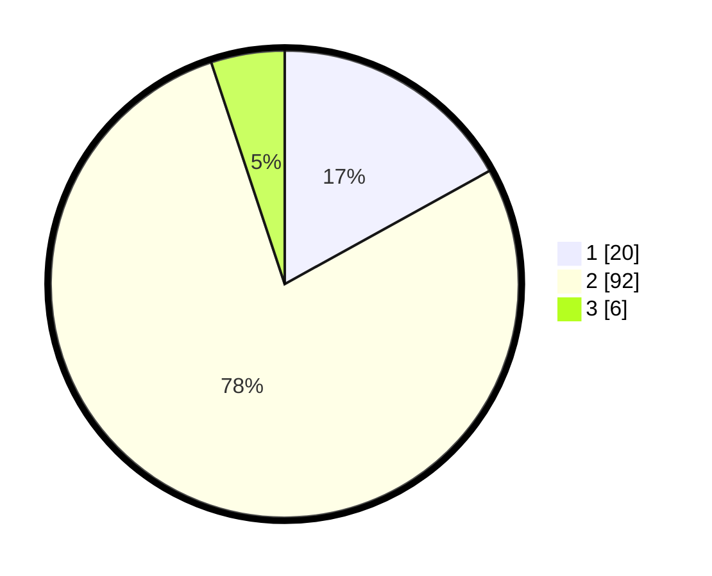

# Hasil

## Grafik

## Tabel

| No. | Nama Paslon    | Suara | Suara (raw) | Persentase |
|:--- |:-------------- | -----:| -----------:| ----------:|
| 1   | ANIES MUHAIMIN | 20    | [20][p-1]   | 16,95      |
| 2   | PRABOWO GIBRAN | 92    | [92][p-2]   | 77,97      |
| 3   | GANJAR MAHFUD  | 6     | [6][p-3]    | 5,08       |

[p-1]: https://github.com/gigit-pemilu/pemilu-2024/blob/main/pilpres/hitung-suara/sub/35-jawa-timur/sub/13-probolinggo/sub/08-krucil/sub/2004-tambelang/sub/017-tps/sub/paslon-1.txt
[p-2]: https://github.com/gigit-pemilu/pemilu-2024/blob/main/pilpres/hitung-suara/sub/35-jawa-timur/sub/13-probolinggo/sub/08-krucil/sub/2004-tambelang/sub/017-tps/sub/paslon-2.txt
[p-3]: https://github.com/gigit-pemilu/pemilu-2024/blob/main/pilpres/hitung-suara/sub/35-jawa-timur/sub/13-probolinggo/sub/08-krucil/sub/2004-tambelang/sub/017-tps/sub/paslon-3.txt

## Foto C Plano

https://sirekap-obj-formc.kpu.go.id/d771/pemilu/ppwp/35/13/08/20/04/3513082004017-20240217-105932--fc0a432d-392f-486e-9d7c-7abd3b98d4e3.jpg

https://sirekap-obj-formc.kpu.go.id/d771/pemilu/ppwp/35/13/08/20/04/3513082004017-20240217-110805--f7a3d769-5b2b-4900-a943-97cd61e4bdc2.jpg

https://sirekap-obj-formc.kpu.go.id/d771/pemilu/ppwp/35/13/08/20/04/3513082004017-20240215-162250--9b8f518b-559b-4b60-be07-b4ca152f64cc.jpg

## Metadata

| Key        | Value               |
| ---------- | ------------------- |
| Time Stamp | 2024-02-25 16:00:00 |

