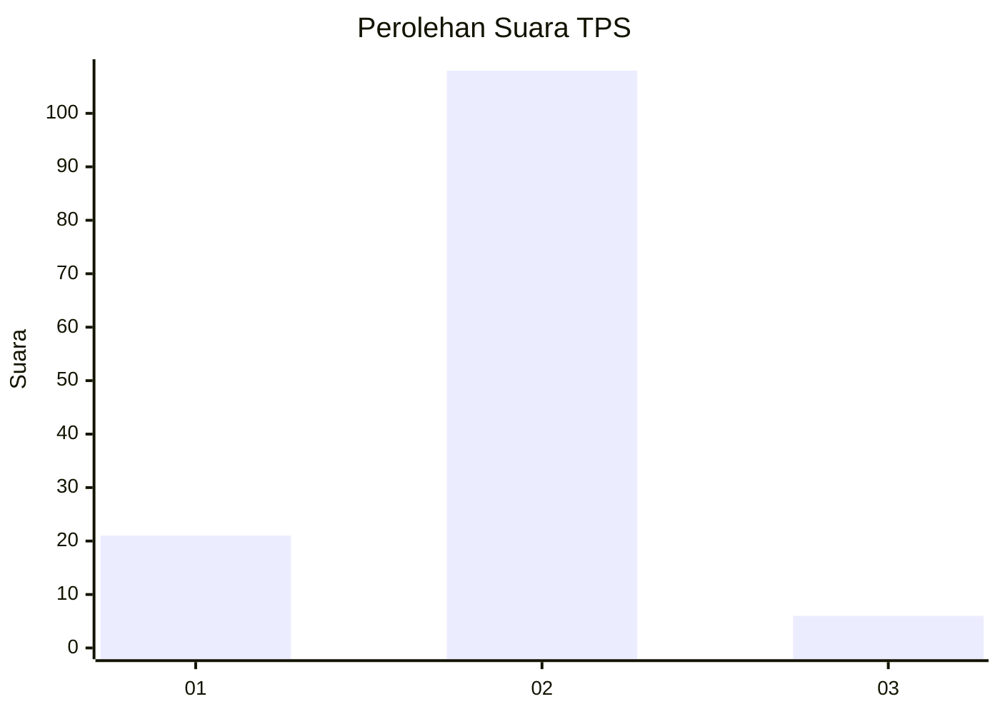
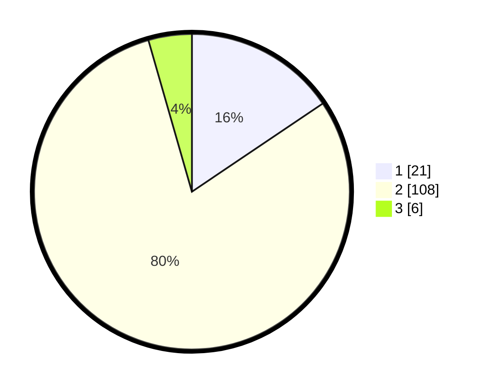

# Hasil

## Grafik

## Tabel

| No. | Nama Paslon    | Suara | Suara (raw) | Persentase |
|:--- |:-------------- | -----:| -----------:| ----------:|
| 1   | ANIES MUHAIMIN | 21    | [21][p-1]   | 15,56      |
| 2   | PRABOWO GIBRAN | 108   | [108][p-2]  | 80,00      |
| 3   | GANJAR MAHFUD  | 6     | [6][p-3]    | 4,44       |

[p-1]: https://github.com/gigit-pemilu/pemilu-2024/blob/main/pilpres/hitung-suara/sub/35-jawa-timur/sub/13-probolinggo/sub/08-krucil/sub/2004-tambelang/sub/018-tps/sub/paslon-1.txt
[p-2]: https://github.com/gigit-pemilu/pemilu-2024/blob/main/pilpres/hitung-suara/sub/35-jawa-timur/sub/13-probolinggo/sub/08-krucil/sub/2004-tambelang/sub/018-tps/sub/paslon-2.txt
[p-3]: https://github.com/gigit-pemilu/pemilu-2024/blob/main/pilpres/hitung-suara/sub/35-jawa-timur/sub/13-probolinggo/sub/08-krucil/sub/2004-tambelang/sub/018-tps/sub/paslon-3.txt

## Foto C Plano

https://sirekap-obj-formc.kpu.go.id/246e/pemilu/ppwp/35/13/08/20/04/3513082004018-20240217-134505--387a094d-7007-4999-ba32-d3de0629ee6d.jpg

https://sirekap-obj-formc.kpu.go.id/246e/pemilu/ppwp/35/13/08/20/04/3513082004018-20240217-134520--d88b20d5-ac69-4a3e-8294-7570c1b2e4f4.jpg

https://sirekap-obj-formc.kpu.go.id/246e/pemilu/ppwp/35/13/08/20/04/3513082004018-20240217-134528--c761ed66-a333-4601-8774-10e7783402bd.jpg

## Metadata

| Key        | Value               |
| ---------- | ------------------- |
| Time Stamp | 2024-02-25 13:00:00 |

