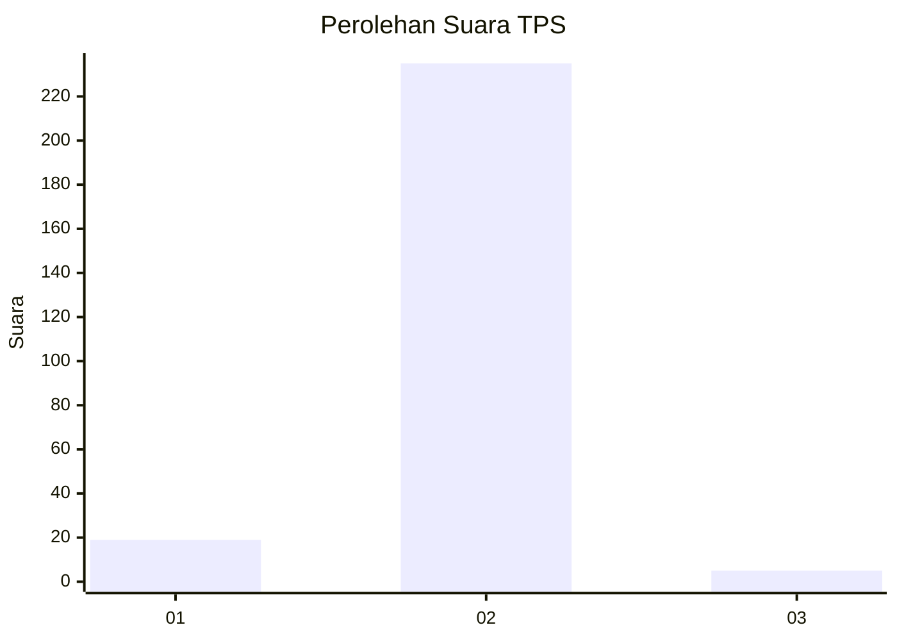
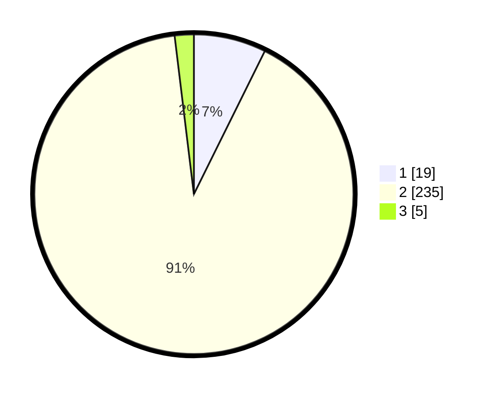

# Hasil

## Grafik

## Tabel

| No. | Nama Paslon    | Suara | Suara (raw) | Persentase |
|:--- |:-------------- | -----:| -----------:| ----------:|
| 1   | ANIES MUHAIMIN | 19    | [19][p-1]   | 7,34       |
| 2   | PRABOWO GIBRAN | 235   | [235][p-2]  | 90,73      |
| 3   | GANJAR MAHFUD  | 5     | [5][p-3]    | 1,93       |

[p-1]: https://github.com/gigit-pemilu/pemilu-2024-35-jawa-timur/blob/main/pilpres/hitung-suara/sub/35-jawa-timur/sub/13-probolinggo/sub/08-krucil/sub/2005-betek/sub/004-tps/sub/paslon-1.txt
[p-2]: https://github.com/gigit-pemilu/pemilu-2024-35-jawa-timur/blob/main/pilpres/hitung-suara/sub/35-jawa-timur/sub/13-probolinggo/sub/08-krucil/sub/2005-betek/sub/004-tps/sub/paslon-2.txt
[p-3]: https://github.com/gigit-pemilu/pemilu-2024-35-jawa-timur/blob/main/pilpres/hitung-suara/sub/35-jawa-timur/sub/13-probolinggo/sub/08-krucil/sub/2005-betek/sub/004-tps/sub/paslon-3.txt

## Foto C Plano

https://sirekap-obj-formc.kpu.go.id/a77f/pemilu/ppwp/35/13/08/20/05/3513082005004-20240214-222910--f6dc1ecc-b399-4b83-a6ae-085eb3577122.jpg

https://sirekap-obj-formc.kpu.go.id/a77f/pemilu/ppwp/35/13/08/20/05/3513082005004-20240214-223038--2a7cd1a0-ca17-41da-b1fe-d303f1c3412c.jpg

https://sirekap-obj-formc.kpu.go.id/a77f/pemilu/ppwp/35/13/08/20/05/3513082005004-20240214-222710--22e25586-c97c-4ec4-9ee0-206492b8322b.jpg

## Metadata

| Key        | Value               |
| ---------- | ------------------- |
| Time Stamp | 2024-02-24 22:31:28 |

