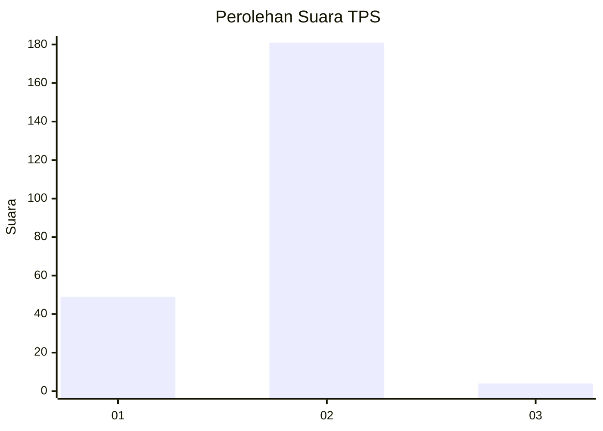
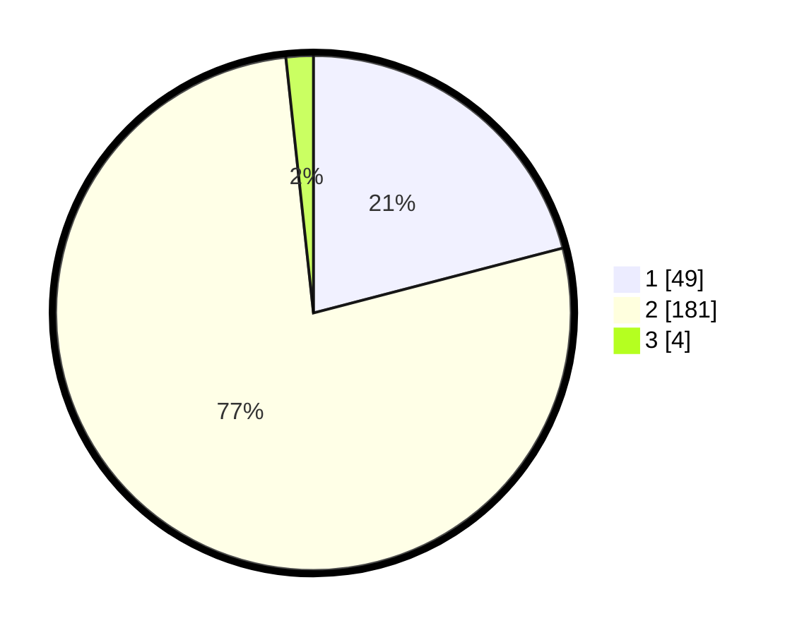

# Hasil

## Grafik

## Tabel

| No. | Nama Paslon    | Suara | Suara (raw) | Persentase |
|:--- |:-------------- | -----:| -----------:| ----------:|
| 1   | ANIES MUHAIMIN | 49    | [49][p-1]   | 20,94      |
| 2   | PRABOWO GIBRAN | 181   | [181][p-2]  | 77,35      |
| 3   | GANJAR MAHFUD  | 4     | [4][p-3]    | 1,71       |

[p-1]: https://github.com/gigit-pemilu/pemilu-2024-35-jawa-timur/blob/main/pilpres/hitung-suara/sub/35-jawa-timur/sub/13-probolinggo/sub/08-krucil/sub/2005-betek/sub/005-tps/sub/paslon-1.txt
[p-2]: https://github.com/gigit-pemilu/pemilu-2024-35-jawa-timur/blob/main/pilpres/hitung-suara/sub/35-jawa-timur/sub/13-probolinggo/sub/08-krucil/sub/2005-betek/sub/005-tps/sub/paslon-2.txt
[p-3]: https://github.com/gigit-pemilu/pemilu-2024-35-jawa-timur/blob/main/pilpres/hitung-suara/sub/35-jawa-timur/sub/13-probolinggo/sub/08-krucil/sub/2005-betek/sub/005-tps/sub/paslon-3.txt

## Foto C Plano

https://sirekap-obj-formc.kpu.go.id/4c03/pemilu/ppwp/35/13/08/20/05/3513082005005-20240214-231541--6faa722d-697a-45af-bcfd-8bf5a159bb86.jpg

https://sirekap-obj-formc.kpu.go.id/4c03/pemilu/ppwp/35/13/08/20/05/3513082005005-20240214-214119--a466c2c6-f523-4aa6-932d-63cc64f41371.jpg

https://sirekap-obj-formc.kpu.go.id/4c03/pemilu/ppwp/35/13/08/20/05/3513082005005-20240214-225810--8ece6e88-c709-426a-a03b-7b7c308a7fcc.jpg

## Metadata

| Key        | Value               |
| ---------- | ------------------- |
| Time Stamp | 2024-02-15 22:30:27 |

