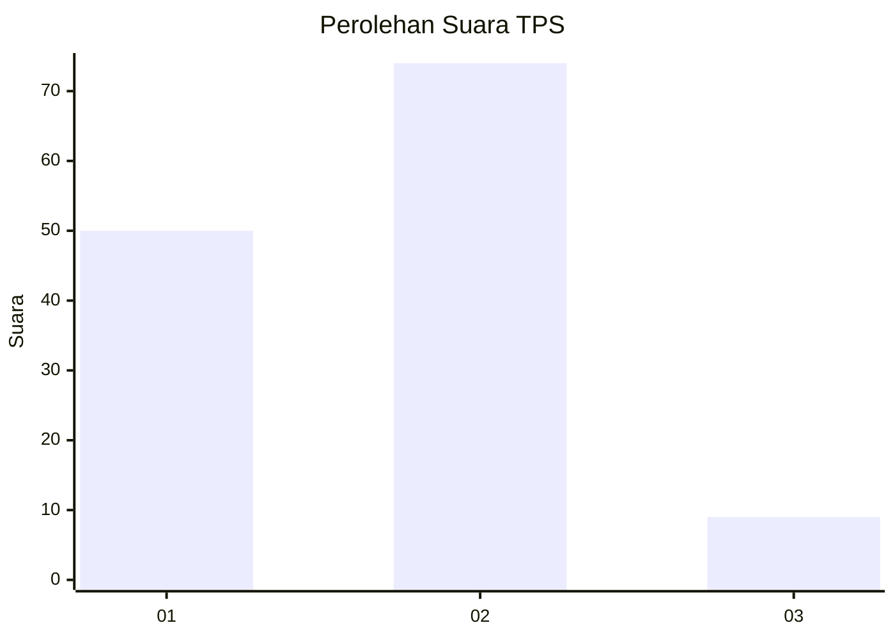
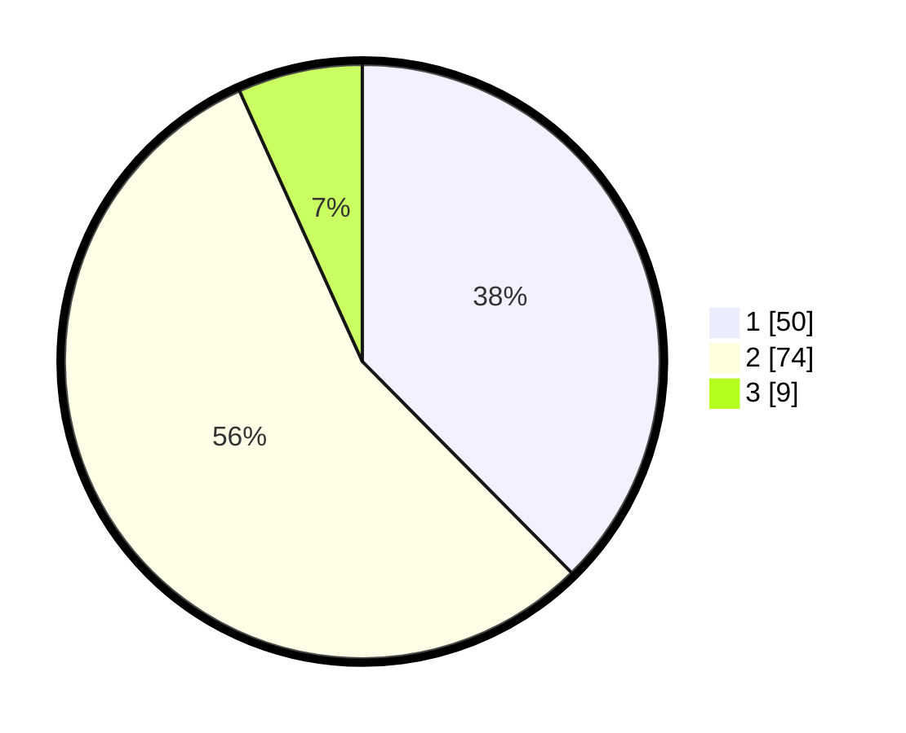

# Hasil

## Grafik

## Tabel

| No. | Nama Paslon    | Suara | Suara (raw) | Persentase |
|:--- |:-------------- | -----:| -----------:| ----------:|
| 1   | ANIES MUHAIMIN | 50    | [50][p-1]   | 37,59      |
| 2   | PRABOWO GIBRAN | 74    | [74][p-2]   | 55,64      |
| 3   | GANJAR MAHFUD  | 9     | [9][p-3]    | 6,77       |

[p-1]: https://github.com/gigit-pemilu/pemilu-2024/blob/main/pilpres/hitung-suara/sub/35-jawa-timur/sub/13-probolinggo/sub/08-krucil/sub/2005-betek/sub/008-tps/sub/paslon-1.txt
[p-2]: https://github.com/gigit-pemilu/pemilu-2024/blob/main/pilpres/hitung-suara/sub/35-jawa-timur/sub/13-probolinggo/sub/08-krucil/sub/2005-betek/sub/008-tps/sub/paslon-2.txt
[p-3]: https://github.com/gigit-pemilu/pemilu-2024/blob/main/pilpres/hitung-suara/sub/35-jawa-timur/sub/13-probolinggo/sub/08-krucil/sub/2005-betek/sub/008-tps/sub/paslon-3.txt

## Foto C Plano

https://sirekap-obj-formc.kpu.go.id/b8cf/pemilu/ppwp/35/13/08/20/05/3513082005008-20240215-072902--66a5db4e-932d-4de8-9c53-273504da0ca9.jpg

https://sirekap-obj-formc.kpu.go.id/b8cf/pemilu/ppwp/35/13/08/20/05/3513082005008-20240215-073024--9ebfa738-fc5a-4b6b-97b2-394b204f5909.jpg

https://sirekap-obj-formc.kpu.go.id/b8cf/pemilu/ppwp/35/13/08/20/05/3513082005008-20240215-073215--44944e67-ef45-4b3e-83be-87afc57ee80b.jpg

## Metadata

| Key        | Value               |
| ---------- | ------------------- |
| Time Stamp | 2024-02-25 16:00:00 |

