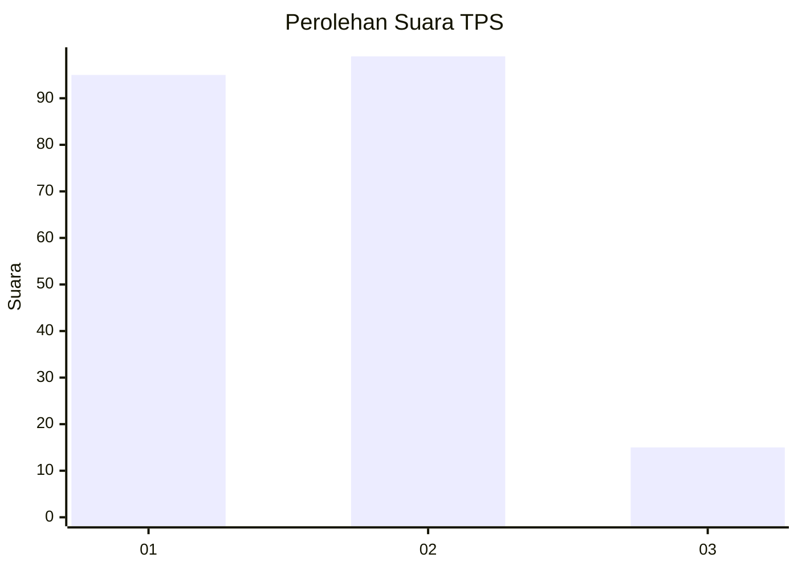
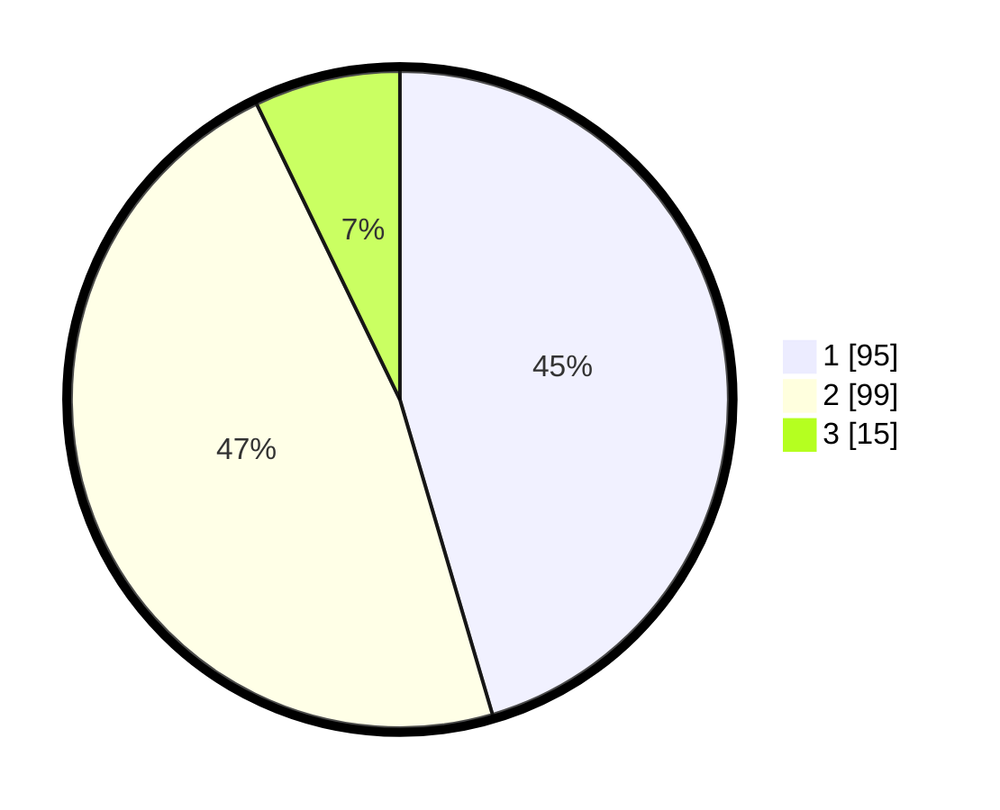

# Hasil

## Grafik

## Tabel

| No. | Nama Paslon    | Suara | Suara (raw) | Persentase |
|:--- |:-------------- | -----:| -----------:| ----------:|
| 1   | ANIES MUHAIMIN | 95    | [95][p-1]   | 45,45      |
| 2   | PRABOWO GIBRAN | 99    | [99][p-2]   | 47,37      |
| 3   | GANJAR MAHFUD  | 15    | [15][p-3]   | 7,18       |

[p-1]: https://github.com/gigit-pemilu/pemilu-2024-35-jawa-timur/blob/main/pilpres/hitung-suara/sub/35-jawa-timur/sub/13-probolinggo/sub/08-krucil/sub/2005-betek/sub/014-tps/sub/paslon-1.txt
[p-2]: https://github.com/gigit-pemilu/pemilu-2024-35-jawa-timur/blob/main/pilpres/hitung-suara/sub/35-jawa-timur/sub/13-probolinggo/sub/08-krucil/sub/2005-betek/sub/014-tps/sub/paslon-2.txt
[p-3]: https://github.com/gigit-pemilu/pemilu-2024-35-jawa-timur/blob/main/pilpres/hitung-suara/sub/35-jawa-timur/sub/13-probolinggo/sub/08-krucil/sub/2005-betek/sub/014-tps/sub/paslon-3.txt

## Foto C Plano

https://sirekap-obj-formc.kpu.go.id/4114/pemilu/ppwp/35/13/08/20/05/3513082005014-20240215-124554--41b6c42e-8646-4ac0-9067-6f590a12be7e.jpg

https://sirekap-obj-formc.kpu.go.id/4114/pemilu/ppwp/35/13/08/20/05/3513082005014-20240215-124824--a1ece292-1c73-41e9-941d-124b37e0e02a.jpg

https://sirekap-obj-formc.kpu.go.id/4114/pemilu/ppwp/35/13/08/20/05/3513082005014-20240215-150456--ed1f5db4-4675-4da8-82df-d4d9611ba3cf.jpg

## Metadata

| Key        | Value               |
| ---------- | ------------------- |
| Time Stamp | 2024-02-15 22:40:13 |

