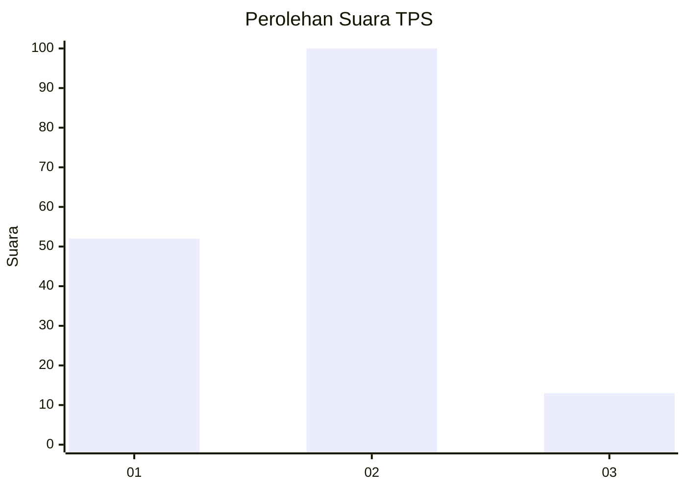
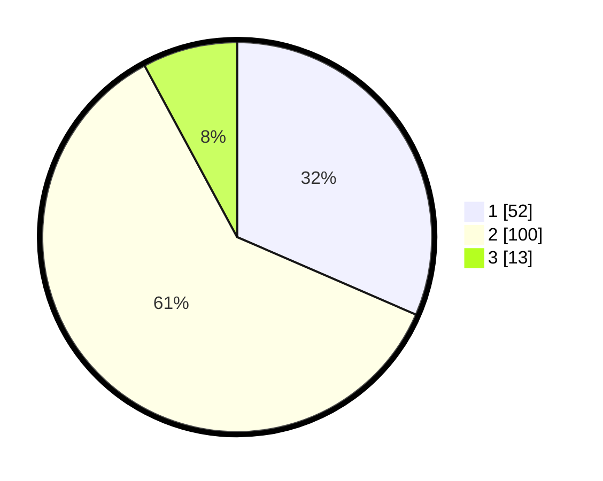

# Hasil

## Grafik

## Tabel

| No. | Nama Paslon    | Suara | Suara (raw) | Persentase |
|:--- |:-------------- | -----:| -----------:| ----------:|
| 1   | ANIES MUHAIMIN | 52    | [52][p-1]   | 31,52      |
| 2   | PRABOWO GIBRAN | 100   | [100][p-2]  | 60,61      |
| 3   | GANJAR MAHFUD  | 13    | [13][p-3]   | 7,88       |

[p-1]: https://github.com/gigit-pemilu/pemilu-2024/blob/main/pilpres/hitung-suara/sub/35-jawa-timur/sub/13-probolinggo/sub/08-krucil/sub/2005-betek/sub/016-tps/sub/paslon-1.txt
[p-2]: https://github.com/gigit-pemilu/pemilu-2024/blob/main/pilpres/hitung-suara/sub/35-jawa-timur/sub/13-probolinggo/sub/08-krucil/sub/2005-betek/sub/016-tps/sub/paslon-2.txt
[p-3]: https://github.com/gigit-pemilu/pemilu-2024/blob/main/pilpres/hitung-suara/sub/35-jawa-timur/sub/13-probolinggo/sub/08-krucil/sub/2005-betek/sub/016-tps/sub/paslon-3.txt

## Foto C Plano

https://sirekap-obj-formc.kpu.go.id/30b3/pemilu/ppwp/35/13/08/20/05/3513082005016-20240214-200318--8ab382bc-fb77-4e00-8451-a7637a41b59e.jpg

https://sirekap-obj-formc.kpu.go.id/30b3/pemilu/ppwp/35/13/08/20/05/3513082005016-20240214-200323--2734bc07-6f6a-4c14-9ecc-81a067a6f0e3.jpg

https://sirekap-obj-formc.kpu.go.id/30b3/pemilu/ppwp/35/13/08/20/05/3513082005016-20240214-201028--8d49bb4a-2ef8-41d6-93e9-6415fe8896fa.jpg

## Metadata

| Key        | Value               |
| ---------- | ------------------- |
| Time Stamp | 2024-02-15 22:40:13 |

